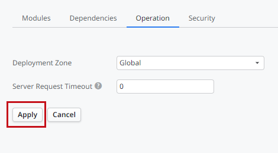
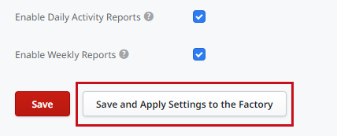

<pre class="script">
template('OutSystems/OSVersionIndicator');
</pre>

# Applying Configurations in Service Center

The OutSystems platform has numerous settings for configuring its behavior in different functional areas. These settings are configured in Service Center and affect the applications generated by the platform.

Settings can be grouped into three categories, based on their impact (ordered from less impact to more impact):

* Operation
* Runtime
* Compile-time

## Operation Settings

**Operation** settings are stored in the database. When you save changes to operation settings, those changes are effective immediately after clearing the cache for the setting (for example, the schedule of a timer).

## Runtime Settings

**Runtime** settings affect the runtime behavior of the applications without requiring the recompilation of the application code. **Applying runtime settings** regenerates the applications configuration artifacts and deploy them next to the application binary files, causing a reload of the applications and a performance penalty on first access.

Changing runtime settings for applications, modules, or extensions has different behavior than changing runtime settings for the whole environment.

### Change Runtime Settings for Applications

When you change a runtime setting for an application, module, or extension, you click the **Apply** button in the corresponding Service Center screen.

By clicking the **Apply** button, you are saving and applying the new runtime setting, causing the reload of the affected modules. From this moment, your changes will be effective (for example, the Effective URL of a consumed SOAP web service).

### Change Runtime Settings for the Environment

When you change runtime settings for the environment, those changes are not applied automatically, due to the impact that the reload of all applications would cause in your environment. You can choose to save the changes first and apply them afterward (for example, the Environment Name setting) when you consider it's the best time to perform that operation.

To save runtime settings for the environment without applying them, click the **Save** button on the corresponding screen.

Until you apply the changes, you will get a warning in the environment indicating there are pending configurations to apply. Modules will also be marked with a warning sign.

If you **republish** or **redeploy** a module, any pending environment runtime setting will be applied to that module.

To apply environment runtime settings to the whole factory, click the **Save and Apply Settings to the Factory** button on any screen where there are environment runtime settings.

By clicking the **Save and Apply Settings to the Factory** button, you are saving your latest changes on that screen and applying all pending runtime settings to all the modules in your factory, causing all modules to reload. From this moment, all the pending settings will be effective for all modules in the factory.

#### Apply Pending Settings to a Set of Modules

If you want to apply pending runtime settings only to a set of modules, and not to the whole factory, you can do it by creating a **solution** in Service Center containing all the modules you want to apply the pending settings and clicking **Apply Settings**.

## Compile-time Settings

**Compile-time** settings affect the compilation process of the applications and the capabilities they exhibit in runtime (for example, the Date Format environment setting).

After changing a compile-time setting, you will need to **republish** your modules so that the new configuration values are taken into account when compiling them.

You can republish your modules in one of the following ways:

In Service Center
:   Click "Publish" on the Module/Extension detail screen (Versions tab), or  
    Click "Publish" on the Application detail screen, or  
    Click "Publish" on the Solution detail screen.

In Service Studio
:   Perform a 1-Click Publish (`F5`) of the module.

## Settings Reference

The tables below list the existing platform settings, the Service Center screen where you can configure them, and the type of each setting.

### Application Settings

Setting                     | Service Center Screen     | Type
----------------------------|---------------------------|--------------
Disable/Enable Application        | Application detail screen | Runtime
Prefetch Resources                | Application detail screen > Operation tab        | Compile-time
Deployment Zone                   | Application detail screen > Operation tab        | Compile-time
Server Request Timeout            | Application detail screen > Operation tab        | Runtime
Security settings                 | Application detail screen > Security tab         | Compile-time
Mobile Apps Generation settings   | Application detail screen > Native Platforms tab | Operations%%Requires regeneration of mobile apps

### Module Settings

Setting                     | Service Center Screen     | Type
----------------------------|---------------------------|--------------
Integration configurations - SOAP, REST and SAP | Module detail screen > Integrations tab | Runtime%%Also applies to all its consumers
Auditing                | Module detail screen > Operation tab       | Runtime
Remote Stack Display    | Module detail screen > Operation tab       | Runtime
Debug mode              | Module detail screen > Operation tab       | Compile-time
Light process execution | Module detail screen > Operation tab       | Compile-time
Activity Logging        | Module detail screen > Operation tab       | Runtime
Screen Requests logging | Module detail screen > Operation tab       | Runtime
Service Actions logging | Module detail screen > Operation tab       | Runtime
Deployment Zone         | Module detail screen > Operation tab       | Compile-time
Catalog                 | Module detail screen > Operation tab       | Compile-time
Run As                  | Module detail screen > Operation tab       | Compile-time
Site Properties         | Module detail screen > Site Properties tab | Operations
Timers                  | Module detail screen > Timers tab          | Operations
Tenants                 | Module detail screen > Tenants tab         | Operations

### Extension Settings

Setting                     | Service Center Screen     | Type
----------------------------|---------------------------|--------------
Activity Logging | Extension detail screen > Operation tab | Runtime%%Also applies to all its consumers
Logical Database | Extension detail screen > Operation tab | Compile-time

### Environment Settings

Setting                     | Service Center Screen     | Type
----------------------------|---------------------------|--------------
Environment Name  | Administration > Environment Configurations | Runtime
Hostname          | Administration > Environment Configurations | Runtime%%Requires regeneration of mobile apps
Purpose           | Administration > Environment Configurations | Operations
Debug mode        | Administration > Environment Configurations | Compile-time
Date Format       | Administration > Environment Configurations | Compile-time
Administration Email | Administration > Environment Configurations | Runtime
Show Email on Login Screen | Administration > Environment Configurations | Operations
Timer Execution Attempts | Administration > Environment Configurations | Runtime
Enable 2-Stage Deploy | Administration > Environment Configurations | Operations%%Only affects Service Center and LifeTime
Enable Mobile Apps Build Service | Administration > Environment Configurations | Operations%%Only affects Service Center and LifeTime
Use Proxy Authentication for Mobile Apps Build Service | Administration > Environment Configurations | Operations%%Only affects Service Center and LifeTime
Enable Reports    | Administration > Environment Configurations | Operations%%Only affects Service Center and LifeTime
Enable HSTS | Administration > Security > Environment Security | Compile-time
Force HTTPS Settings | Administration > Security > Environment Security | Runtime
Cookies Settings | Administration > Security > Environment Security | Runtime
CSP Settings | Administration > Security > Environment Security | Compile-time
Network Security  | Administration > Security > Network Security | Runtime
Applications Authentication | Administration > Security > Applications Authentication | Runtime
Database Catalogs | Administration > Database Catalogs | Compile-time
Database Connections – DBMS | Administration > Database Connections | Compile-time
Database Connections – Other configurations | Administration > Database Connections | Runtime%%Also applies to all its consumers
Default Sender Email | Administration > Email | Runtime
Default Sender Name  | Administration > Email | Runtime
Redirect Emails To Test List | Administration > Email | Runtime
Test List Addresses  | Administration > Email | Runtime
Certificates      | Administration > Certificates | Runtime%%Also applies to all its consumers
