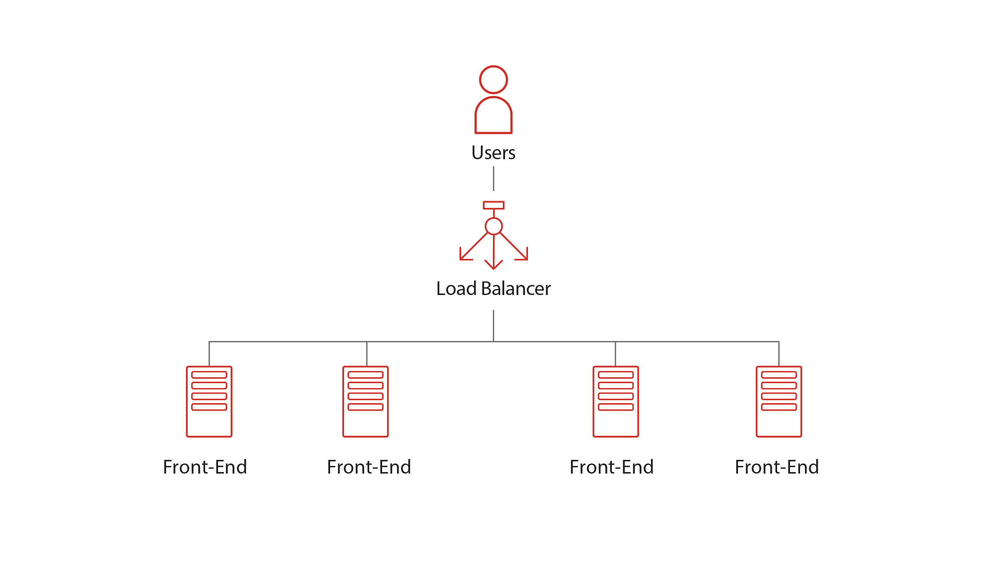
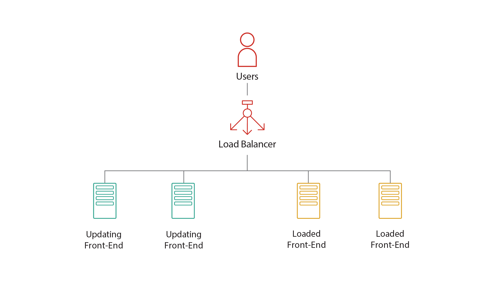
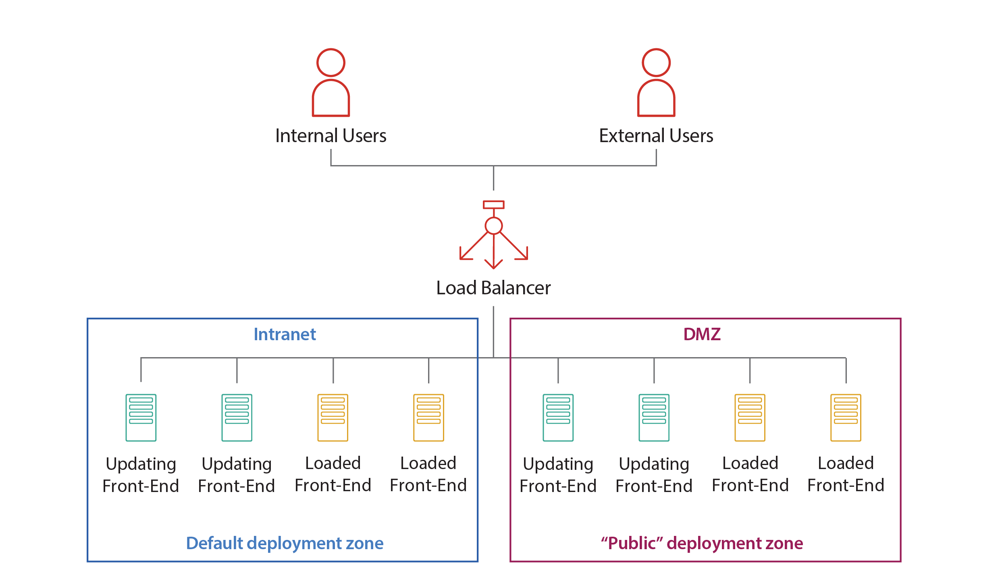
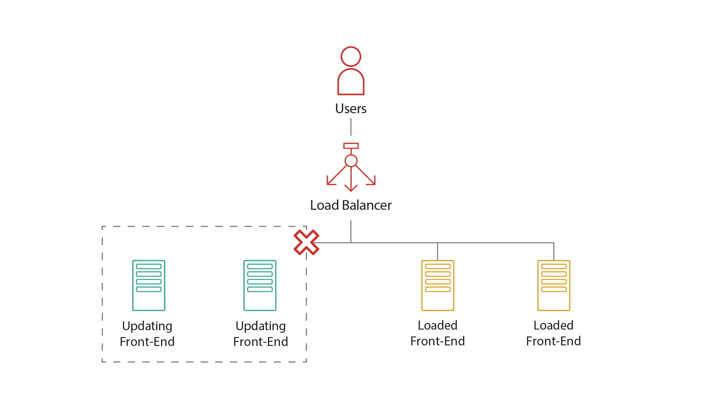
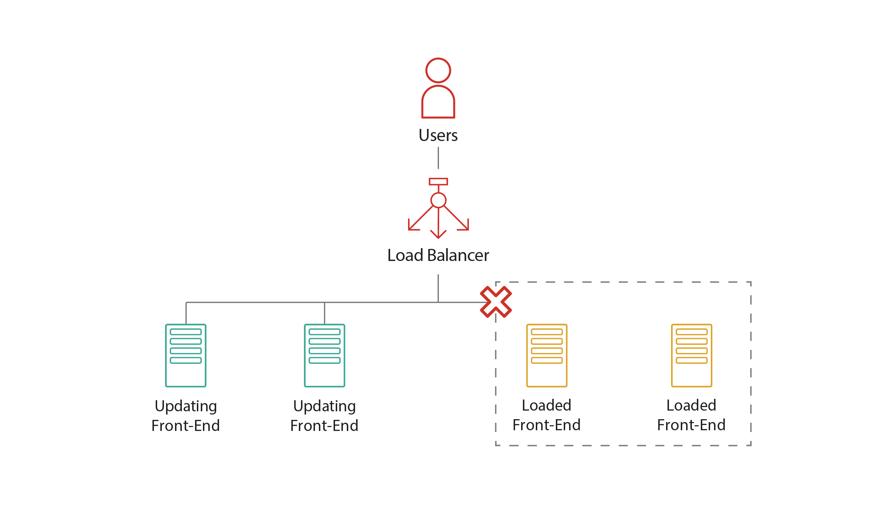

# Balanced application deployment

This guide applies only to self-managed installations. It doesn't apply to OutSystems Cloud, where OutSystems provides the load balancing mechanism.

OutSystems hot-deploys the new versions of your applications with no downtime. At any time, it's possible to [rollback to a previous version](rollback-to-a-previous-version.md) if, for example, critical bugs are detected.

For highly loaded farm environments, the recommendation is to perform a balanced application deployment.

This article describes the steps to deploy an application into a highly loaded OutSystems farm environment. The deployment process is balanced throughout the existing front-ends, guaranteeing no downtime for the applications.

## Prerequisites

For the execution of this procedure, the following requirements must be met:

* Have a **network load balancing mechanism** to distribute the application traffic between the front-ends.

* The operation is performed by a user with **administrative privileges** at Service Center and operating system level (in the services management console).

## Overview

The overall procedure is the following:

* The front-end servers are divided into two groups.

* One group of front-ends is disabled from the load balancer, thus not receiving new requests.

* The applications are then deployed to the front-ends which are not receiving traffic.

* When the deployment is finished, the load balancer is configured to only redirect traffic to the front-ends which already have the new applications, while the applications are deployed to the remaining front-ends.

* Once all front-ends are running the new versions of the applications, the load balancer is configured to redirect traffic among all of them.

By performing an incremental deployment, this process ensures no downtime.

For this procedure, you will have to identify **two groups** of front-end servers:

* **Updating front-ends**: the servers in this group will be executing the deployment process first, while the end-users access to this group of front-ends is disabled. The server that has the Deployment Controller role must be in this group.

* **Loaded front-ends**: the servers in this group will have end-users accessing its applications and will not allow the application deployment process to execute.

The following diagram shows these front-end groups in the farm environment, where the end-users access the applications through a load balancing mechanism:

Note that, if the environment uses [Deployment Zones](zones/intro.md) for application segmentation, you must consider a group of Updating front-ends and a group of Loaded front-ends for each Zone. In that case, think of each Zone as if it were a distinct farm environment.

## Before you start

* Identify your two groups of front-ends: **Updating front-ends** and **Loaded front-ends**.

* Annotate the procedure to have the actual front-end/machine names so that you can reference them during the execution of the deployment.

## Deploying applications in a highly loaded farm environment  

Follow the steps below to execute a balanced application deployment.

**Step 1. Disable the OutSystems Scheduler Service in all front-ends (Updating and Loaded front-ends)**

Do the following on each front-end server:

1. Launch the Windows Services management console (services.msc).
1. Stop and disable the **OutSystems Scheduler Service**. Confirm that the service stays stopped and disabled.

 
Don’t start the OutSystems Scheduler Service until instructed to do so. 

**Step 2. In the Load Balancer, set the traffic to the Loaded front-ends**

1. Access your **Load Balancer** management tool.
1. Remove the application traffic from the **Updating front-ends**. The **Loaded front-ends** must be the only ones receiving traffic from end-users.

**Step 3. Disable deployment in the Loaded front-ends**

1. For each **Loaded front-end**, access the Windows Services management console (services.msc).
1. Stop and disable the **OutSystems Deployment Service**.
1. Confirm that the service stays stopped and disabled.

**Step 4. Publish your application to the Updating front-ends**

1. Access **LifeTime** directly through its URL (for example: `https://<LifeTime-server>/lifetime`)
1. Log in with deployment privileges.
1. Create or reuse a **deployment plan** including your applications and deploy it.
1. Wait until the deployment finishes successfully.

Any updates in the database caused by the new application version are executed during this publishing. The updated code will be automatically deployed to the remaining **Updating front-ends**.

**Step 5. Test your application on the Updating front-ends**

Do the following on each **Updating front-end** server:

1. Access the application directly through the **Updating front-end** (for example: `https://<front-end-server>/<Application>`).
1. Confirm the application is available and updated.

**Step 6. In the Load Balancer, set the traffic to the Updating front-ends**

1. Access your **Load Balancer** management tool.
1. Set the **Updating front-ends** to start receiving application traffic.
1. Remove the application traffic from the **Loaded front-ends**. This time, the **Updating front-ends** must be the only ones receiving traffic from end-users.

Now your end-users will start seeing the new application version.

**Step 7. Start the OutSystems Scheduler Service in the Updating front-ends**

Do the following on each **Updating front-end** server:

1. Launch the Windows Services management console (services.msc).
1. Configure the **OutSystems Scheduler Service**’s startup type as `Automatic` and then start the service.

**Step 8. Start the OutSystems Deployment Services in the Loaded front-ends**

By starting the OutSystems Deployment Services, you ensure all applications are immediately deployed to the **Loaded front-ends**.

Do the following on each **Loaded front-end** server:

1. Launch the Windows Services management console (services.msc).
1. Start the **OutSystems Deployment Service**.

**Step 9. Check the deployment process status**

1. Access the **environment’s Service Center** (for example: `https://<front-end-server>/ServiceCenter`).
1. Log in with administrative privileges.
1. Go to **Monitoring > Environment Health**.
1. For each **Loaded front-end**, click the detail link for the **Deployment** service to check the status of its threads. Wait until the status of all threads is `Idle` or `Sleeping`. When this happens, the deployment process to the **Loaded front-ends** has finished.

**Step 10.  In the Load Balancer, reset the traffic to all front-ends**

1. Access your **Load Balancer** management tool.
1. Set the **Loaded front-ends** to start receiving application traffic again.

**Step 11. Start the OutSystems Scheduler Service in the Loaded front-ends**

Do the following on each **Loaded front-end** server:

1. Launch the Windows Services management console (services.msc).
1. Configure the **OutSystems Scheduler Service**’s startup type as `Automatic` and then start the service.
