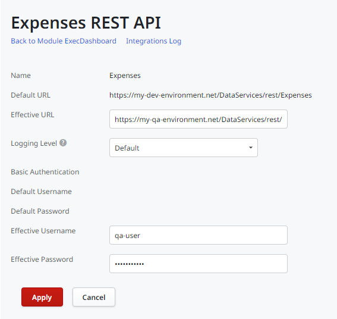

# Configure Application Settings After Deployment

When deploying an application to another environment, you often need to change application settings according to the environment you're deploying to.

An example is while developing, you want your application to integrate with systems that don't handle production data. When deploying your app to Production, you need to ensure the application integrates with the systems that store production data.

When deploying an application module to an environment, OutSystems allows you to configure the:

* URL of consumed REST APIs, and SOAP web services
* Connections for external databases and SAP systems
* Values of module parameters
* And more

These configurations are made in the environment management console. They don't need republishing your app, and have no downtime to your end users.

## Example - Configure the Executive Dashboard App

In this example we've just [deployed the Executive Dashboard application](<deploy-an-application.md>) from Development to Quality. The development team has changed the Executive Dashboard app to integrate with Expenses app through its REST API.

While developing, the team used a connection for the service with development data. After deploying the Executive Dashboard app, we need to configure it to integrate with the Expenses version that has a copy of production data.

In the infrastructure management console (LifeTime), find the **Executive Dashboard** app and navigate to its details.

In the application detail screen, click **Quality**. On the menu choose **Configure Application** to customize the Expenses integration that's running on the Quality environment.

Now on the Quality environment management console, click on the modules you want to configure. In this case we'll configure the ExecDashboard module.

The module settings are grouped into different tabs:

* Integrations – Configure the connections to external systems the module integrates with
* Tenants – If your module supports multi-tenancy, here you can manage the tenants
* Site Properties – Set the value of parameters used in the module
* Timers – Set the schedule of batch tasks defined in the module
* Operation – Configure other runtime settings like logging and auditing

Click the Integrations tab to see the ExecDashboard module integrations and to configure them. In this case we have two integrations:

* Employees – Was added to the module on a previous version, and is already configured.
* Expenses – Didn't exist until now. So when deploying this version to Quality, the platform used the URL configured at development time.

To make the Expenses integration point to a system production-like data, click 'Expenses', set the **Effective URL** field with the URL to use.

By setting an Effective URL, you are overriding the URL defined at development time. Even if developers change the URL in the application, the platform uses the Effective URL.

Click the **Apply** button for the Executive Dashboard app to start using the new URL for the Expenses integration.
