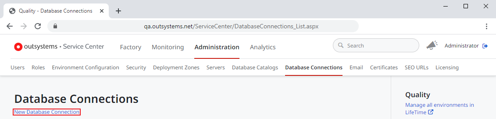
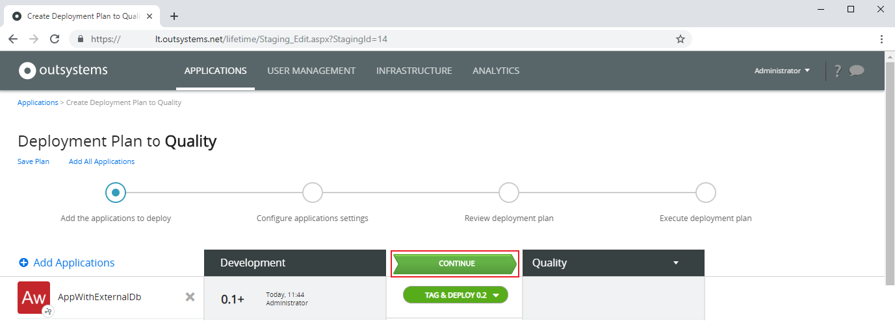
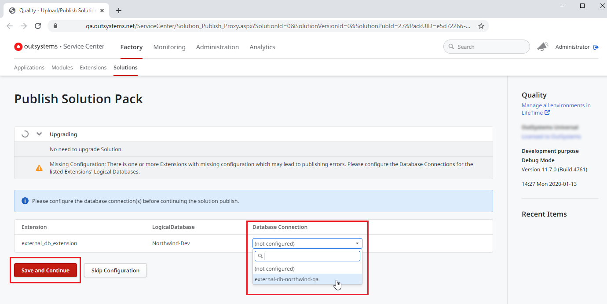

# Deploy an Integration With an External Database

Follow the steps in this guide to deploy an application with a connection to an external database from an OutSystems environment (in this case, the Development environment) to the next environment (in this case, the Quality environment).

Use this guide after you [created the integration with the external database](../../extensibility-and-integration/external-database/connect-external-db.md) in your Development environment and if your application needs to connect to a different external database in each environment.

**Before you begin following this step by step guide, make sure that:**

* Your infrastructure uses **LifeTime 11.4.2** or later.
* Both the source and target environments use **Platform Server 11 Release Jul.2019 CP1** or later.
* You have **Change & Deploy Applications** permission for the applications that you want to deploy.
* You created the **Extension** that integrates with an external database while connected to an environment running **Platform Server 11 Release Jul.2019 CP1** or later.  
Otherwise, republish the Extension in Integration Studio while connected to an environment running **Platform Server 11 Release Jul.2019 CP1** or later.

## Define a Database Connection in the Quality environment

In the Quality environment, define a Database Connection:

1. Open the **Service Center** management console of your **Quality environment**.

1. On the **Administration** tab, select **Database Connections**.

    

1. Click **New Database Connection** and fill in the fields to set up the connection to the external database.

    

    If you need to fine-tune the database connection, choose the option **Advanced configuration**. This allows you to define your own connection string.

    

    If you are defining a connection to an external Oracle database which NLS_LANGUAGE parameter is different from `AMERICAN`, make sure you set the **NLS_LANGUAGE** field to the same value set in the database. This will prevent runtime issues related to date and number formats.

    To get the value of the NLS_LANGUAGE parameter set in your external Oracle database you can run the following script:
        `select value from nls_database_parameters where parameter = 'NLS_LANGUAGE';`

    

1. Click **Test** to check if the connection is working correctly.

    

    The database user must have permissions to:

    * List the necessary tables and views in the external database.
    * Perform the operations Create, Read, Update, and Delete on those tables and views.

    

1. Click **Create** to create the Database Connection.

## Deploy the application to the Quality environment

To deploy the application to the Quality environment follow these steps:

1. Open LifeTime for your Infrastructure.

    

    Tip: Open LifeTime directly from Service Center by clicking **Manage all environments**.

1. Select the **Applications** tab and select the **DEPLOY...** button between the Development environment and the Quality environment.

    

1. Select **Add Applications** and, in the **Choose one or more Applications** dialog, select your application and select **Add to Deployment Plan**.

    

1. Select the **VALIDATE NOW** button between the Development environment and the Quality environment.

    

1. Select the **CONTINUE** button between the Development environment and the Quality environment.

    

1. Verify the deployment plan, select **Deploy Now** and then in the **Deploy applications as planned** dialog select **Deploy Now** to start the deployment.

    

1. In the **Configure applications settings** step, enter the three-part **Physical Table Name** of each external database Entity. Make sure you enter the correct **Physical Table Name** for the target environment.

    

    

    If your application connects to the same external database/schema for both your environments, select **Copy from Source** to copy the **Physical Table Name** from the source environment.

    

1. After the deployment stops, click the **configuration or confirmation** link in the warning banner to open Service Center and map the database name of the extension to the database connection.

    

1. Associate the logical database name of the extension to the Database Connection that you created previously.

    

After the Deployment finishes your Extension is ready to be used by other applications in the Quality environment.

