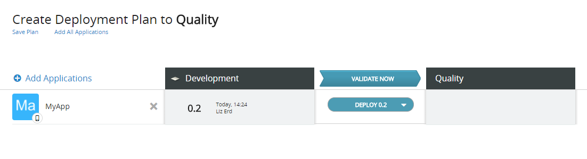
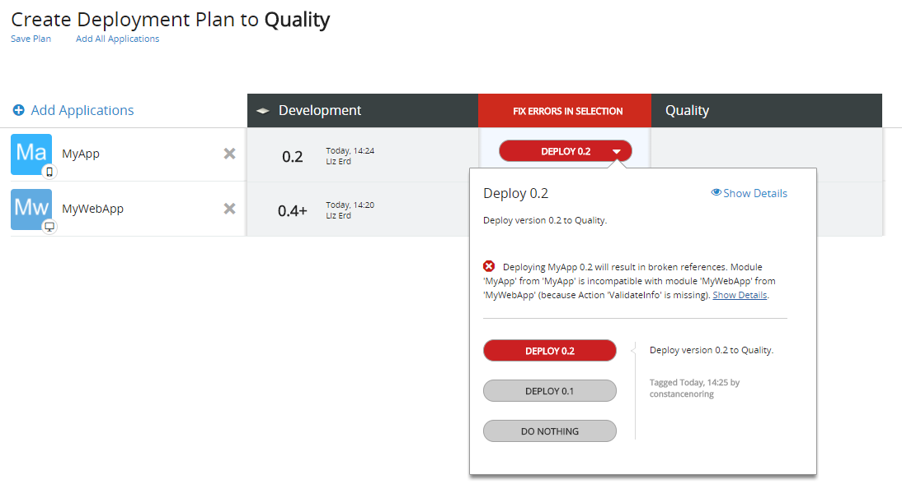
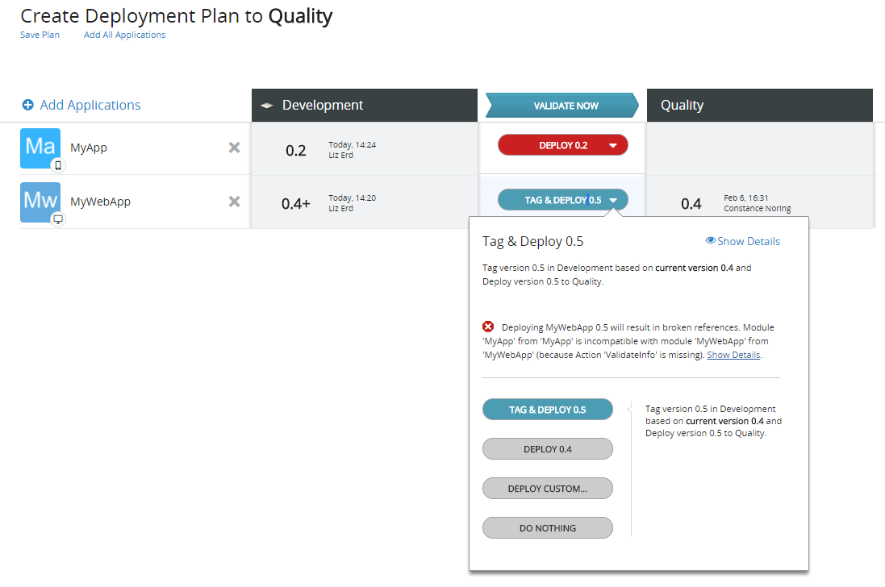
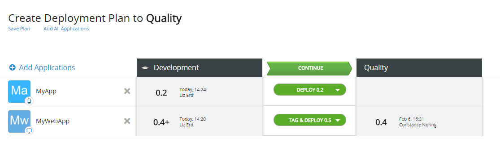
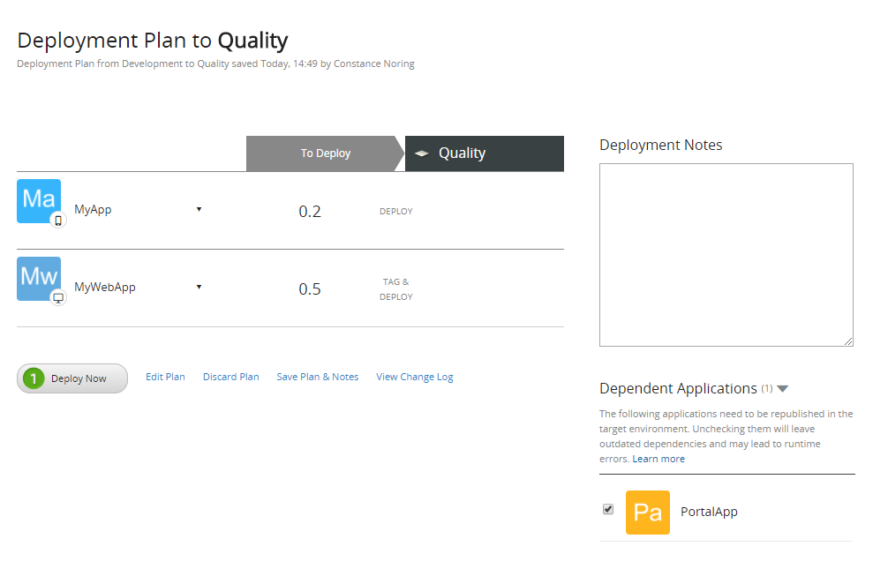

# Deploy an Application with Dependencies

An application that is [deployed to another environment](<deploy-an-application.md>) may experience runtime errors if it depends on the functionality of other applications that are not deployed together with it. 

LifeTime validates these type of dependencies before deploying applications. 

LifeTime detects all application dependencies that are not up-to-date in the destination environment and adds those dependencies to the deployment plan, highlighting them in red.

In this situation, do the following:

1. Confirm with the teams that are responsible for each dependency module if the current version can be deployed to the destination environment.
1. Set each dependency module to be tagged and deployed with your application.
1. Validate the deployment again.
1. LifeTime validation goes green (OK), you can proceed with the deployment.

Here's an example of how to do it.

## Deploy MyApp to Quality for Testing

In this example, a new mobile app (MyApp) was developed to extend the functionality of the existing web application (MyWebApp):

* **MyApp** is [tagged with version 0.2](<tag-a-version.md>) and is ready to be deployed to Quality for testing.
* **MyWebApp** is updated in the Development environment to include a new functionality used by **MyApp**.

  
### Deploy the Mobile App
To deploy MyApp to Quality, do the following:

1. Select **Deploy...** and add MyApp to the deployment plan. You can also search by the application name:

    

1. Select the option **DEPLOY 0.2** and click **VALIDATE NOW**:

    

LifeTime detects that MyApp depends on MyWebApp, which also needs to be updated in Quality, and adds MyWebApp to the deployment plan. Both applications go red (error), and it’s not possible to continue with the deployment.

In very specific situations where you have the total ownership of all the identified dependency modules and you are aware of the impact this deployment will cause in the destination environment, you can choose to "Continue with errors". Otherwise, you should continue forward to understand and solve all the dependencies. 

### Understand the Dependencies

To understand the dependencies, click on the error message in MyApp:

LifeTime is warning that deploying this version of MyApp will make the application misbehave in Quality. This happens because MyApp is using an action from module MyWebApp, which is not available in the MyWebApp version that is deployed to Quality.

### Resolve the Dependencies

MyWebApp 0.4+ is exposing the required functionality and has to be tagged and deployed to Quality:

1. Choose **TAG & DEPLOY 0.5** for MyWebApp.

    

1. Keep **DEPLOY 0.2** for MyApp and click **VALIDATE NOW** to validate the deployment again:

    

This time, all applications should go green (OK) and the deployment can now go ahead.

### Deploy to Quality

At this point you will review the deployment plan and deploy the applications to the Quality environment:

1. Click **CONTINUE** to move to the Deployment Plan step.

1. Add a deployment note, if needed.

1. Review the deployment plan. In this example, PortalApp application consumes functionality from MyWebApp, so LifeTime suggests to republish PortalApp in the Quality environment in order to update its dependencies.

    

1. Click the **Deploy Now** button.

MyApp and MyWebApp are deployed to Quality. MyApp is ready for testing.

## Update Dependencies in Target Environment

When deploying an application to a target environment, LifeTime detects the applications consuming functionality from the application being deployed and that would have [outdated dependencies](../../develop/reuse-and-refactor/handle-changes.md#change-functionality-in-the-producer-module) with the current deployment. In the deployment plan, LifeTime suggests to republish these consumer applications in the target environment to ensure all its dependencies are up to date.

No changes are made to these consumer applications: they will only be republished in the target environment to start using the new version of the application being deployed. You will only be able to republish the applications to which you have permissions.

Choosing not to republish the consumer applications in the target environment may lead to runtime errors.