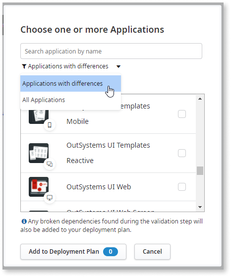
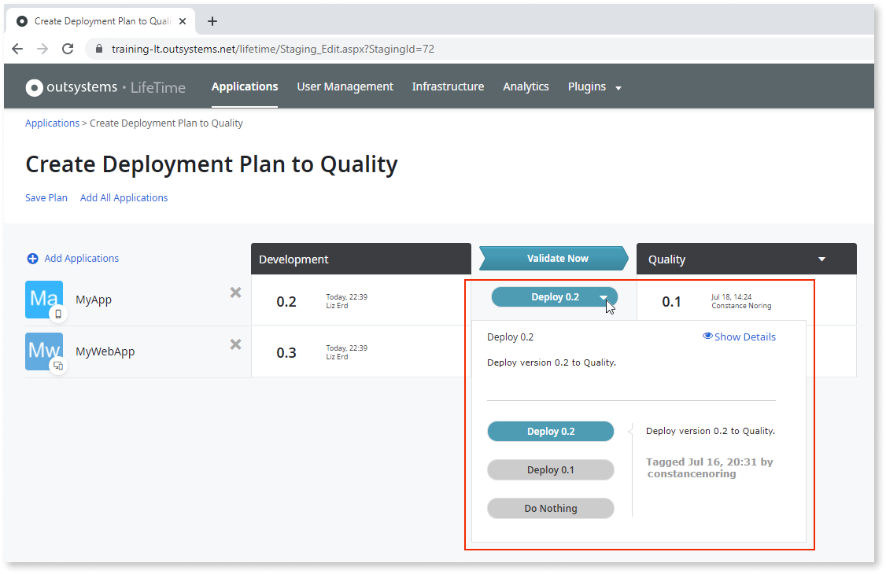
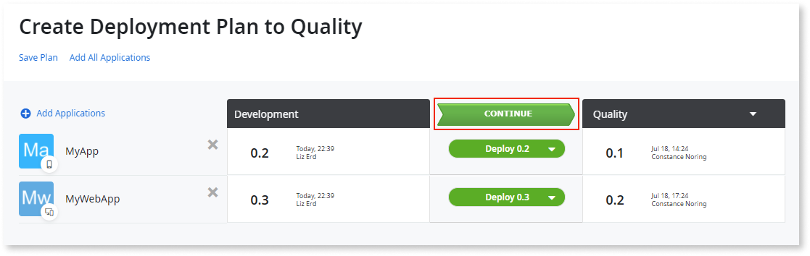
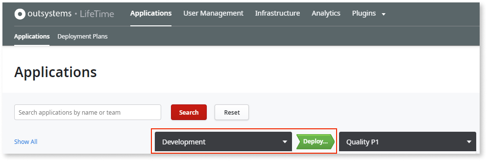
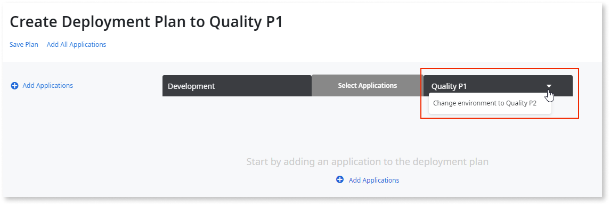

# Deploy an Application

In LifeTime, deployment of an application's [tagged version](<tag-a-version.md>) takes a version of the application from one environment and deploys it in another. Just select the tagged version of the application and LifeTime deploys it in the exact development state in which it was tagged.

**Note:** Application and module names must be unique within each environment and that as you stage, name changes are propagated to the target environments. It is important to keep all environments up to date when changing application or module names to avoid the following scenarios:

- [LifeTime staging aborts after renaming an app or module](https://success.outsystems.com/Support/Troubleshooting/Application_lifecycle/LifeTime_staging_aborts_after_renaming_an_app_or_module)

- [Application renamed unexpectedly after staging](https://success.outsystems.com/Support/Troubleshooting/Application_lifecycle/Application_renamed_unexpectedly_after_staging)

Here's an example of deploying applications in LifeTime.

## Deploy a Web and a Mobile Application

This example uses Development, Quality, and Production environments. The application environments in your infrastructure may differ.

In this example, two applications are being developed in the Development environment:

* A mobile app (MyApp)
* A web application (MyWebApp)

A milestone is reached and the applications are ready to be tested by Quality. They are [tagged](<tag-a-version.md>) as follows:

* The mobile app is tagged with version 0.2
* The web application is tagged wih version 0.3

To deploy both applications to Quality, do the following:

1. In your LifeTime console (`https://<lifetime_env>/lifetime`), navigate to the **Applications** area.

1. Click the **Deploy...** button between Development and Quality.

    

1. In the popup window, search for the applications to deploy. You can filter by **Applications with differences** or search by the application name.

    

1. Select the applications to deploy and click **Add to Deployment Plan**.

    

1. In the deploy options, select **Deploy 0.2** for MyApp and **Deploy 0.3** for MyWebApp.

    

1. Click **Validate Now** to validate the deployment in Quality.

    

    Note: If LifeTime detects any changes in the applications included in the plan either in the source or in the target environment, it will show a **Refresh Applications** sticker that you can click to [refresh the applications](#refresh) included in the plan.

1. The deployment plan is OK (all green). Click **CONTINUE** to move on.
    
    

1. Type the **Deployment Notes** and click the **Deploy Now** button to execute the deployment.
    
    

When the deployment finishes, both applications have the same tagged version in both environments.

If you're deploying a mobile app that is already [configured to generate the mobile app package](<../../deliver-mobile/generate-distribute-mobile-app/intro.md>), be aware that some changes you do in your application might cause the generation of a new application package. For example, changing the icon or the main color of the application.  
[Check here](../../deliver-mobile/mobile-app-update-scenarios.md#situations-when-the-user-must-install-a-new-build) all the situations that require the user to install a new application package.

If the deployment **finishes successfully**, you can [reuse this deployment plan](deployment-plans.md#reuse) to get next deployments faster.

On the other hand, if the deployment is **aborted**, you can [retry this plan](deployment-plans.md#retry) to create a copy of the original plan and customize it before running it again.

## Deploying to a different target environment { #change-target-environment }

If you have several [pipelines](https://www.outsystems.com/evaluation-guide/outsystems-cloud-architecture/#2) in your OutSystems infrastructure you may need to choose a specific target environment, belonging to a different pipeline, when deploying applications.

To change the target environment of a deployment do the following:

1. Click the **Deploy...** button on the right of the source environment name.  

    For example, if we want to deploy an app from **Development** to **Quality P2**, the source environment is **Development**.

    

1. In the popup to choose one or more applications to deploy, press **Cancel**. First, you will select a different target environment.

1. Open the target environment dropdown by clicking its name (**Quality P1** in our example).

    

1. Select the desired target environment in the dropdown. In our example, we selected **Change environment to Quality P2**.

1. Proceed as described in the previous section by adding applications to the deployment plan, validating the plan, and starting the deployment.

## Refresh applications in the deployment plan { #refresh }

After creating a deployment plan and adding applications to it, OutSystems notifies you if there are any relevant changes in the source or target environments related to the applications included in the plan.

The detected changes include:

* In the **source** environment, publishing/moving a module of an application included in the plan 
* In the **target** environment, publishing/moving **any** module of an application
* In the **source**/**target** environment, tagging a version of an application included in the plan 

When any of these changes is detected, a **Refresh Applications** sticker appears under the page title heading of the deployment plan creation screen:

To refresh the applications in the current plan, click **Refresh Applications**.

The refresh operation does the following:

* The versions displayed in the deployment plan's source and target environments are updated.
* Applications with the "Tag & Deploy" option selected will be deployed with the most recent code.
* Any new tags created outside the plan are shown in the deployment options and can be selected for deployment.
* All deployment options previously selected are kept, except if they are no longer available.
