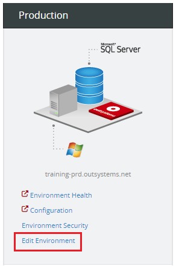
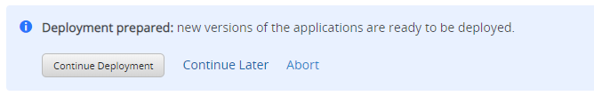
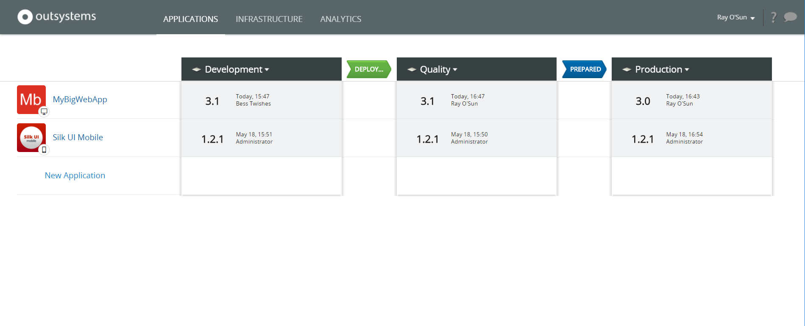
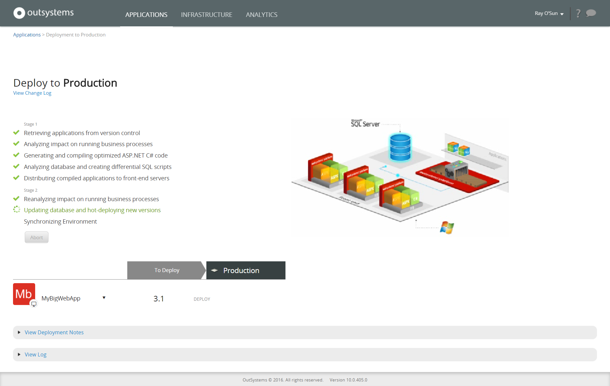

# Deploy in a Short Deployment Window

When LifeTime deploys the applications in a single stage, it does the following:

1. Compiles applications code and deploys them
1. Generates SQL scripts and runs them to update the database
1. Changes the running version of applications in the application server
1. Generates a new mobile app package (only if we are deploying a mobile app with changes that require a new app package)

In cases there is a short window of time to deploy, it may not be possible to deploy it in a single stage. It will impact business. To overcome that, LifeTime allows splitting the deployment in two stages:

1. **The first stage** is the preparation stage, with no impact:  

    1. Applications are compiled
    1. SQL scripts are generated
    1. Binaries are uploaded to the front-ends in the destination environment, but there are no changes in the running versions

1. **The second stage** is when changes become effective:  

    1. SQL scripts are executed to update the database
    1. The running version of applications are changed to the new ones in the application server
    1. A new mobile app package is generated (only if we are deploying a mobile app with changes that require a new app package)

Here's an example of how to do it.

## Deploy MyBigWebApp in Two Stages to Avoid Impact on Business

In this example, we need to deploy the new version of MyBigWebApp to Production, which requires some time due to the application size. However, to avoid impact on business, our company has set the deployment window to a limited period of time during the night (eg. from 2am to 4am). Since the deployment of MyBigWebApp will take longer than the deployment window, we have to do it in a 2-stage deployment.

### Activate the 2-Stage Deployment

To activate the 2-stage deployment, do the following:

1. Login in LifeTime console with a user with role to manage the infrastructure.

1. Go to the **Infrastructure** area.

1. Click the **Edit Environment** link in the target environment. In this case, the Production environment.

    

1. Check the **Execute deployments in two stages** option.  

    

1. Click **Save**. The 2-stage deployment is now active for Production.

**In OutSystems Cloud**: the 2-stage deployment is managed in Service Center, the management console of the environment. Go to the 'Administration' tab, choose 'Environment Configuration', and check the 'Enable 2-Stage Deploy' option.

### Do the First Stage of the Deployment

With the 2-stage deployment active, we can safely start deploying the application to Production with no impact on the business:

1. Start the deployment as usual.

1. In the deployment plan, click on **Prepare Deployment**.  

    

    At this stage, applications are compiled, SQL scripts are generated, and binaries uploaded to the destination environment.

    

1. Choose **Continue Later** to finish the first stage of the deployment.  

      

The solution will automatically be deleted if it's been created for longer than 96h. This can lead to errors when trying to continue the deployment.

### Do the Second Stage of the Deployment

As agreed, by the deployment window time, we can safely start the second stage of the deployment:

1. Click on **Prepared**.  

    

1. In the deployment plan, click on **Continue Deployment**. The SQL scripts are executed and the running application is changed to the new version.  

    

If you are deploying a mobile app to another environment for the first time, you need to [configure the app](<../../deliver-mobile/generate-distribute-mobile-app/intro.md>) in that target environment, so the mobile app package can be generated.
