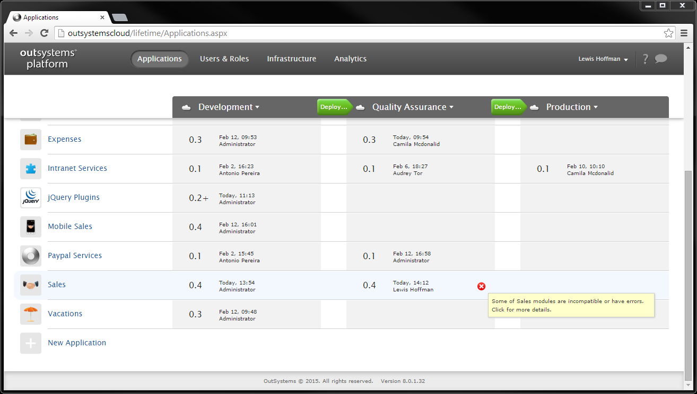

# Deploy to an Environment with Applications with Errors

In LifeTime, you may find applications marked with a  icon next to them in a environment. This means that they are currently using (referencing) functionality of other applications but that functionality is no longer available or is incompatible. These applications are said to have incompatible references.

In the example above the Sales application has incompatible references in the Quality Assurance environment. This happens because Sales is using a public action of Customer Services through a reference.

However, the action has changed, it has a new mandatory input parameter, and is currently deployed in Quality Assurance, thus making the Sales reference to it incompatible. An application with incompatible references may be executed but you will probably experience runtime errors or misbehaviors.

## Deploying to an Environment with Incompatible References

When selecting an application to deploy to an environment with incompatible references, it is always important to validate whether the application depends on any application with incompatible references. 

### The Deployed Application Depends on Applications with Incompatible References

If the application you select to deploy depends on one or more applications with incompatible references, you have first to repair those applications to be sure that the application you are deploying will work properly.

In the example, Mobile Sales 0.4 depends on Sales, therefore, before deploying Mobile Sales 0.4 to Quality Assurance you have first to repair the Sales application.

Learn more about how to [Repair Deployed Applications](<repair-deployed-applications.md>).

### There are No Dependencies from Applications with Incompatible References

If the application you select to deploy does not depend on any application with incompatible references, simply proceed with the deployment normally.

In the example, Vacations 0.3 can be deployed without problems since it does not depend on the Sales application.

Learn more about how to [Deploy an Application](<deploy-an-application.md>).
