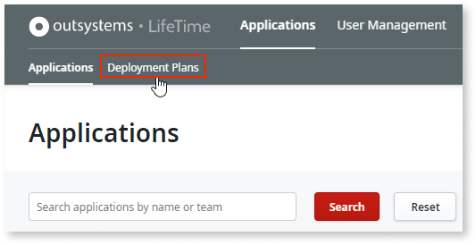
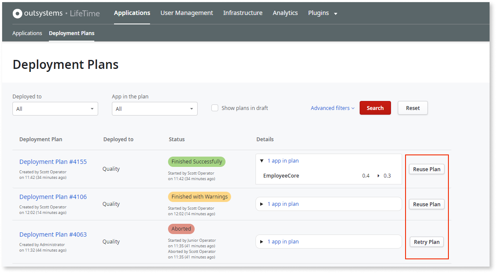
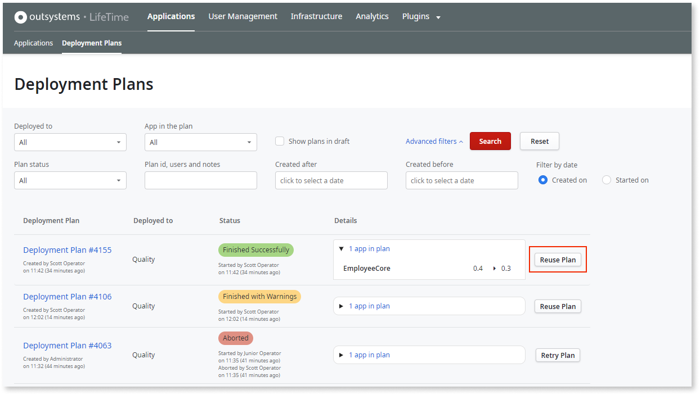
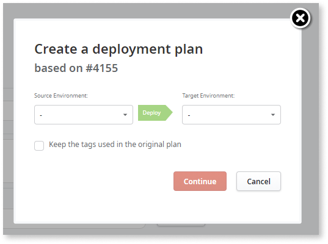

# Deployment Plans

A **deployment plan** allows you to deploy application changes, like new features and fixes, performed in one environment to a different environment, for example from Development to QA.

A deployment plan can contain:

* The applications to be deployed
* Version tag information, that can be used to tag stable versions of apps
* Deployment notes, including the release notes
* Settings like [Site Property values](tp-configure-site-properties-during-deploy.md)

You create deployment plans in LifeTime, on the **Deployment Plans** screen under the **Applications** area.

You can also create a deployment plan by [reusing a finished plan](#reuse) or [retrying an aborted plan](#retry).

## The Deployment Plans screen

The **Deployment Plans** screen contains a list of past and current deployment plans in LifeTime, along with their status and details.

Open the Deployment Plans screen by clicking **Deployment Plans** under the **Applications** area.

From this screen you can perform several operations like retrying an aborted deployment plan, or reusing a finished deployment plan. The available operations on each plan depend on the plan's status.

## Reusing a deployment plan { #reuse }

Reusing a deployment plan gets you faster deployments by not having to create deployment plans from scratch. You can reuse any finished deployment plan that wasn't aborted.

 This operation is especially useful in the following situations:

* **You are deploying to sequential environments in your infrastructure.** For example, you first deployed from Development to QA, and now you wish to deploy the same applications and versions from QA to Production. In this case, you can reuse a recently finished plan to deploy applications to the next environment.

* **You are creating a new deployment plan very similar to a previous one.** Reusing an existing plan helps you reduce the risk of making mistakes, since you don't have to create the deployment plan from scratch. In this case, you can search for the desired plan in the Deployment Plans screen and choose the Reuse Plan operation.

The new deployment plan, reused from an existing one, has the same applications (if they're available in the selected source environment) and, optionally, the same tagged versions of those applications.

To reuse a deployment plan from the Deployment Plans screen, do the following:

1. Open the **Deployment Plans** screen under the **Applications** area.

1. Find the plan you wish to reuse in the plans list. You can search for the plan using several criteria. Expand the **Advanced filters** for more search options.

    

1. Click **Reuse Plan**. This operation is available for all finished plans that weren't aborted.

1. In the pop-up window, choose the **source** and the **target** environments for the new plan.

    

You can choose to keep the tags that were in the source plan by selecting **Keep the tags used in the original plan**.  

In this case, if some of the tagged versions of the original plan are not available for deployment (for example, if the version is not available in the selected source environment or if there's a more recent version of an application in the selected target environment), you will get a feedback message stating this situation, and you will be able to adjust the new deployment plan accordingly.  

If you don't select this option, the plan will contain the same applications but with the latest tags available for deployment.

**Notes:**

* The Reuse Plan operation is only available for finished deployment plans that weren't aborted. For aborted plans, use the [Retry Plan](#retry) operation.

* You can select any source and target environments, as long as the source environment has at least **one** application contained in the source plan. When you select a source environment that doesn't contain **any application** from the source plan, the pop-up shows a warning, and you cannot to move forward.

* When you select a source environment that doesn't contain **some** of the applications in the source plan, the pop-up shows a message telling you that those applications will not be available in the new plan.

## Retrying an aborted deployment plan { #retry }

A deployment plan can be aborted manually by an operator or by the OutSystems platform, due to some issue that occurs during deployment.

When this happens, you don't need to create a new deployment plan from scratch to try to execute the same deployment operation - a deployment with the same applications and the same versions. In these situations, you can **retry the deployment plan**, which is an operation available for all aborted deployment plans.

The retry operation does the following:

1. Creates **a copy** of the aborted deployment plan in an unsaved state, with the same applications and tagged versions and between the same source and target environments as the original deployment plan.  

1. Navigates to the new deployment plan detail screen, allowing you to make some adjustments to the plan before executing it.

To retry a deployment plan from the Deployment Plans screen, do the following:

1. Open the **Deployment Plans** screen under the **Applications** area.

1. Find the aborted plan you wish to retry in the plans list. You can search for the plan using several criteria. Expand the **Advanced filters** for more search options.

    

1. Click **Retry Plan**. This operation is available for all aborted plans.

**Notes:**

When you're retrying a deployment plan the following situations may arise due to changes in the source or in the target environment:

* If the source environment no longer contains **some** of the applications from the original plan, LifeTime shows a pop-up with a message telling you that those applications will not be available in the new plan.

* If the source environment no longer contains **any** application from the original plan, LifeTime shows a pop-up with a warning, and you cannot move forward.

* If some of the **tagged versions** aren't available for deployment anymore when you retry the plan (for example, if a more recent version of an application was already deployed to the target environment), LifeTime shows you a feedback message stating this situation, and you'll be able to adjust the new deployment plan accordingly.
