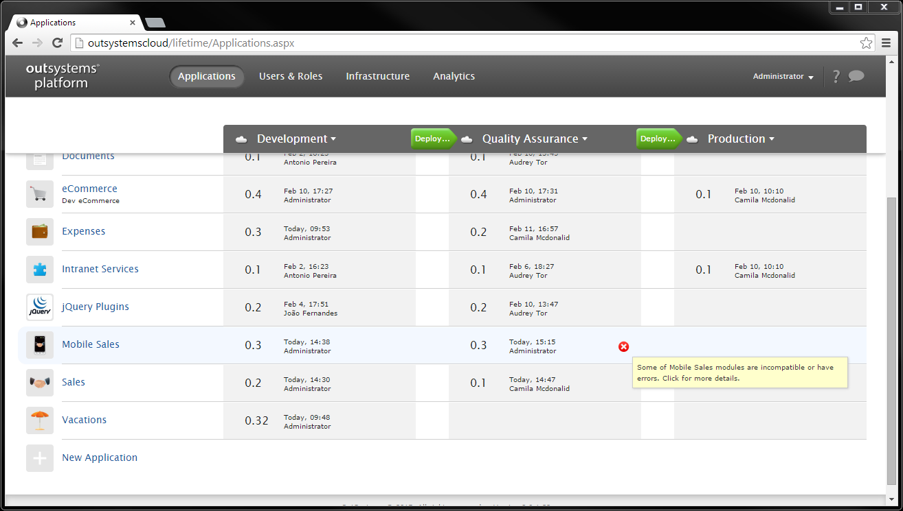
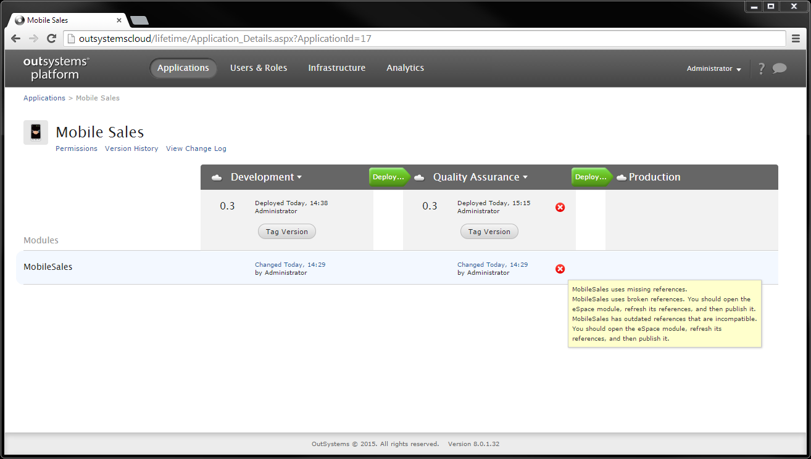

# Repair Deployed Applications

This topic describes how to solve the situation of an application that depends on functionality that no longer exists or has changed. Elements in the producer application have changed and cannot be used by other applications the way they used to.

In this example the Mobile Sales application consumes an action exposed by the version 0.2 of the Sales application. But since the Sales 0.2 is not yet on Quality Assurance the Mobile Sales running on that environment has a broken reference.

## Understand the Problem

LifeTime displays a red icon near every application that is not running properly, so that you can easily understand the status of all applications running on each environment.

To find out what is the problem with Mobile Sales, on the Applications tab click **Mobile Sales**, to display the details of the application.

On the MobileSales module, hovering the mouse over the red icon shows a tooltip with the description of the problem: the module has broken references.

To know which references are broken, the Mobile Sales module has to be opened and analyzed in Service Studio:

1. Click on the link of the module with the error to open the module with conflicts.
1. Once the module opens, a warning of incompatible or missing references is displayed. Open the **Add/Remove References** window.
1. Check which references are broken: the references to the Sales application.

## Solve the Conflict

Deploy Sales 0.2 from the development environment to the quality assurance environment.

When the deployment finishes, Mobile Sales has no more conflicts. It now references the Sales 0.2, making the Quality Assurance environment run without errors.
