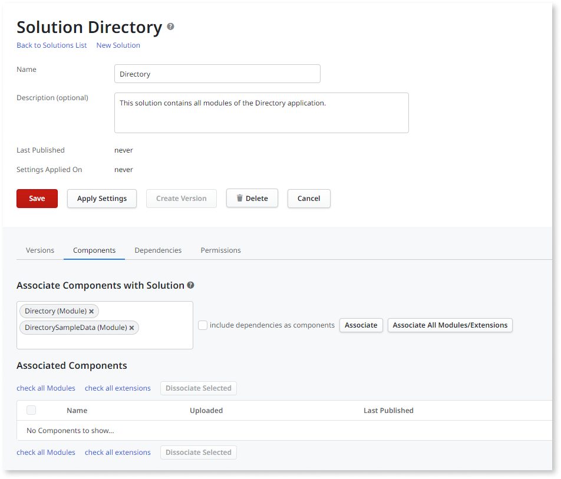

# Rollback to a Previous Version

This topic describes how to rollback to a previous version of an application.

In this example the 0.3 version of Directory was deployed to Production, and a critical bug was then detected. Since the bug is causing data to be inconsistent, the Operations team needs to rollback the application to its previous version.

## When to Rollback to a Previous Version?

Most of times, bugs found in Production are small and have low impact to the business. In those scenarios the team can simply [Apply a Hotfix](<apply-a-hotfix.md>).

In scenarios in which applying a hotfix is not possible due to the severity of the bug or time constraints, LifeTime provides you two ways to rollback an application to its previous version: create a tag based on a previous version or republish a Solution.

## Create a Tag Based on a Previous Version

In LifeTime it is not possible to deploy a version prior to the one running on the environment; instead, you need to create a new version. This lets you track what patches have been applied to a running application.

This version will be exactly the same as the stable version, since LifeTime lets you specify the modules when creating a version. In LifeTime, click in the Directory application to go to the application details screen.

In the Quality Assurance, click **Tag Version** to create a new version. By default tags are based on the latest version: click the ▼ button in front of the application version and choose the **0.2** option to specify that the version you are creating is the same as version 0.2.

Notice that by choosing the version 0.2 of the application as the base version for the tag, the version of the Directory, DirectorySampleData and all other modules of this application have also changed. LifeTime lets you specify the module versions that will be part of the tag.

Fill in the description for the tag and click **Tag Version** to create the new version.

You have just created the Directory version 0.2.1, that is exactly the same has the Directory 0.2. Now, simply deploy Directory 0.2.1 to Production. Learn how to [Deploy an Application](<deploy-an-application.md>).

## Rollback Outside the Infrastructure Management Console

Some software factories have complex internal processes to deploy applications, making it difficult to integrate OutSystems in their deployment procedures.

In such scenarios, another way to rollback to a previous version, is to create a Solution in the environment management console **before deploying a new version**. Solutions allow to aggregate several application modules (eSpaces and extensions) into a single deployable unit.

Simply go to Production management console (`https://<prod-environment>/ServiceCenter`), click **Factory** and then **Solutions**. In the Solutions screen, choose **New Solution**.

After the Solution is created you need to specify the modules that are part of it: **type 'Directory'**, **'DirectorySampleData'** in the input field.

Finally click **Associate** to include the specified modules in the solution.

Now that the 'Create Version' button is enabled, simply click and specify the version name and a description for this version.

Once you save, the version becomes available under the 'Versions' tab. To rollback to this version, simply click on the **Publish** button. Even though the solution is published via the environment management console, LifeTime automatically detects its version, so it displays in Production 'Directory 0.2'.
