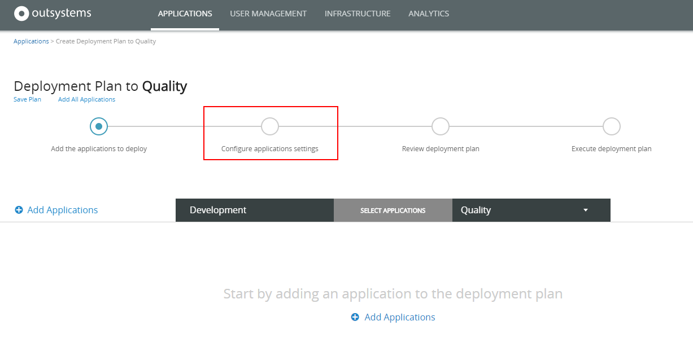
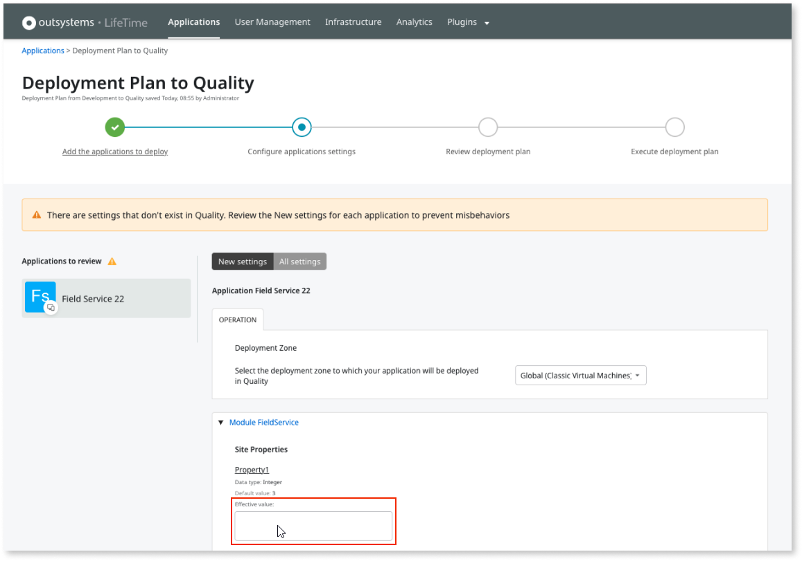
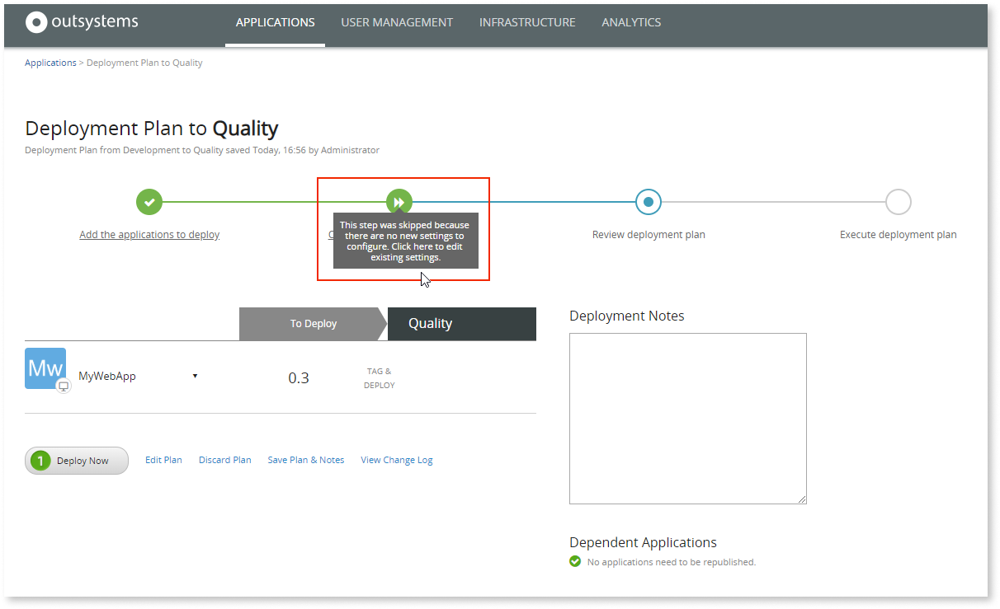

# Configure Site Properties During Deployment

You can configure your applications' Site Properties in the target environment during the deployment plan.

<iframe src="https://player.vimeo.com/video/734417155?h=793863e41d" width="750" height="375" frameborder="0" allow="autoplay; fullscreen" allowfullscreen=""></iframe>

Make sure the user executing the deployment has the "Change & Deploy Applications" permission for all applications in the deployment plan.

The deployment plan wizard enables you to configure the Site Properties of the applications being deployed during the step **Configure application settings**.

When deploying applications, after adding the applications to your deployment plan, the deployment plan wizard takes you to the step **Configure application settings**.

If there are application modules in the plan with new Site Properties that were never set in the target environment, you can define in this step the **Effective value** for those Site Properties in the target environment.

In the deployment plan wizard, you can also see and change the existing settings of the applications to deploy. Click the button **All settings** to see the existing settings.

Select an application from the applications list to the left to see the settings for that application. If your deployment plan contains applications with no changes, you will not be able to change the settings for those applications.

There are some situations when this step is **skipped** or **disabled**:

* The step is **skipped** when there are no new settings to configure. However, if you need to change any existing setting, you can manually go back to **Configure application settings** by clicking the step in the wizard.

    

* The step is **disabled** when there aren't any settings to configure or the user executing the deployment doesn't have the required permissions.

The Site Properties of the applications to deploy are set in the target environment after the applications are published. Beware of Timers that run `When Published`, since the Site Properties that the Timers may use are not yet updated when the Timers run.

To update the Site Properties' value in the target environment after the deployment, [use the Service Center console](configure-application-settings-after-deployment.md).

This feature doesn't apply to multi-tenant Site Properties.

