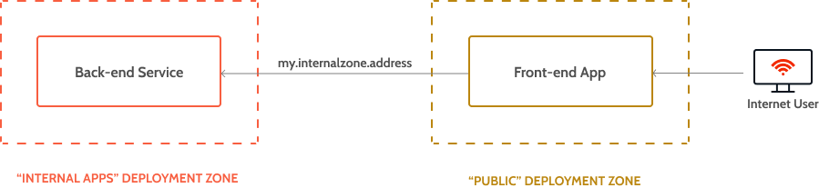
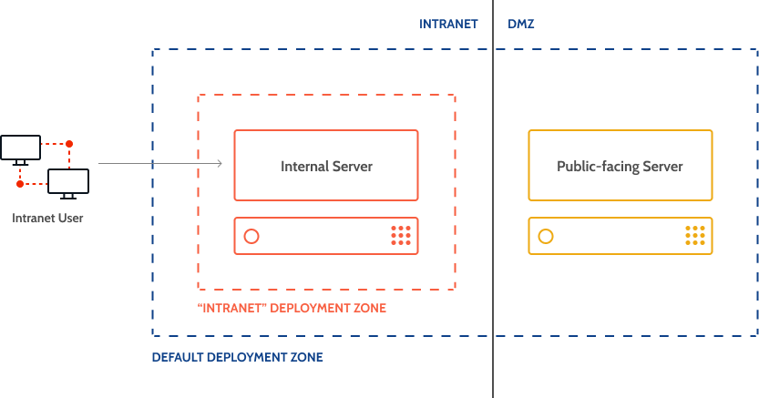
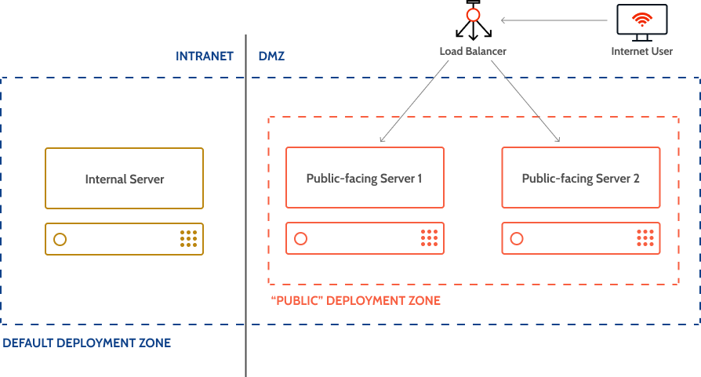

# Selective Deployment Using Deployment Zones

Only available in OutSystems on-premises installations.

Deployment zones allow you to define the distribution of applications by front-end servers on a farm environment.

Use deployment zones when you have servers with different purposes — for example, when some servers are in a DMZ ("demilitarized zone") network — and you want to choose into which servers OutSystems should deploy your applications.

Deployment zones provide isolation to applications by ensuring they're only deployed to the servers configured for a given deployment zone.

Each deployment zone has one or more servers. Servers can belong to several zones at the same time. However, you can only associate an application with a single deployment zone. You can define these configurations in Service Center.

When you do one of the following changes, OutSystems deploys the application to the servers configured for the (new) deployment zone and removes it from the servers that don't belong to that deployment zone:

* you updated the configuration of the deployment zone used by an application
* you changed the application configuration to deploy it to a different deployment zone

You can define that a deployment zone should automatically include all front-end servers available in the environment by activating the "Includes all Servers" configuration option. This avoids the manual task of adding a new server to the deployment zone each time you add a new front-end server to the environment.

You can configure deployment zones to perform one of the following kinds of deployments:

* deploying to a regular Internet Information Services (IIS) web server — a hosted technology named "Classic Virtual Machines"
* deploying to a [container-based infrastructure](<../../containers/app-run.md>), supporting different hosting technologies

When you change the deployment zone of an application to a deployment zone that uses a container-based hosting technology, you must republish your application for the changes to take effect.

Configuring the deployment zone of individual modules is **deprecated** since Platform Server 11.8. Even though applications with modules in different deployment zones are still supported, OutSystems will stop supporting this option in the future.

If you have applications with modules in different deployment zones, you must refactor and reorganize them to meet this restriction.

## Default deployment zone

The **default deployment zone** configuration controls where OutSystems deploys your new modules and applications. OutSystems creates a deployment zone named "Global" on a first install, set as the default deployment zone. You can make any other deployment zone the default one as long as its hosting technology is "Classic Virtual Machines".

As a rule, when you create a new application and publish it for the first time, the platform deploys its modules to the default deployment zone. Once you have published a module or application for the first time, you can select any other deployment zone as its deployment target.

Creating a new application module associates it automatically with the **same deployment zone** as the other modules in that application.

The OutSystems applications provided in the System Components solution must be available in **all the front-end servers** of your OutSystems environment. Make sure that you only deploy these applications to deployment zones that include all the front-end servers in your environment.

## Example

In the following example, we define three deployment zones:

* The "Internal Apps" deployment zone has two associated servers: Server 1 and Server 2
* The "B2E" deployment zone has one associated server: Server 2
* The "Public" deployment zone has one associated server: Server 3

Then, we configure three applications associating them with a given deployment zone:

* Application 1 is associated with the "Internal Apps" deployment zone
* Application 2 is associated with the "B2E" deployment zone
* Application 3 is associated with the "Public" deployment zone

The platform deploys the applications to the three servers according to the following diagram:

## Communication Between Applications in Different Deployment Zones

Sometimes applications need to communicate with other applications outside of their deployment zone. To achieve this they use the deployment zone address of the second application.

This is required for features like [Services](<../../../develop/reuse-and-refactor/services.md>), [Processes](<../../../develop/processes/intro.md>), [Timers](<../../../develop/timers/intro.md>), [Emails](<../../../develop/logic/emails.md>), and for management operations performed by Service Center.

### Example

In the following scenario, we have an application named "Front-end App" exposing the web interface for Internet users. This application reuses existing logic in the form of [Services](<../../../develop/reuse-and-refactor/services.md>) for its back-end. The "Back-end Service" was deployed in the "Internal Apps" deployment zone while the "Front-end App" was deployed to the "Public" deployment zone. This allows the "Back-end Service" to be isolated from the Internet users while also allowing its functionality to be accessed via the "Front-end App".

The "Back-end Service" is discovered by the "Front-end App" through the deployment zone address of the "Back-end Service". This address might vary according to your network architecture and is defined by you in the "[Deployment Zone Address](<reference.md>)" parameter when creating the deployment zone.

## Example Use Cases

In following examples we have an environment with multiple servers, one targeted at internal end users ("Internal Server") and one (or more) targeted at public end users ("Public-facing Servers").

### Explicitly Segmented Servers

Consider a scenario with two servers configured in the environment, in which the default deployment zone only includes the Internal Server:

* One server on a DMZ network, serving **public only** web applications accessed by external end users connected to the Internet.

* One internal server, serving **internal only** web applications accessed by internal end users.

You wish to deploy some web applications that are only available to internal end users and some other web application that are exclusively available to external end users. By default, a web application is deployed to the default deployment zone. However, this would make it available only in the internal server in the Intranet network.

To change the configuration of a web application so that it's only deployed to the public-facing server, do the following:

1. Create a new deployment zone (for example, named "Public") containing only the public-facing server.

    Note: The **Deployment Zone Address** configuration parameter, which is mandatory when creating the deployment zone, depends on several factors, like your network architecture and the hosting technology you selected for the deployment zone. Check the [Deployment Zones Reference](reference.md) for more information on this parameter.

1. Configure the web application to use the new deployment zone.

After these steps, the application you just configured is only deployed to the public-facing server, and it's removed from any other servers belonging to the previously configured deployment zone. Internet users access the application through the public server address.

If at a later stage you add a new module to the web application, it will be deployed to the same deployment zone ("Public").

### Internal Web Application

Consider a scenario with two servers configured in the environment, in which both are part of the default deployment zone:

* One server on a DMZ network, accessed by external end users connected to the Internet
* One internal server, accessed by internal end users

You wish to deploy a web application and make it available to internal end users only. By default, the platform deploys your web application to the default deployment zone. However, this would make it available in all servers, both the internal and the public-facing one in the DMZ network.

To change the configuration of the web application so that it's only deployed to the internal server, do the following:

1. Create a new deployment zone (for example, named "Intranet") containing only the internal server.

    Note: The **Deployment Zone Address** configuration parameter, which is mandatory when creating the deployment zone, depends on several factors, like your network architecture and the hosting technology you selected for the deployment zone. Check the [Deployment Zones Reference](reference.md) for more information on this parameter.

1. Configure the web application to use the new deployment zone.

After these steps, the application you just configured will only be deployed to the internal server, and it will be removed from any other servers belonging to the previously configured deployment zone. Internal end users will access the application through the internal server address.

If at a later stage you add a new module to the web application, it's deployed to the same deployment zone ("Intranet").

### Load Distribution for a Public Web Application

Consider a scenario with two public servers, accessible from the Internet, with all servers being part of the default deployment zone. You wish to deploy a web application for public access and distribute the load between the two available public servers. This requires that you set up a load balancer, a 3rd-party component, to split the load between the two.

To correctly deploy a web application to these two public-facing servers and do a load distribution between them, do the following:

1. Set up a load balancer that routes requests made to the application module URLs to one of the public-facing servers that will be part of the deployment zone.

1. Create a new a deployment zone (for example, named "Public") containing the two public-facing servers to handle requests made to the web application.  
    Set the **Deployment Zone Address** parameter to the Fully Qualified Domain Name (FQDN) of the load balancer.

   Note: The suggested value for the **Deployment Zone Address** parameter is only an example. The exact value depends on your specific network architecture and the hosting technology you selected for the deployment zone. Check the [Deployment Zones Reference](reference.md) for more information.

1. Configure the web application to use the new deployment zone.

After doing these configurations, the platform deploys your web application to the two public-facing servers. Users can access the web application using the address of the load balancer, which hands over the requests to the configured servers in the "Public" deployment zone.

## Limitations

Take the following limitations into account when using deployment zones:

* The platform always deploys System Components to the default deployment zone. Use the internal network configuration to limit the access to Service Center and LifeTime (available in Service Center in **Administration** > **Security** > **Network Security**).

* Processes, Timers and Emails require at least one server in the deployment zone of the application configured to execute them. Check the current configuration for all front-end servers in the environment in Service Center under **Administration** > **Servers** (requires **Full Control** permissions).
