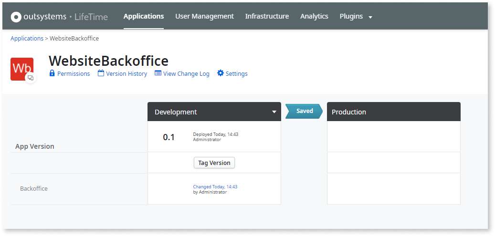
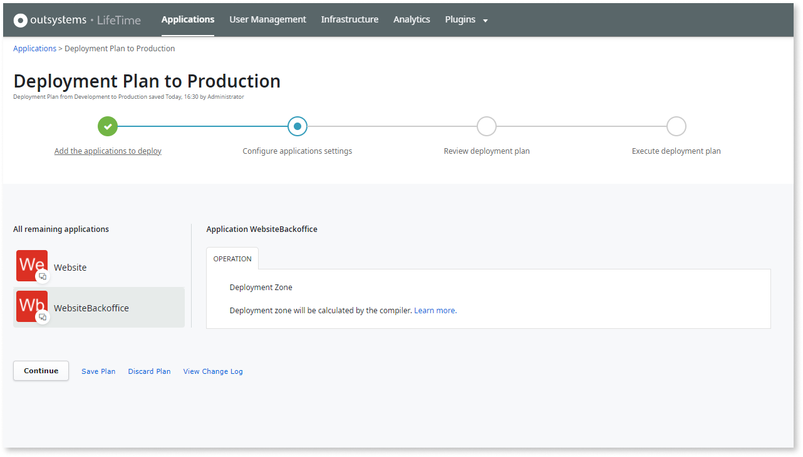

# Configure the Deployment Zone during the deployment

Only available in OutSystems on-premises installations.

When you [deploy an application](../deploy-an-application.md) to a target environment, you are able to choose the Deployment Zone to which your application will be deployed.

After adding the application to your deployment plan, when there are new settings to configure in the target environment the deployment plan wizard takes you to the step **Configure application settings**.

If your are deploying an application to that environment **for the first time** and the environment has more than one Deployment Zone, LifeTime enables you to select a Deployment Zone different from the default zone in the **Configure application settings** step.

When selecting a specific Deployment Zone during the deployment:

* LifeTime automatically sets that zone for the application in the target environment, and the application will be deployed there.

* All the modules of the application will be deployed to the selected Deployment Zone. If the application includes modules that already exist in the target environment inside other applications - even if deployed in a different Deployment Zone - those modules will be moved to the Deployment Zone selected during the deployment.

If the application **already exists** in the target environment, the deployment plan will skip the Deployment Zone configuration. However, you can still change the Deployment Zone for the application during the deployment by getting back to that setting in the **Configure application settings** step.

## Limitation to Deployment Zone configuration during the deployment

When deploying an application to a target environment **for the first time**, if the application **contains only** modules that already exist in the target environment inside other applications, it's not possible to select the Deployment Zone. In this case, the platform compiler will define in which Deployment Zone of the target environment the application is deployed.

In this scenario, to be able to select the Deployment Zone where you want the application to be deployed, you need to create a new application module, which will be deployed for the first time in the target environment.

### Example

Consider an application named **Website** containing two modules already deployed to the Production environment: the **Backoffice** module, and the **Frontoffice** module.

For proper segmentation accessing the different kind of modules, we created a new application, **WebsiteBackoffice**, and moved the existing **Backoffice** module to this application.

When deploying both applications to the Production environment, to properly segment the modules in the front-end servers, LifeTime will not allow selecting the Deployment Zone of **WebsiteBackoffice** application. This application will remain deployed in the previous zone.

To make sure the **WebsiteBackoffice** application can be deployed to a different Deployment Zone, we must add a new module (for example, a new **WebsiteServices** module) to the **WebsiteBackoffice** application.

When deploying the **WebsiteBackoffice** application to the Production environment again, you'll now be able to select the Deployment Zone for the application.

## Known issue

Up to LifeTime Management Console 11.10.5, there's an issue preventing the selection of a deployment zone different from the default for applications containing an existing module previously deployed in the target environment. This issue is solved in LifeTime Management Console 11.10.6.

