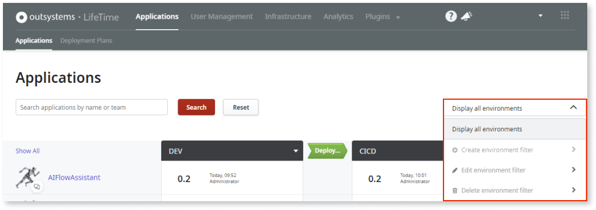
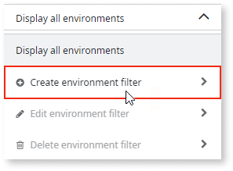
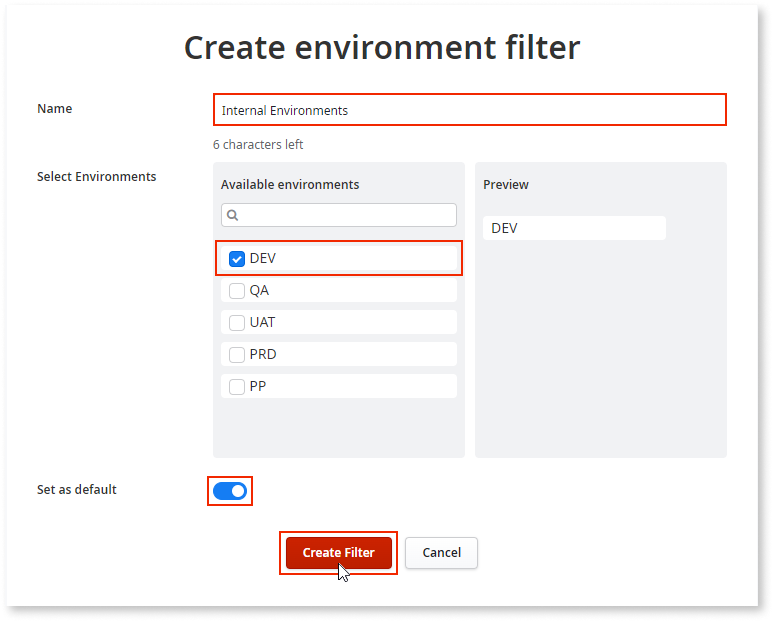
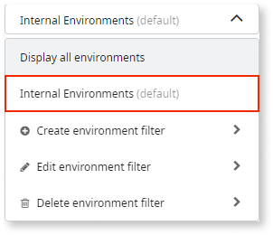
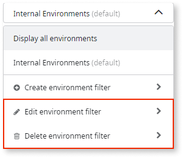
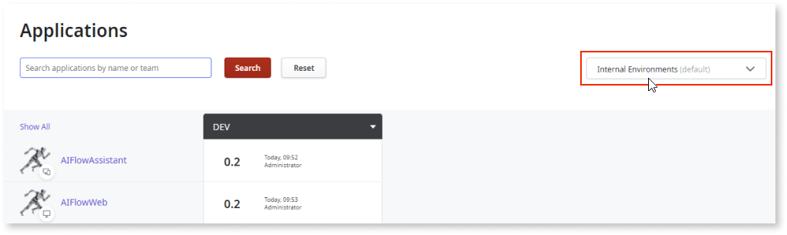
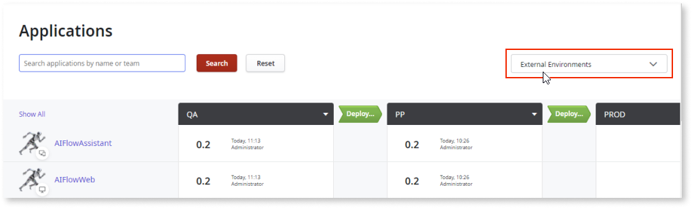

# LifeTime environment filters

 While not a prerequisite, some knowledge on the following topics is helpful for anyone using the environment filter feature:

* OutSystems infrastructure and environment:

    * [Setting Up OutSystems](../setup-maintain/setup/intro.md)

    * [Managing Your OutSystems Infrastructure](../managing-the-applications-lifecycle/initial-setup-of-an-infrastructure.md) (namely, adding or removing and reordering environments in an infrastructure)

* [Deployments and stagings with OutSystems](https://www.outsystems.com/evaluation-guide/how-does-outsystems-handle-deployment-and-staging/)

The landing page of the **LifeTime Management Console** (**Applications** list screen) gives IT users a high-level view of the state of their application portfolio. It provides information on the state of existing applications across the different environments that compose the infrastructure and it's the starting point for many  business needs, such as checking application details, staging application versions across environments up to managing user permissions, and infrastructure-level configurations.

## Benefits of using environment filters

With time, you might add new environments to your growing infrastructures and have to accommodate different CI/CD needs. For example, you might have a new specialized environment for integration testing, or you need a segmented app portfolio for separate delivery lines, depending on the target audience of the apps, such as internal facing apps versus external facing ones.

Infrastructure growth makes it difficult to monitor different CI/CD pipelines efficiently when the console displays the whole infrastructure, as opposed to a segmented one that suits your business needs.

To deal with this increased complexity, as of **LifeTime version 11.15.0**, OutSystems allows you to create custom views of the infrastructure, or environment filters. 

An environment filter is a subset of the infrastructure environments that you define, which helps you to focus on specific business cases, as opposed to the whole infrastructure. Create, edit, and delete as many environment filters as you need, and switch between them on the **Applications** list screen in LifeTime. Examples include creating a filter for your internal environments and another for your external ones. 

## Real-life examples of using environment filters

Here are 2 business cases that showcase the benefits of the new filters feature:

1. In a factory with multiple delivery lines, **an app deployer creates a filter that enables them to** select and focus only on the environments of the pipeline that are currently relevant for their work.

1. **A developer** that usually works with a small set of environments (out of the many that compose a factory) **creates a filter that enables them to** focus only on those, instead of having the whole factory visible by default.

### Creating an environment filter

**Prerequisite**: IT users require read access to the environment they want to create a filter for. 

To create an environment filter, follow these steps in LifeTime:

* In the **Applications** list screen, expand the environment dropdown list and select the option to create an environment filter.

    

* Enter a name for the filter and select the environments that you want to display in this new filter. Then, choose whether you want this filter to be the default screen for your applications list, and click **Create**.

    

As a result, the new filter is available to use. Edit or delete filters, as needed.

Each time you switch filters, the view is automatically updated to the selected filter.

## Conclusion

Ultimately, environment filters provide you with a customized view of your environments, thus giving you better visibility and oversight of your environments to better manage your pipelines and application lifecycle within each pipeline. Futhermore, using smaller environment filters can provide better response times for loading the applications list screen.
