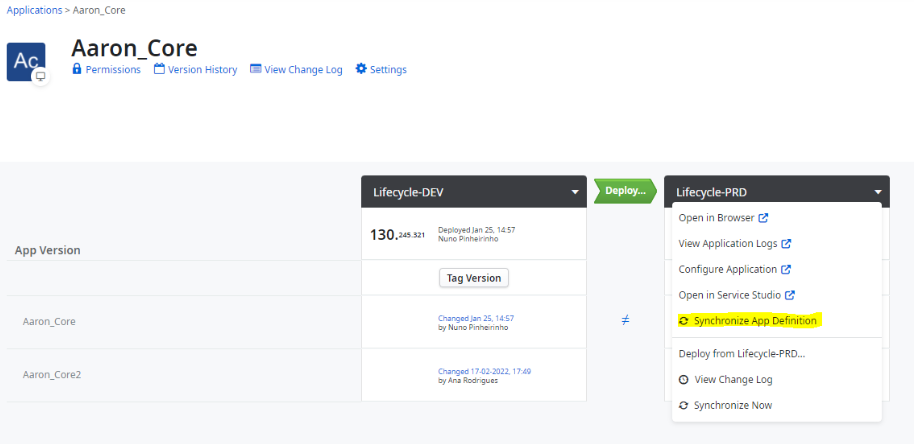

# Factory-Level-Application-View

Nowadays, LifeTime provides a unified view of several application attributes that can take different values depending on the environment in which the application is. These attributes are the application’s name, icon, and color. The information shown in LifeTime is based on the most recent changes to the application in Service Studio in the application details view.
If an IT user wishes LifeTime to show the name, icon and color an application has in a particular environment, they can go to the application’s details screen in LifeTime, and click the “Synchronize App Definition” option from the Environment Options dropdown (see Figure #1). 

***
Figure #1
***

