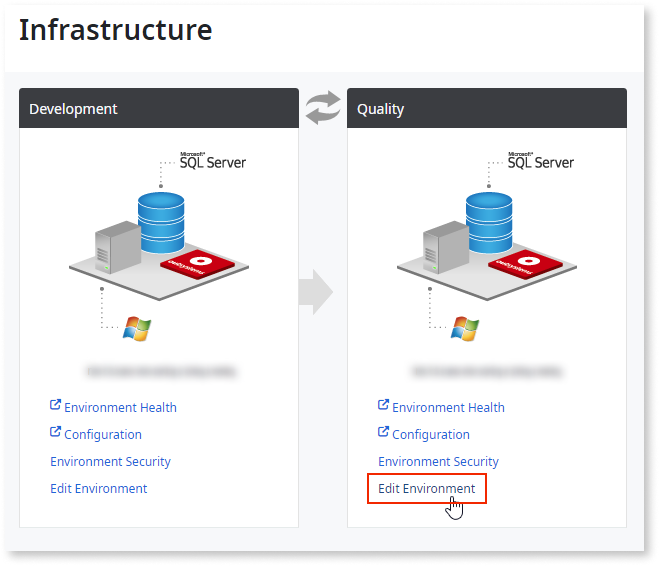
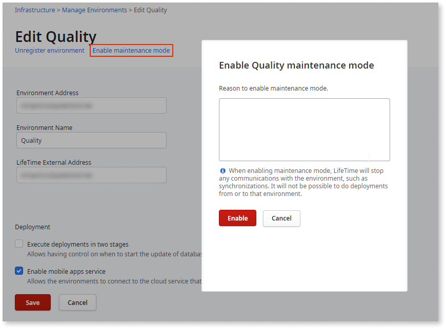

# Environment in maintenance mode

LifeTime continuously synchronizes information with all the registered environments. When there’s the need to perform maintenance on an environment, for example, when upgrading the Platform Server version, enabling **maintenance mode** avoids unnecessary communication attempts from the LifeTime console.

Maintenance mode is available from **LifeTime** version 11.9.0 onwards.

When an environment is in maintenance mode, LifeTime doesn't synchronize with that environment, and some operations are disabled.

LifeTime skips the following actions for an environment in maintenance mode:

* Synchronizing application
* Synchronizing IT users and permission models
* Synchronizing environment settings
* Propagating new Technical Preview features
* Propagating configuration for external authentication providers

Also, the following LifeTime operations are disabled for that environment:

* Tagging applications
* Deploying applications to or from the environment
* Operating deployment plans to or from the environment (for example, editing or retrying a plan)
* Changing application settings
* Testing applications (**Open in Browser** option for web apps, and **Test** option for mobile apps)
* Navigating to application details in the Service Center console (**View Applications Logs** and **Configure Application** options)
* Opening an application in Service Studio
* Creating new applications for a team
* Enabling or disabling Technical Preview features
* Creating new LifeTime plugins
* Synchronizing the environment
* Changing an environment’s security settings
* Editing environment details (applies only to self-managed environments)

Maintenance mode only affects communication between LifeTime and the environment with maintenance mode enabled. If an environment is online while in maintenance mode, developers can still reach it through Service Studio.

When disabling maintenance mode, LifeTime resumes the communication with the environment, and the environment is fully synchronized.

LifeTime tracks the enabling/disabling maintenance mode operations in the [audit logs](monitor-and-troubleshoot/monitor-usage-with-audit-logs.md).

In OutSystems Cloud, OutSystems manages your environments. When performing maintenance operations, OutSystems enables/disables maintenance mode accordingly.

For hybrid infrastructures, you can enable/disable maintenance mode for your self-managed environments (hybrid configuration is only supported in OutSystems licenses purchased before January 2020).

## Enable maintenance mode

In a **self-managed environment**, enable maintenance mode before executing planned maintenance. After completing maintenance, disable maintenance mode to resynchronize the environment with LifeTime.

To enable maintenance mode in an environment:

1. Go to your LifeTime console (`https://<your_lifetime_server>/lifetime`).

1. In the **Infrastructure** tab, click the **Edit Environment** link for the environment that needs maintenance. For self-managed environments in OutSystems Cloud, go to the **Environments** tab and select the environment.

1. Click the **Enable maintenance mode** link.

1. Type the reason for enabling maintenance mode and click **Enable**.

Maintenance mode is now enabled, and LifeTime doesn't communicate with the environment. LifeTime aborts any deployments or synchronizations in progress, and it records the operation and corresponding reason in the [audit logs](monitor-and-troubleshoot/monitor-usage-with-audit-logs.md).

## Disable maintenance mode

After you finish maintenance operations in your **self-managed environment**, disable maintenance mode:

1. Go to your LifeTime console (`https://<your_lifetime_server>/lifetime`).

1. In the **Infrastructure** tab, click the **Edit Environment** link for the environment in maintenance mode. For self-managed environments in OutSystems Cloud, go to the **Environments** tab and select the environment.

1. Click the **Disable maintenance mode** link.

1. Type the reason to disable maintenance mode and click **Disable**.

LifeTime resumes communication with the environment, and the environment starts synchronizing. LifeTime also records the operation and corresponding reason in the [audit logs](monitor-and-troubleshoot/monitor-usage-with-audit-logs.md).
