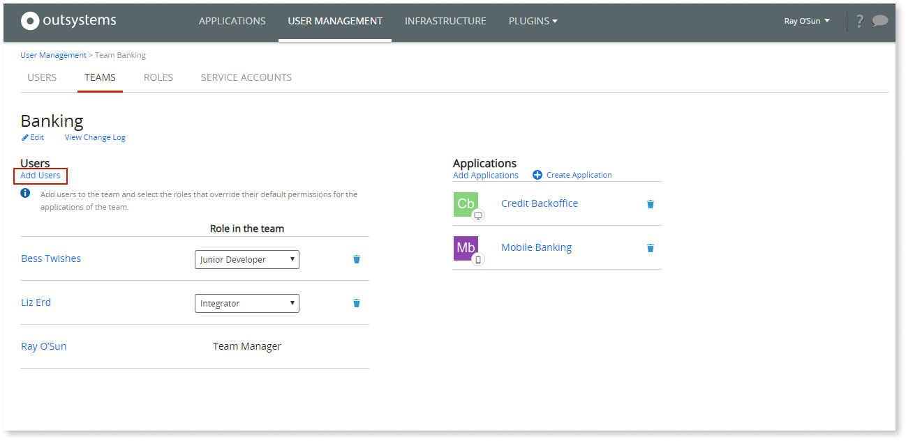
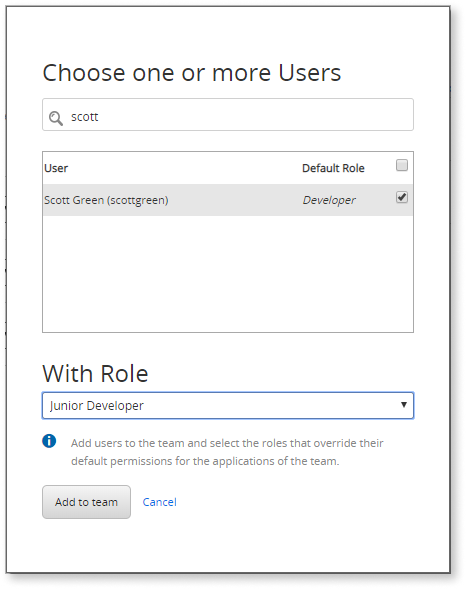

# Allow Managers to Handle Permissions of IT Teams

As an infrastructure manager, when someone joins your company you need to create a new IT user and assign the corresponding roles. This is tedious work but cannot be easily delegated, otherwise, the security of your infrastructure might be compromised.

To help you with this, OutSystems allows you to keep control of the users and teams that are created while delegating the permissions management to the team manager.

To do this:

1. [Create a new role](create-an-it-role.md#create-a-new-role) for the team manager that has the infrastructure-wide permission **Manage Teams and Application Roles**. The team manager will only be able to assign roles that have the same or lower permissions than his/her own. Therefore, you must set the permission levels for each environment to the maximum level that the team manager needs to assign to the team.  

    

1. [Add the team manager to the team](create-an-it-team.md#add-it-users-to-the-team) with the new role.  

    

When a new user joins the company, the infrastructure manager still needs to [create the user](create-an-it-user.md) and set the default role. Then, the team manager can add the user to the team.

When adding the user to the team, the team manager can only assign a role that has the same or lower permissions than his/her own.

