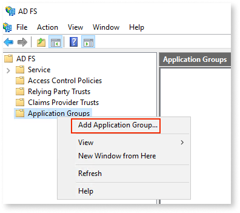
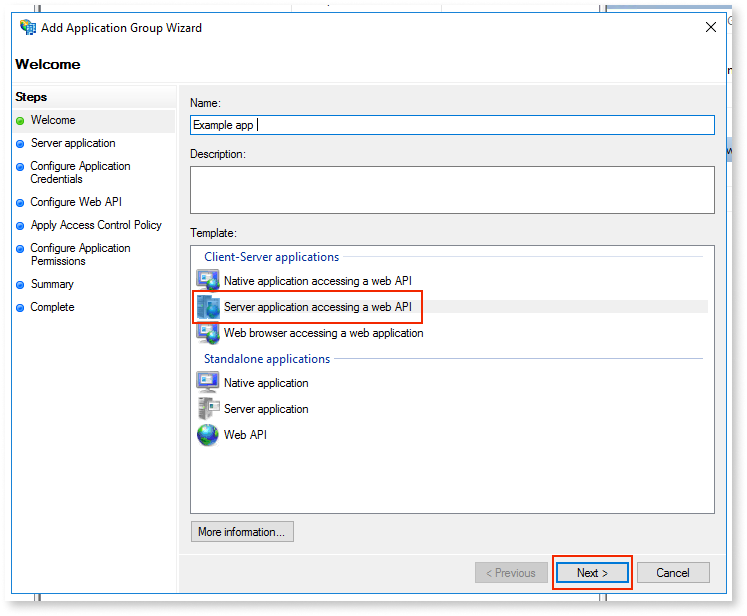
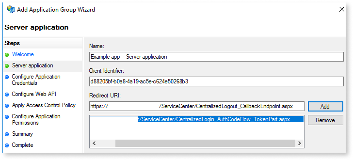
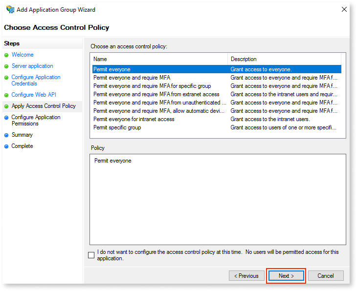
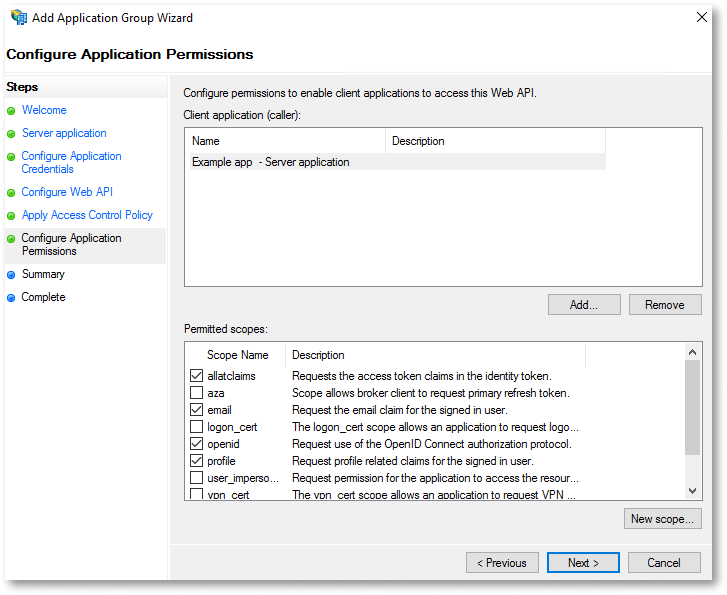
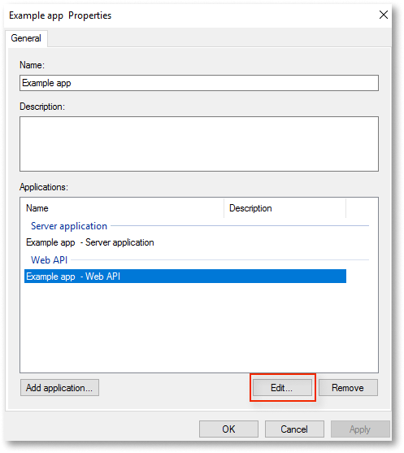
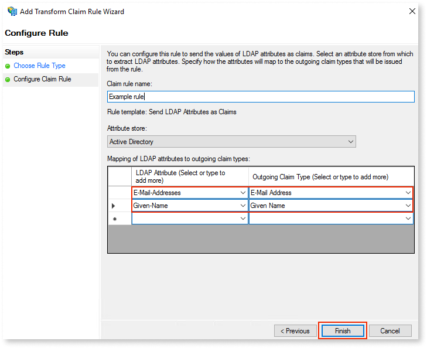
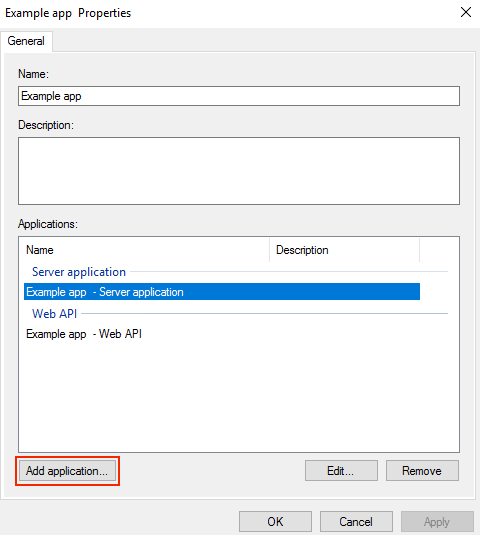
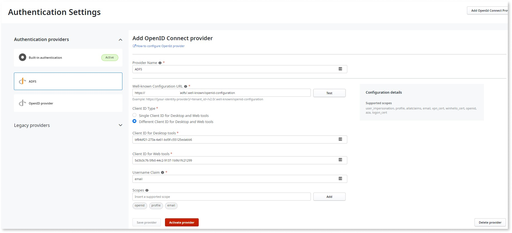

# Configuring Active Directory Federation Services as external identity provider

To configure Active Directory Federation Services (AD FS) as an external IdP, follow these steps:

1. [Create applications in AD FS](#create-applications-in-ad-fs)
1. [Create users in Lifetime](#create-users-in-lifetime)
1. [Configure AD FS as OpenId connect provider in LifeTime](#configure-ad-fs-as-openid-connect-provider-in-lifetime)

## Prerequisites

* Connected to AD FS server
* Users exist in the server’s active directory’s user store.
* The IdP initiated sign-on is activated on the AD FS server.You can check this using the following URL: ``https://<ADFShostname>/adfs/ls/idpinitiatedsignon``

## Create applications in AD FS 

To log into web tools such as LifeTime and Service Center using an external IdP, you must create a combination of [server apps](#create-a-server-app) and a Web API app in AD FS. Additionally, to log into desktop tools such as Service Studio and Integration Studio using an external IdP, you must create a combination of [native apps](#create-a-native-app) and a [Web API app](#create-a-web-api-for-the-native-app) in AD FS.

### Create a server app

1. Open **Windows Administrative Tools** > **AD FS**. Right-click **Applications Groups** and select **Add a new application group**.

    

1. Select **Server application accessing a Web API template** and enter a meaningful application **Name**. Click **Next**.  

    

1. Add the Redirect URI to Service Center login and logout page from the Lifetime environment:

    * ``https://<LT_ENV>/ServiceCenter/CentralizedLogin_AuthCodeFlow_TokenPart.aspx``

    * ``https://<LT_ENV>/ServiceCenter/CentralizedLogout_CallbackEndpoint.aspx``

        

1. Copy the **Client Identifier** (required in later steps) and click **Next**.

1. Select the **Generate a shared secret** checkbox and copy the secret for later use. Click **Next**.

1. Set the **Identifier** as the **Client Identifier** that was copied in step 4. Click **Next**.

1. Choose an access control policy and click **Next**.

    

1. Set **Configure Application Permissions** by allowing recommended scopes. For AD FS to work with OutSystems platform, **openid**, **email**, **profile**, and **allatclaims** scopes must be added.

    

1. Click **Next** and complete the setup. 

    The application is created in Application Groups.

1. Add the following **Issuance Transform Rules** for the newly created application to map the outgoing claims.

    a. Right-click the app you just created and select **Properties**. 

    b. Select the Web API application and click **Edit**. 

    

    c. Select the **Issuance Transform Rules** tab and click **Add Rules**.

    d. Set the **Claim rule template** as **Send LDAP Attributes as Claims** and click **Next**.

    e. To configure a claim rule, set the **Attribute store** as **Active Directory**. Map some LDAP attributes to outgoing claims such as **E-Mail-Addresses** and **Given-Name**. Click **Finish** and apply the changes.

    

### Create a native app

1. To set up the native application, right-click on the newly created app and select **Properties**. 

1. Select the Server application and click **Add application**.

    

1. Select **Native application** and click **Next**.

1. Add the following Redirect URIs for Mobile and Desktop applications:
    * ``integrationstudio://auth``
    * ``servicestudiox11://auth``   
    * ``https://experiencebuilder.outsystems.com/Authentication/OIDC_Callback``
    * ``https://workflowbuilder.outsystems.com/Authentication/OIDC_Callback``
    * ``https://integrationbuilder.outsystems.com/Authentication/OIDC_Callback``
    * ``https://aimentorstudio.outsystems.com/Authentication/OIDC_Callback``
    * For each OutSystems environment in your infrastructure (excluding LifeTime), add an Integration Manager’s URI:
        * ``https://<YOUR_ENV>/OSIntegrationManager/OIDC_Callback``

1. Copy the **Client Identifier** (required in later steps), click **Next** and finish the setup.

### Create a Web API for the native app

1. Right-click on the  app and select **Properties**. 

    Three applications are displayed. A native application, a server application, and a Web API application.

1. Click **Add application** to add a new Web API to map the native application and click **Next**.

1. Set the **Identifier** as the native **Client Identifier** that was copied in step 5 of [Create a native app](#create-a-native-app). Click **Next**. 

    Repeat step 7 to step 10 of the [Create a server app](#create-a-server-app) for this newly created Web API application.

The AD FS setup is now complete.

**Note**: The following is an example of a well-known URL of the AD FS server:

 ``https://<ADFShostname>/adfs/.well-known/openid-configuration``. 

You can find your AD FS server endpoints by going to **Windows Administrative Tools** > **AD FS Management**> **Service > Endpoints**.

## Create users in LifeTime

1. Login to LifeTime and navigate to **User Management** > **Users** and click **New User**.

1. Complete the user creation form. 

    The **Username** must be as per the claim rule set in AD FS, for example, email.

## Configure AD FS as OpenId connect provider in LifeTime

You can configure AD FS as an external IdP by navigating to **Lifetime** > **User Management** > **Authentication Settings** using the the following details for the OIDC provider information:

* **Provider name**: Anything of choice
* **Well-known Configuration URL**: ``https://<ADFShostname>/adfs/.well-known/openid-configuration``
* **Client ID Type**: Different Client ID for Desktop and Web tools
* **Client ID for Web tools**: Copied in step 4 of [Create a server app](#create-a-server-app)
* **Client ID for Desktop tools**: Copied in step 5 of [Create a native app](#create-a-native-app)
* **Username Claim**: email (or whatever has been configured at the time of setting up AD FS)
* **Scopes**: Click the Test button next to the well-known configuration URl. It recommendeds scopes.
* Click **Save Provider** then **Activate provider**. Enter the  client secret and select **Activate and Log Out**.

    
