# Configuring Microsoft Azure AD authentication

To configure Microsoft Azure AD authentication, follow these steps:

1. [Register an application](#register-an-application)

1. [Configure the platform - Web apps](#configure-the-platform---web-apps)

1. [Configure the platform - Mobile and desktop apps](#configure-the-platform---mobile-and-desktop-apps)

1. [Configure the client secret](#configure-the-client-secret)

1. [Configure Azure AD Open ID permissions](#configure-azure-ad-open-id-permissions)

1. [Configure Azure AD as OutSystems' Identity Provider](#configure-azure-ad-as-outsystems-identity-provider)

## Register an application

1. Access the Microsoft Azure portal.

1. Go to **Azure Active Directory** -> **App registrations**.

1. Click  **+ New registration**.

    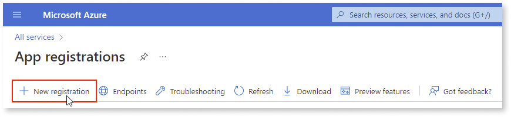

1. Enter the **Name** and **Supported account type**.

    Example:

    * **Name**: OutSystems Platform

    * **Supported account type**: Accounts in this organizational directory only

1. Click **Register**.

## Configure the platform - Web apps

1. Go to **Authentication** and click **+ Add a platform**.

    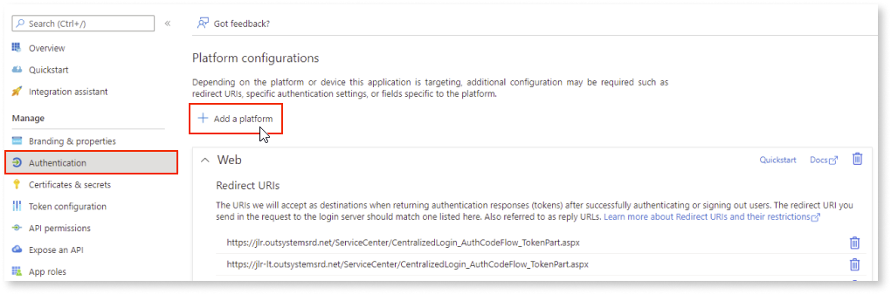

1. From the **Configure platforms** screen, click **Web**.

    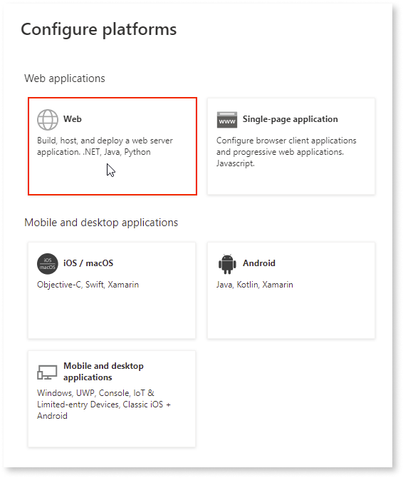

1. Set the **Redirect URI** to the Service Center login page from the LifeTime environment:

    * ``https://<LT_ENV>/ServiceCenter/CentralizedLogin_AuthCodeFlow_TokenPart.aspx``

    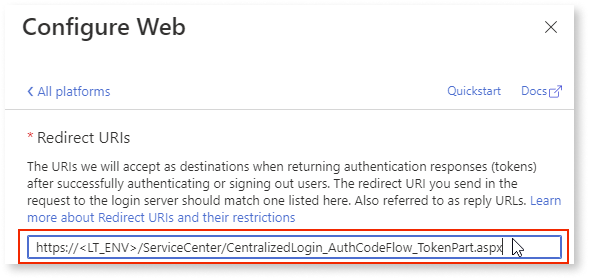

1. Click **Configure**.

1. For each of the environments in your infrastructure, add a new URI for the Service Center login page:

    * ``https://<YOUR_ENV>/ServiceCenter/CentralizedLogin_AuthCodeFlow_TokenPart.aspx``

    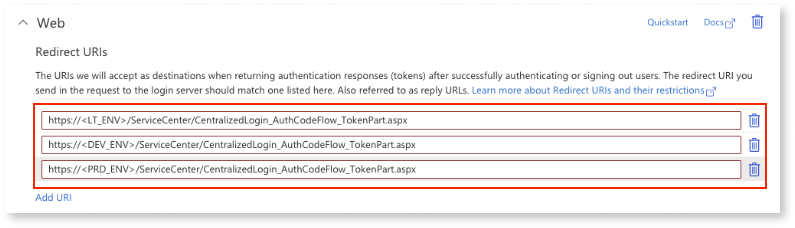

1. Click **Save**.

## Configure the platform - Mobile and desktop apps

1. Go to **Authentication** and click **+ Add a platform**.

    

1. From the **Configure platforms** screen, click **Mobile and desktop applications**.

    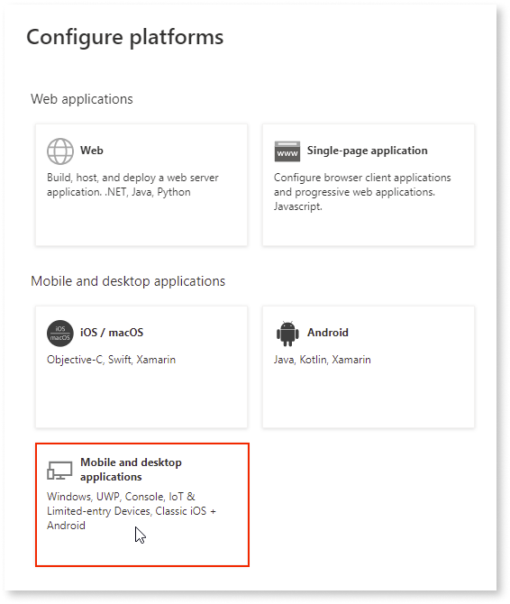

1. Set the **Custom redirect URIs** to the following Service Studio protocol:

    * ``servicestudio://auth``

    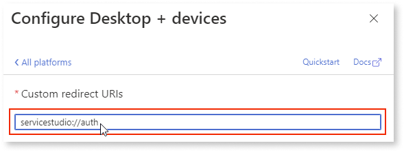

1. Click **Configure**.

1. Add the following URIs to the **Mobile and desktop applications** section:

    * ``integrationstudio://auth``

    * ``servicestudiox11://auth``

    * ``https://experiencebuilder.outsystems.com/Authentication/OIDC_Callback``

    * ``https://workflowbuilder.outsystems.com/Authentication/OIDC_Callback``

    * ``https://integrationbuilder.outsystems.com/Authentication/OIDC_Callback``

    * ``https://aimentorstudio.outsystems.com/Authentication/OIDC_Callback``

    * For each OutSystems environment in your infrastructure (excluding LifeTime), add an Integration Manager’s URI:

        * ``https://<YOUR_ENV>/OSIntegrationManager/OIDC_Callback``

1. Click **Save**.

## Configure the client secret

1. Go to the **Certificates & Secrets** > **Client  secrets** and click **+ New client secret**.

    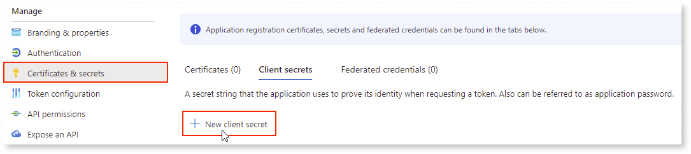

1. On the **Add a client secret** screen, enter the following details:

    * **Description**: Platform Consoles

    * **Expires**: Recommended: 6 months

    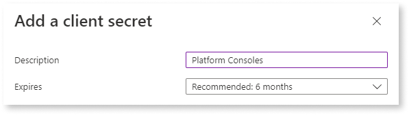

1. Click **Add**.

1. On the **Client secrets** tab, copy the secret in the **Value** column and store it somewhere safe.

    

     You need this information when configuring the provider in LifeTime. **This value won't be displayed again, so ensure you save it now.**

    

    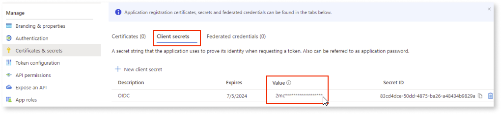

## Configure Azure AD Open ID permissions

1. Go to **API Permissions** and click **+ Add a permission**.

    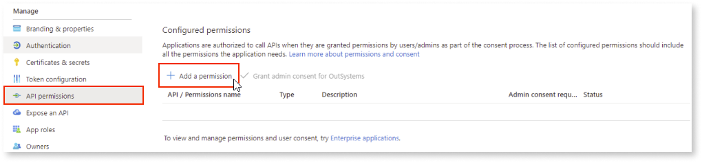

1. From the **Request API permissions** screen, go to **Microsoft APIs** and select **Microsoft Graph**.

    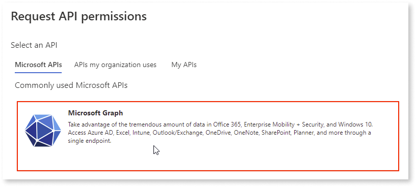

1. Select **Delegated permissions**.

    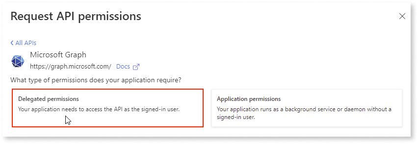

1. Select all **OpenId permissions**.

    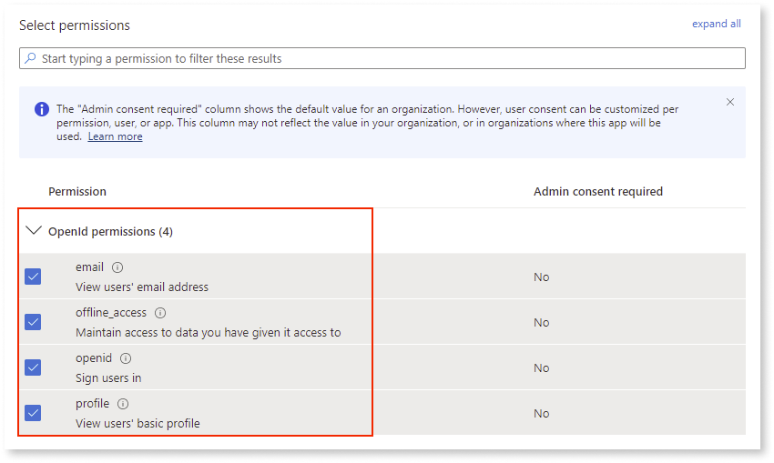

1. Click **Add Permissions**.

## Configure Azure AD as OutSystems' Identity Provider

To finalize and activate the Azure AD configuration for IT users, follow these steps:

1. Access the LifeTime console.

1. Go to **User Management** > **Authentication Settings**, and click **Add OpenId Connect Provider**.

1. Enter the following Azure AD details in the form:

    1. **Name**: ID Provider (for example, Azure AD OIDC)

    1. **Well-known Configuration URL**: OpenID Connect metadata document URI.

        **Note** This URI can be found in the Azure Portal by navigating to the **Azure Active Directory** > **App Registrations** > **Endpoints**, and copying the **OpenID Connect metadata document** link.

        

    1. **Client ID Type**: Select the option **Single Client ID for Desktop and Web tools**.

    1. **Client ID**: Fill in with the **Application (client) ID** that is found in the Azure Portal's **Azure Active Directory** service and **Overview** tab.

        

    1. **Username Claim**: The claim used to match the username field of the user configured in LifeTime which will need to be  ``preferred_username`` for Azure AD. For more information about claims, see [Standard Claims](https://openid.net/specs/openid-connect-core-1_0.html#StandardClaims).

1. Click **Save Changes**.

1. Before making Azure AD the effective IdP, make sure to test the configuration and ensure that the Azure AD users have a corresponding user created in the OutSystems platform first.

1. Click **Activate**.

1. In the pop-up window that will appear, fill in the **Client Secret** stored earlier.

1. Click the **Activate and Logout** button to start using Azure AD as the external Identity Provider of the OutSystems platform.
