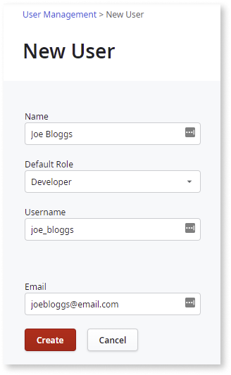

# Configuring LifeTime authentication

To configure the external provider (OIDC) in LifeTime, follow these steps:

1. Access the Lifetime console.

1. Go to **User Management** > **Authentication Settings** and click **Add OpenId Connect Provider**.

    

    If there’s no local administrator configured, a warning pop-up displays advising you to add a local administrator account before configuring the external provider. With the external provider activated, if the SSO login method fails, the local administrator can help unblock users by configuring the username and password for them.

1. Check the **Set administrator as local administrator** checkbox and click **Configure Provider**.

    

    The existing administrator is migrated and a local administrator is automatically created. For more information about creating a local administrator account, see [Adding a local administrator](#adding-a-local-administrator). 

1. Enter the following details according to the OIDC provider you are using:

    1. **Name**: ID Provider

    1. **Well-known Configuration URL**: OpenID Connect metadata document URI

        You can validate the URL using the **Test configuration** link. 

    1. **Client ID Type**: Select one of the following:

        * Single Client ID for Desktop and Web tools

        * Different Client ID for Desktop and Web tools

            If you choose the **Use a different Client Ids for Desktop and Web tools** option, enter the following:

            * **Client ID for Desktop tools**: Native Application’s Client ID
           
            * **Client ID for Web tools**: Web Application’s Client ID

    1. **Client ID**: Client ID for both desktop and web tools.
        
    1. **Username Claim**: Claim used to match the username field of the user configured in LifeTime. By default, the claim is ``email``. For more information, see [Standard Claims](https://openid.net/specs/openid-connect-core-1_0.html#StandardClaims).

        **Note**: For Azure and OKTA use ``preferred_username`` as the **Username Claim** value.

    

1. Click **Save Changes**.

1. Click **Activate**.

    The **Activate OpenID Connect provider** pop-up is displayed. 

    

1. Enter the **Client Secret**.

1. Select the **Clear all local user’s passwords now (Recommended)** checkbox.

    For more information about clearing user’s passwords, see [Clearing built-in password credentials](#clearing-built-in-password-credentials).

1. Click **Activate and Log Out**. 

    

Once activated, you are logged out of the current session and redirected to the login page of the currently active OIDC provider login page.

**Note**: Once the OpenId Connect provider is activated, users  can no longer use the fallback built-in authentication mechanism. In the case of any issues with the external IdP, designated break-glass users, also known as local admins, can login using a username and password to deactivate the OpenID Connect provider and enable any alternative authentication mechanism.

If an OpenId Connect provider is activated before the LifeTime upgrade, to gain access to the complete feature set, you must deactivate and reactivate the provider again. OutSystems recommends having at least one [local administrator added](#adding-a-local-administrator) before activating OIDC. To deactivate the existing OpenId Connect provider, the built-in authentication mechanism must be activated and then OpenId Connect provider must be reactivated. Note that the client secret is required when you activate the OpenId Connect provider.

## Deactivating the external identity provider

Only one external identity provider method can be active at a time. When you activate one authentication mechanism, you automatically deactivate the currently active external identity provider.

## Managing Users

The auto-provisioning of IT Users is not available. Therefore, you must create users manually even though OIDC providers can authenticate users regardless of their presence in LifeTime. The platform still requires that users exist in LifeTime so that they can be identified correctly when they successfully log in using the external IdP.

When creating a new user in LifeTime, if an external IdP configuration is active, it’s not necessary to enter a password. This is because the authentication happens on the external IdP side. This way, users are forced to use the IdP authentication. Apart from basic user information, such as name, email, and role, the user is identified by matching the LifeTime **username** with the **username claim** value of the external Idp.

### Adding a local administrator

If the external IdP is unavailable or has configuration errors, the local administrator is responsible for configuring user profiles. With the external IDP activated, only the local administrator can log into the platform using a username and password. 

You can create a local administrator before or after adding a new OIDC connection. It is recommended that you add at least one local administrator before activating an OIDC provider. This ensures that there is always a fallback authentication option for the user to log into the platform.

Local administrators are only able to log in to LifeTime.

To add a local administrator, follow these steps:

1. Access the LifeTime console.

1. Go to **User Management** > **Authentication Settings** and click **Add local administrator**.

    

1. Add the relevant details and click **Create**. 

    

Once you add the local administrator, you can log in using `<domain>/LifeTimeSDK/Internal_Login.aspx?`. 

### Clearing built-in password credentials

Once the OpenID Connect provider is activated, the fallback of using the built-in provider is no longer available. As the built-in user credentials are not going to be used, we recommend clearing the built-in user passwords. In the case of any issues with the external IdP, designated break-glass users, also known as local admins, can login using a username and password to deactivate the OpenID Connect provider and enable any alternative authentication mechanism.

* **Option 1**

    When activating the OIDC provider, in the **Activate OpenID Connect provider** pop-up, select the **Clear all local users passwords now (Recommended)** checkbox and click **Activate and Log Out**.

    

* **Option 2**

    If you don't clear the passwords when activating the OIDC provider, a warning message displays on the **Authentication Settings** screen. Click **Clear passwords now**.

    
