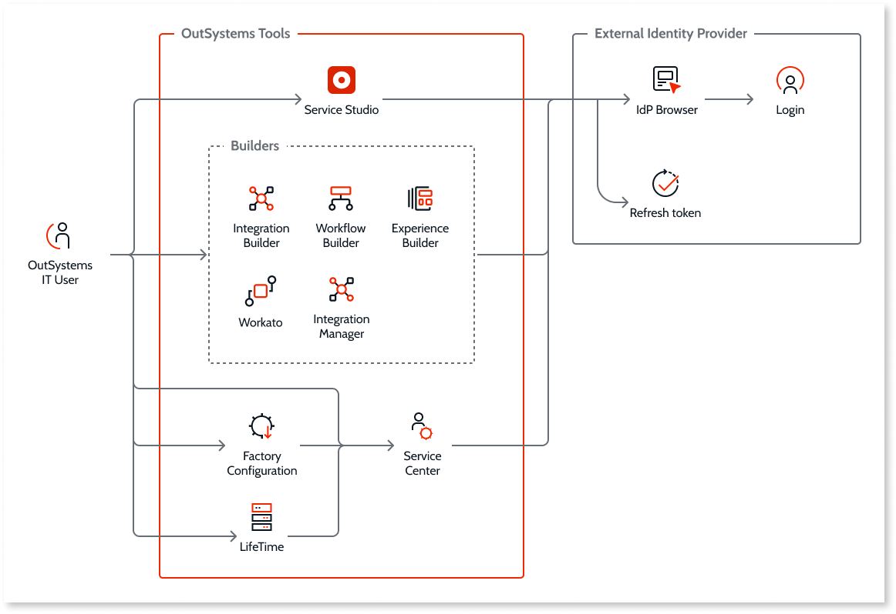

# IT Users Integration with External IdP via OpenId Connect

The **IT Users Integration with External IdP OpenId Connect (OIDC)** feature enables you to implement modern security standards to the authentication, setup, and management of IT users. The main goals of the feature are to:
* Reduce the risk associated with using unsecure passwords to access business-critical digital assets.
* Reduce the risk of managing multiple Identity Providers (IdPs). 
* Improve the authentication experience offering a single sign-on (SSO) method across the company.

## Feature summary 

The **IT Users Authentication with External IdP (OIDC)** feature enables:

* Secure the authentication of IT users, making sure that only authorized users have access to OutSystems tools and management consoles across environments.
* Secure access to OutSystems management consoles and tools by following customer compliance policies integrated with external IdPs, which use authentication best practices, for example, multi-factor authentication, password complexity, expiration, and rotation.
* Efficient authentication by using SSO across the company, which avoids users having to recall different credentials for different systems.
* External IdP login practices; creating users without a password forces them to log in using the external IdP. **Note**: It's also possible to add or remove the password for any existing users previously created after you enable the OIDC feature.

## Login flow 

You can integrate an external IdP by configuring the OIDC protocol in LifeTime. IT Users can log into the following OutSystems tools using their company IdP credentials in a new external IdP login flow: 

* Service Center (SC)

* Lifetime (LT)

* Service Studio (SS)

* Integration Studio (IS)

* Integration Builder

* Experience Builder

* Workflow Builder

* Factory Configuration 

* Workato

Applications that use Service Center as a user provider and that implement the regular authentication flow using the [User_GetUnifiedLoginUrl](https://success.outsystems.com/Documentation/11/Reference/OutSystems_APIs/Users_API#User_GetUnifiedLoginUrl) API are also covered by this feature.

The following diagram shows the flow for the IT Users Integration with External IdP (OIDC) feature when you activate it.

## Limitations

Tools that **don’t** enforce the external IdP flow use the username and password login authentication or [LT login authentication plugins](../use-an-external-authentication-provider.md). The following tools **do not** enforce the external IdP flow:

* [OutSystems Solution Pack (OSP) Tool](../../../setup-maintain/setup/unattended-install/osp-tool-ref.md) 

* Custom apps that use Service Center as a user provider and don’t use the [User_GetUnifiedLoginUrl](https://success.outsystems.com/Documentation/11/Reference/OutSystems_APIs/Users_API#User_GetUnifiedLoginUrl) API

## Prerequisites

The **IT Users Authentication with External IdP (OIDC)** feature requires the following versions of OutSystems components:

* Platform Server 11.18.1 

* LifeTime 11.16.1

* Service Studio 11.53.13

* Integration Studio 11.14.17

* Factory Configuration 11.1.1

To use an IT User as an End User in an OutSystems Reactive app, you must [configure the single sign-on between app types](../../secure-the-applications/configure-authentication.md).

**Note**: This only applies to custom apps that use Service Center as a user provider. 

To avail of the IT Users Authentication with External IdP (OIDC) feature, **all** environments registered in LifeTime and Factory Configuration **must** meet the prerequisites.

