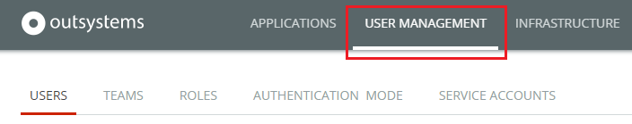

# Manage IT Users

This section applies to **IT users** like OutSystems developers and Administrators.  
To learn more about managing the **end users** of your OutSystems applications, check [End User Management](../../develop/security/end-user-manage/intro.md).

OutSystems allows you to define the permissions of IT users using a [role-based permission model](about-permission-levels.md). This model enables you to set up the permissions of your IT users for simple to complex security policy needs, as you can:

* Set up the permissions of a small team using only the built-in default roles, Developer and Administrator.
* [Create additional roles](create-an-it-role.md#create-a-new-role) to better control the different permission levels of a larger team.
* [Use teams](create-an-it-team.md) to manage an enterprise-grade security policy, where you have many applications and users.
* [Grant or revoke permissions to users for specific applications](grant-it-roles-for-a-specific-application.md) without using teams.

Manage your IT Teams in the **USER MANAGEMENT** area of your LifeTime console (`https://<lifetime_env>/lifetime`).

To manage IT teams, you must be an infrastructure manager.
