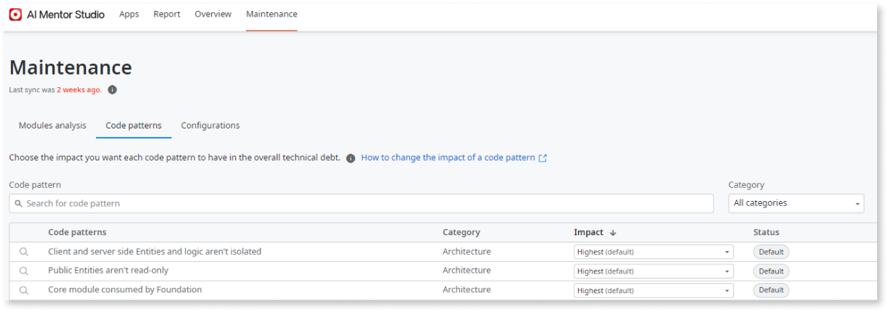
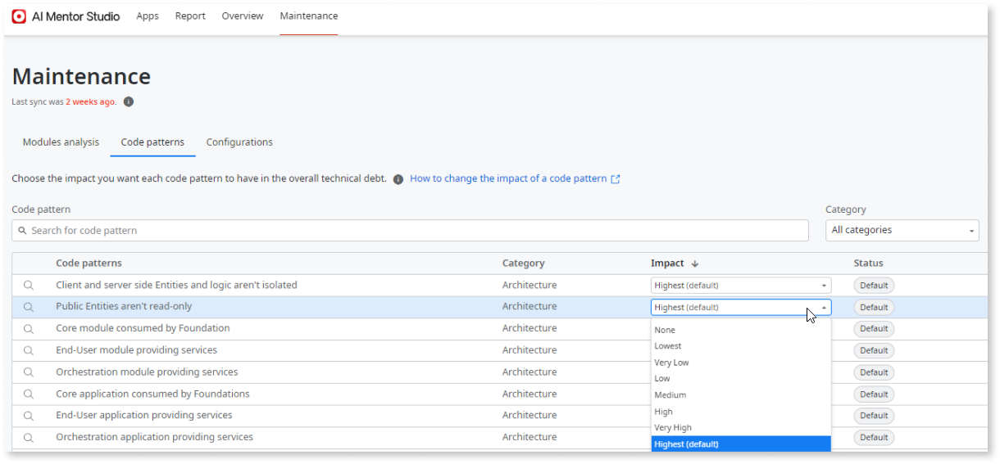
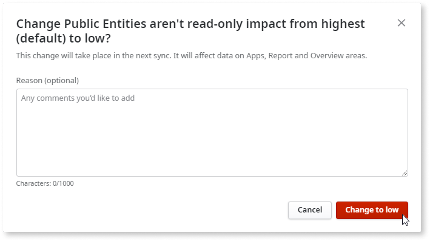

# Change the impact level of a code pattern on your technical debt

Before changing a code pattern's impact level, consider the impact on your infrastructure of that specific code pattern. Review the full list of [code patterns](code-patterns/ref-code-patterns.md) analyzed by AI Mentor Studio.

AI Mentor Studio calculates your technical debt considering each code pattern's specific weight and the number of findings of that pattern. For more information, see [how AI Mentor Studio calculates and shows technical debt](tech-debt-formula.md).

The predefined weight for each code pattern may not always fit your organization's needs. To allow you to manage your specific technical debt priorities and best practices, you can customize the weight each code pattern has on your total technical debt. 

The weight of a code pattern is defined by the **Impact** level you choose in the **Maintenance** area of AI Mentor Studio. The impact levels go from None to Highest. A code pattern whose impact is defined as None will not be considered for the overall technical debt calculation, but the findings will still be counted. The **Status** of a code pattern tells you if its weight has been customized or not. If the status is set as Customized, the pattern's predefined impact level has been changed; If the status is set as Default, the pattern has the impact level predefined by AI Mentor Studio.

## Change the impact level of a code pattern

To change the impact level of a code pattern on your total technical debt, follow these steps:	

1. Access AI Mentor Studio, and go to **Maintenance** > **Code Patterns**.

1. Choose the code pattern you want to customize.

1. In the **Impact** column, use the dropdown to select the impact level for the code pattern.

    

    

    Select the magnifying glass icon on the left of each code pattern name to know more about that pattern. 

    

1. Optionally, enter a reason for the impact change. Click **Change to &#60;new impact level&#62;** to confirm.

    

    The chosen impact levels reflect on the technical debt calculation only on the next synchronization. For more information, see [how to request a synchronization](how-force-sync.md).

You can change the impact level of a code pattern at any point. To revert to the default option, select the default level from the **Impact** dropdown.

