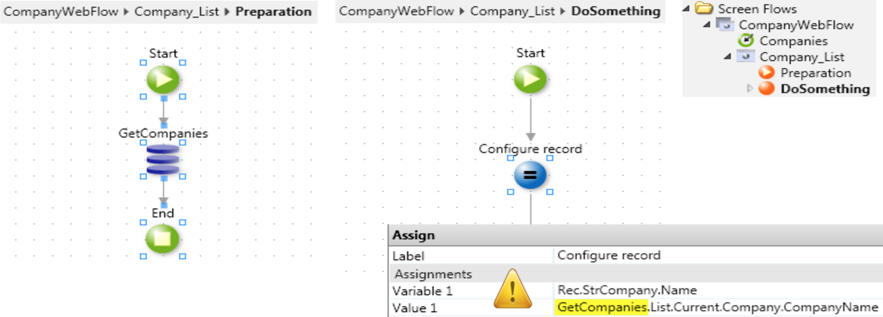

# Don't abuse scope information

All the local variables of a screen and the results of queries or actions from the preparation are kept in the scope of the entire screen. You can reference Local variables in the Preparation, in the screen itself and in  screen actions.

## Impact - think Viewstate

The screen scope is practical, but it should be used carefully in screen actions.

Keep in mind that a Screen Action execution is the result of a request to the Web Server, different from the initial request to the screen that generated the local variables and preparation data.

Any information scope required in all Screen Actions will be placed in the Viewstate that is sent back and forth between requests. Even if some data is required by only one of the Screen Actions, it will be passed to all the screen actions - because the viewstate is unique per screen. Sometimes information kept in the viewstate isn't even used, simply because the Screen Action requiring that information is never hit.

In conclusion, the use of scope information in a Screen Action enlarges the viewstate, increasing the network traffic between the server and the browser. This is why Ajax can become slower and page load performance decrease.

## Best practices

To limit the Viewstate size, make sure you aren't referencing large data from the screen scope in your Screen Actions.

It's acceptable to reference local screen variables or the Preparation result of a small type for example, an integer or an Id.

Don't reference any Structure, record list or large text.
Instead, do the following:

* Reload queries and rerun actions - it's better to repeat the work at server side, than save these calls by reusing the result from the preparation at the cost of sending large information back and forth in the viewstate.

* Pass information in screen action parameters - if certain information is used only by a screen action, passing it in a parameter instead of referencing the scope will guarantee that it won't be passed to other screen actions in the viewstate.

Parameters are also a clean way to pass the minimum context information to rerun queries or execute actions inside the Screen Action. For example, pass the `TableRecord.List.Current.Customer.Id` in a parameter instead of referencing it inside the screen action (which would include the entire `TableRecord.List` in the Viewstate).
