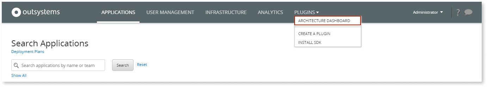

# How to associate an Infrastructure with your Architecture Dashboard account

Before you can see an Infrastructure in Architecture Dashboard, you need to associate your Architecture Dashboard account with that Infrastructure.

## Before you start

Make sure the [setup of Architecture Dashboard](how-setup.md) has been completed in the Infrastructure and that the Architecture Dashboard Probes are updated to the latest available version.

## Associate an Infrastructure with your Architecture Dashboard account

To associate an Infrastructure with your Architecture Dashboard account, follow these steps:

1. Make sure you are logged off from Architecture Dashboard.

1. Go to **LifeTime** (`https://<lifetime_environment>/lifetime`) and **Login**.

`<lifetime_environment>`is the address of the LifeTime Environment for the Infrastructure that you are associating with your account.

1. Select **Plugins** \> **Architecture Dashboard**.

    

    

    If your LifeTime does not have a **Plugins** menu, select **More** \> **Architecture Dashboard**.

    

1. Select **Go to Architecture Dashboard**.

1. In Architecture Dashboard, log in with your Community email and password.

    

1. Check the **Installation details** and read the **privacy policy** carefully.

1. If you agree with the privacy policy, select the check box and then select **Agree and continue**.

After completing these steps your Infrastructure is associated with your Architecture Dashboard account.
