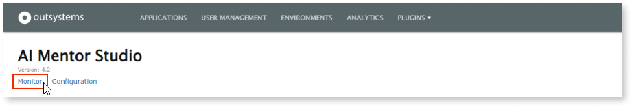

# How to request a synchronization

Architecture Dashboard is now AI Mentor Studio.

Synchronization of data between the AI Mentor Studio LifeTime probe and the AI Mentor Studio SaaS occurs every 12 hours, but you may also request unscheduled synchronizations. 

There's a daily limit to the number of unscheduled synchronization requests that AI Mentor Studio can process for each infrastructure. You can request up to 5 unscheduled synchronizations after each scheduled synchronization.

To request an unscheduled synchronization, follow these steps:

1. Go to the AI Mentor Studio LifeTime plugin (`https://<lifetime_environment>/AIMentorStudioProbe/`) and select **Monitor**.

    

1. Select **Request Synchronization**.

    

After these steps, the synchronization request enters the **Outbound Queue** as **SyncRequest**.

Select **Refresh** to update the queues and check changes to the status of **SyncRequest**.

