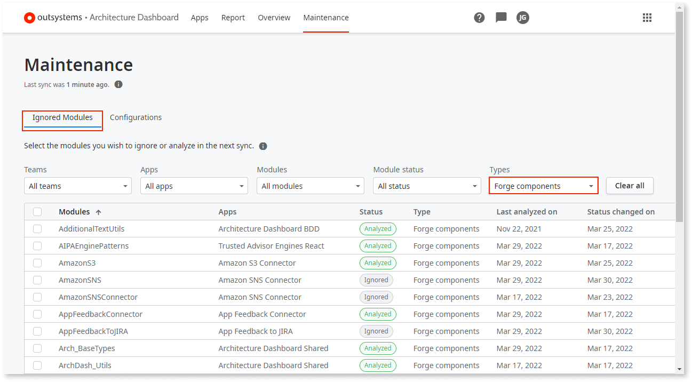
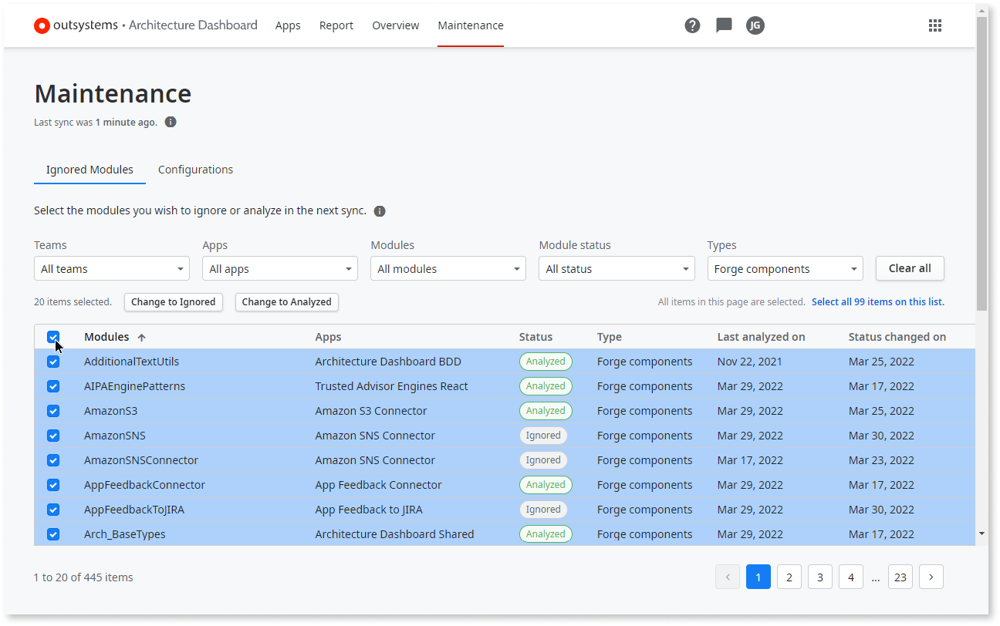
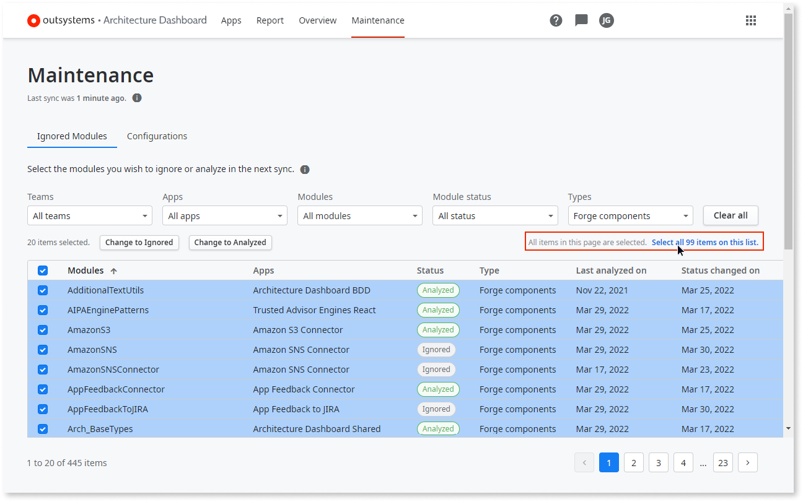
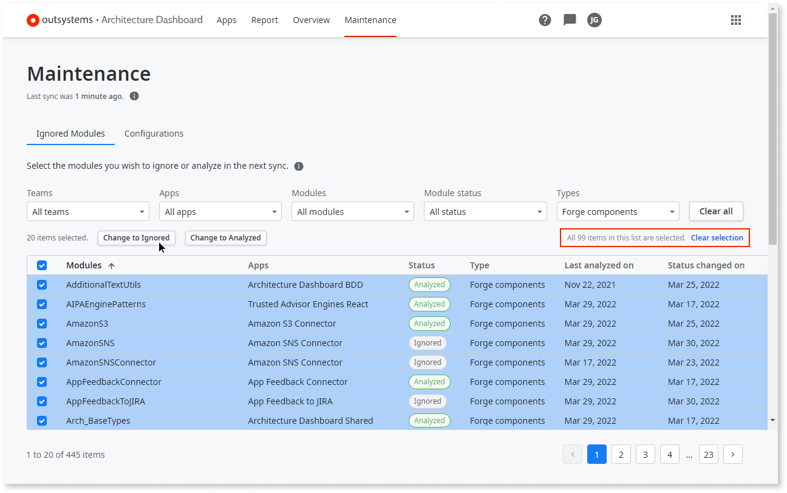
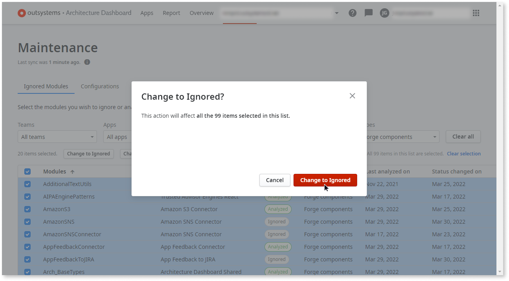

---
tags:
summary: You can ignore classes of modules during tech-debt analysis in AI Mentor Studio.
guid: 70460AD8-7C84-4D86-9E83-2274E9802B93
locale: en-us
---

Architecture Dashboard is now AI Mentor Studio.

# Ignoring modules during tech debt analysis

**AI Mentor Studio** provides an integrated, bird’s eye view of technical debt across an entire portfolio of applications and the interdependencies between modules in the developers’ environment.

However, analyzing every module in a factory can result in a misleading technical debt score. To help your development team get a realistic picture of the portfolio's technical debt, you can ignore certain modules during the analysis.

Modules that might be ignored include:

* Proof-of-concept or demo applications
* Applications that have not changed for an extended period of time, possibly because development was halted
* Experimental or preliminary applications that are not meant for production
* Forge components integrated, as is, into applications

**AI Mentor Studio** gives architects and team leads the ability to ignore individual modules—or to bulk-select whole classes of modules—so they will be ignored during the technical debt evaluation of your factory’s portfolio.

For more information about permissions to access this feature, see [How does AI Mentor Studio work](https://success.outsystems.com/Documentation/11/Managing_the_Applications_Lifecycle/Manage_technical_debt/How_does_Architecture_Dashboard_work#Permissions).

To select modules to ignore:

1. Go to the **Maintenance** tab of **AI Mentor Studio**.
    
1. On the **Maintenance** page, click **Ignored Modules** to get a list of all modules in your infrastructure, which includes filtering options for finding specific modules to ignore.
    

You can use the following filters to fine-tune your choices, and then sort the results by the column headers.

* Teams
* Apps
* Modules
* Module status
* Types

## Batch selection of modules

In some cases, **OutSystems** recommends ignoring entire classes of modules during technical debt analysis, such as demo apps that are not meant to be released to production.

Ignoring **[Forge](https://www.outsystems.com/forge/)** components in **AI Mentor Studio** is another good practice. **OutSystems** developers rely on the **Forge** to accelerate the design process. Components that are used as-is do not have to be included when calculating your infrastructure’s technical debt.

To ignore **Forge** components in technical debt analysis:

1. Go to the **Maintenance** tab.
1. Click **Ignored Modules**.
1. Select **Forge components** from the **Types** dropdown.
    
1. Click the select all box in the header. 
    This selects all of the components on the current page.
    
1. The information area under the filters tells you how many modules have been selected on the current page. Click **Select all &lt;n> items on this list** to add **Forge** components on all pages to the selection.
    

1. The information area now tells you that all components on all pages have been selected. Click **Change to Ignored**. 
    
1. Click **Change to Ignored** in the popup window that asks you to confirm that you want to ignore all of the selected components, including those beyond the displayed page.
    

All of the selected components/modules are marked to be ignored during future technical debt evaluations.

## Ignoring individual modules

In some cases you may wish to fine-tune your selections. As one example, you may ignore old or discontinued modules, as follows:

1. In the **Maintenance** page click **Clear all** if the **Ignored Modules** page shows the results of a previous search.
1. Sort the modules by the **Last analyzed on** column (or the **Status changed on** column, depending on what criteria you wish to use).
1. Click the specific modules to ignore during analysis.
1. Click **Change to Ignored**.
    

    

    When all modules in an app are changed to **Ignored**, the app itself is also ignored during analysis. In a like manner, if one or more modules of a previously ignored app is changed to **Analyzed** the app itself will also be analyzed.
    
    

