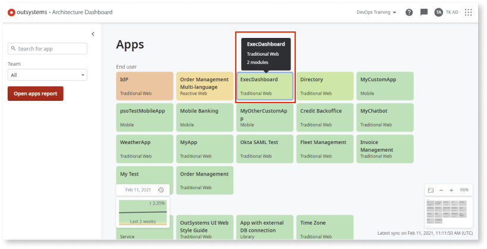
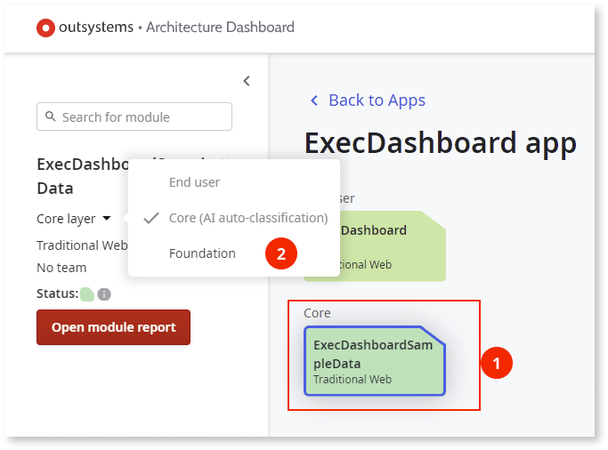
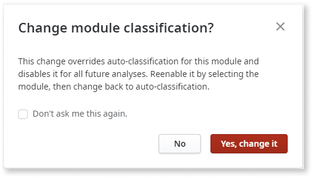

# How to change module classifications

You can change a module's classification in the canvas. However, by changing the classification of a module, the classification of the app may be affected. OutSystems AI model receives this reclassification.

## Prerequisites

Before changing a module’s classification in Architecture Dashboard, make sure that the following requirements are met:

* You have [enabled AI auto-classification](how-enable-autoclass.md).

* You have [full control permissions assigned as a default role](how-works.md#maintenance-and-operations-permissions)

## Change module classifications

To change a module’s classification, follow these steps:

1. In the Architecture Dashboard canvas, double-click the app that contains the module you want to reclassify.

    

1. Select the module you want to reclassify, and in the module details area, from the dropdown, select the new architecture layer. 

    

    When you reclassify the module classification, the **Change module classification** popup is displayed letting you know that all auto-classification for the module will be overridden.

      

1. Click **Yes, change it**. 

When you reclassify a module, the technical debt score related to architecture code patterns is recalculated immediately.
