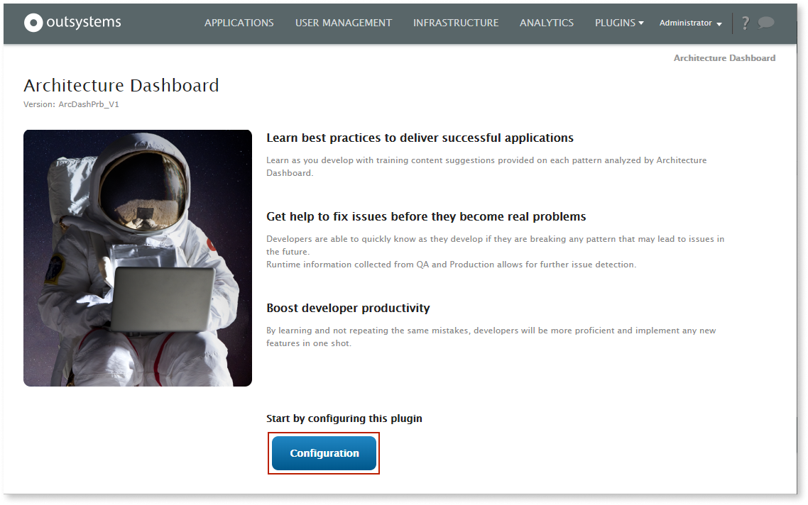
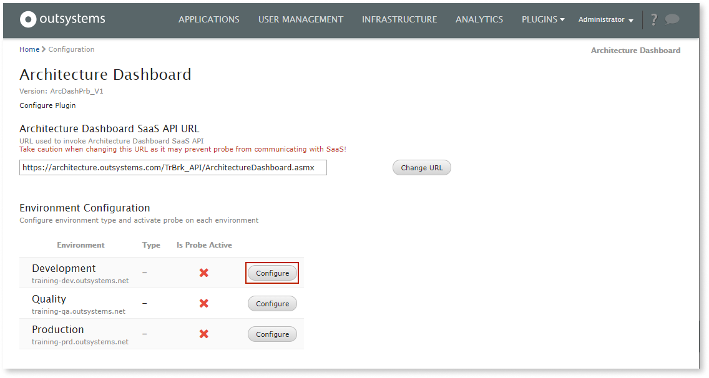
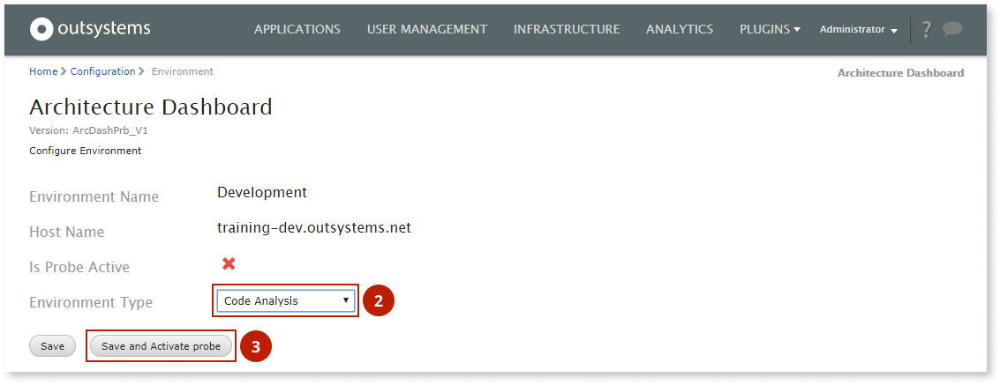

---
tags:
summary: Learn about pre-requirements and how to setup Architecture Dashboard.
en_title:
locale: en-us
guid: e1303736-5727-4eb9-82a1-dc7039b26731
app_type: traditional web apps, mobile apps, reactive web apps
---

# How to configure Architecture Dashboard probes in OutSystems 10

1. Go to **LifeTime** (`https://<lifetime_environment>/lifetime`). 

1. Select **Plugins** \> **Architecture Dashboard**.

    

    

    If your LifeTime does not have a **Plugins** menu, select **More** \> **Architecture Dashboard**.

    

1. Select **Configuration**.

    

1. Confirm that **Architecture Dashboard SaaS API URL** is set to `https://architecture.outsystems.com/Broker_API/ArchitectureDashboard.asmx`

    

    This is the URL used to connect to Architecture Dashboard SaaS.
    Do not change the URL otherwise the plugin will stop working.
    

1. Activate the Development environment probe by following these steps:

    1. In the **Environment Configuration** section, select the **Configure** button for **Development** environment.

        

    1. Select **Code Analysis** as the **Environment Type**.

    1. Select **Save and Activate probe** and confirm.

        

1. Activate runtime performance analysis by following these steps:

    1. In the **Environment Configuration** section, select the **Configure** button for the environment where you want to analyze runtime performance, usually the Production or Quality Assurance environment.

    1. Select **Runtime Performance** as the **Environment Type**.

    1. Select **Save and Activate probe** and confirm.

    

    You can only set one Type for each Environment.  
    Furthermore, you can only set each Type once.

    

1. Select **Go to Architecture Dashboard**.

1. After you are redirected to Architecture Dashboard, associate your IT user with Architecture Dashboard:

    1. Check the **Installation details** and read the **privacy policy** carefully.

    1. If you agree with the privacy policy, select the check box and then select **Agree and continue**.
