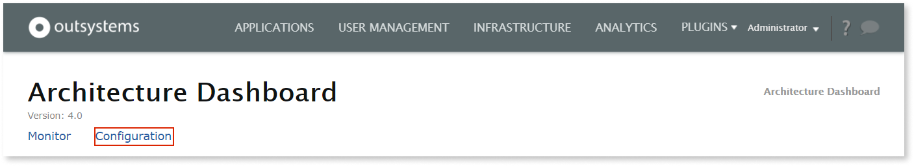
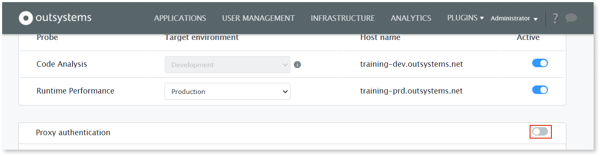
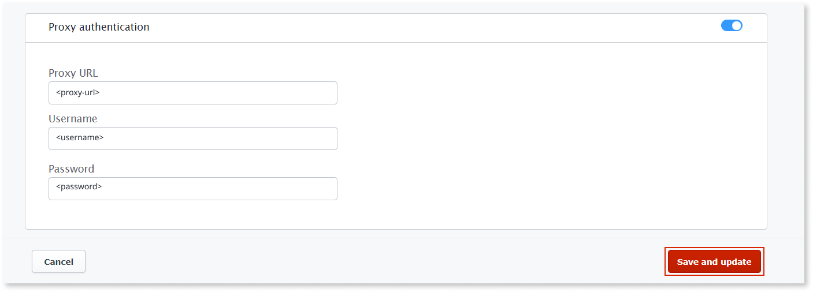

# How to use a proxy to connect to Architecture Dashboard

The Architecture Dashboard plugin can use a forward proxy while connecting to the Architecture Dashboard Software as a Service (SaaS).

## Prerequisites

Before configuring the proxy in Architecture Dashboard, make sure that the following requirements are met:

* Your infrastructure uses **version 4.0 or higher** of the **Architecture Dashboard probes**.

## Configure the forward proxy

To configure the proxy, follow these steps:

1. Go to the Architecture Dashboard LifeTime plugin (`https://<lifetime_environment>/ArchitectureDashboardProbe/`) and select **Configuration**.

    

1. In the **Configuration** screen, turn on the **Proxy authentication** toggle.

    

1. In the **Proxy configuration** section, enter the proxy URL and the credentials.

1. Select **Save and update**.

    

After these steps the Architecture Dashboard plugin uses the proxy you configured when connecting to the Architecture Dashboard SaaS.
