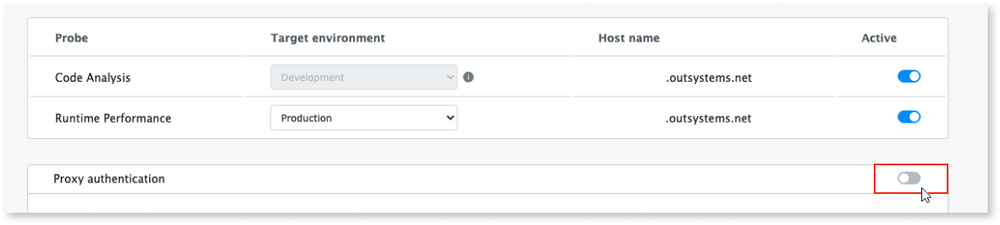

# How to use a proxy to connect to AI Mentor Studio

Architecture Dashboard is now AI Mentor Studio.

The AI Mentor Studio plugin can use a forward proxy while connecting to the AI Mentor Studio Software as a Service (SaaS). 

## Prerequisites

Before configuring the proxy in AI Mentor Studio, make sure that the following requirements are met:

* Your infrastructure uses **version 4.0 or higher** of the **AI Mentor Studio probes**.

## Configure the forward proxy

To configure the proxy, follow these steps:

1. Go to the AI Mentor Studio LifeTime plugin (`https://<lifetime_environment>/ArchitectureDashboardProbe/`) and select **Configuration**.

    

1. In the **Configuration** screen, turn on the **Proxy authentication** toggle.

    

1. In the **Proxy configuration** section, enter the proxy URL and the credentials.

1. Select **Save and update**.

    

After these steps the AI Mentor Studio plugin uses the proxy you configured when connecting to the AI Mentor Studio SaaS.
