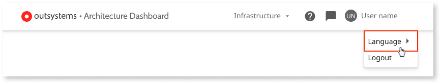
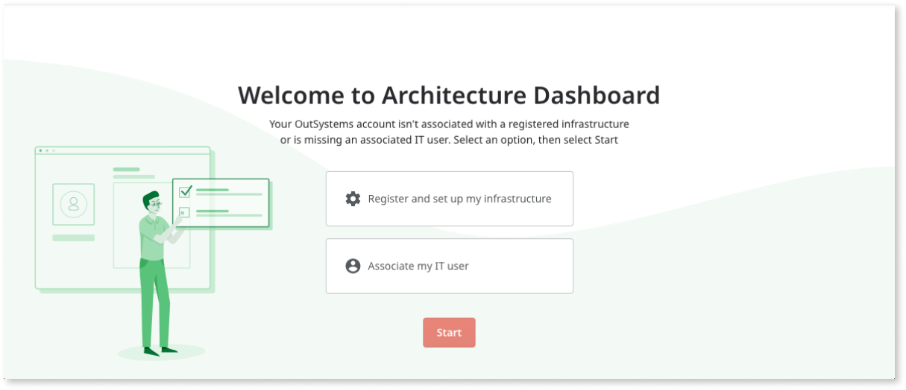
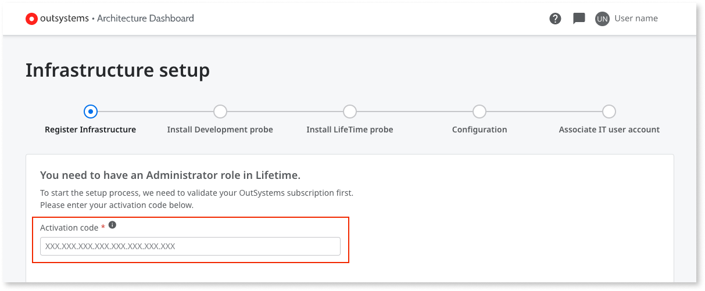
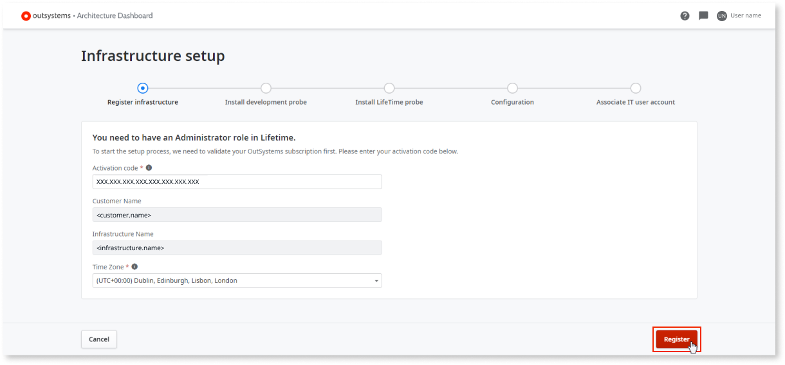
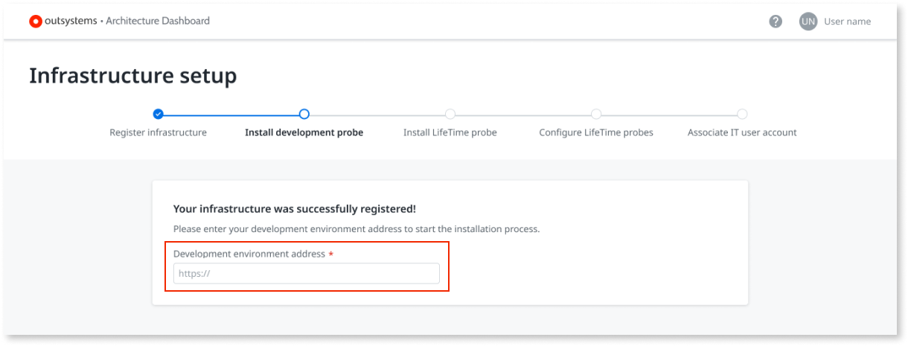
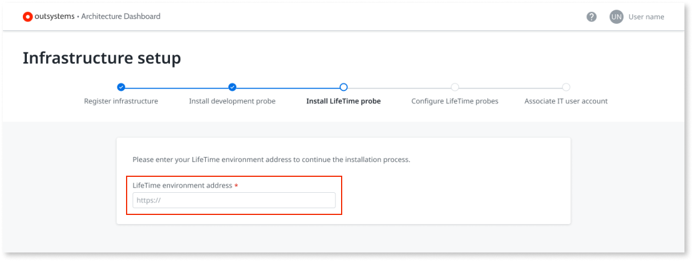
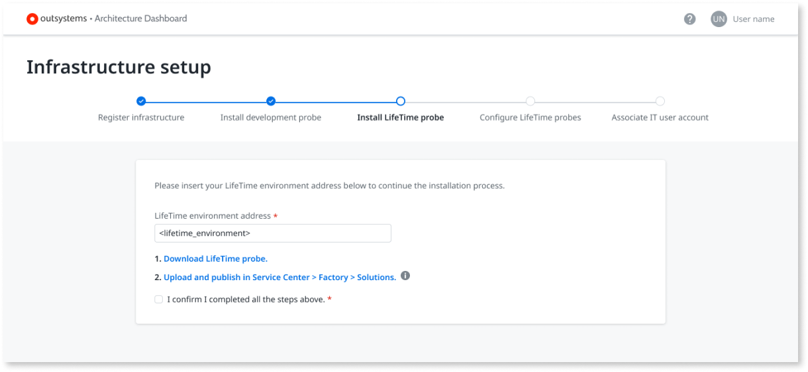
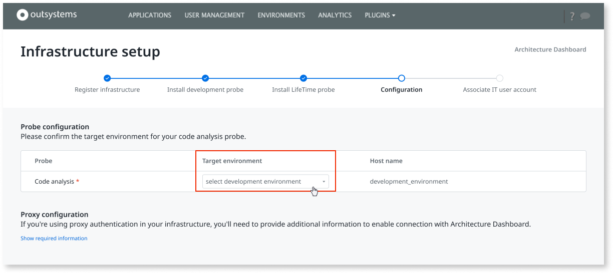
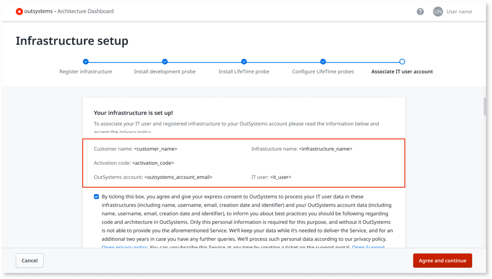

# How to set up Architecture Dashboard

Learn how to configure Architecture Dashboard so you can start using it.  
This topic shows you how to add an infrastructure and what the prerequisites are, and how to associate an IT user with Architecture Dashboard. 

To change the language of Architecture Dashboard select your user name, then select a language under **Language**.

## Log in for the first time {#first-login}

When you log in to [Architecture Dashboard](https://architecture.outsystems.com/) for the first time you are shown a welcome screen.

Select one of the options shown in the welcome screen:

[Register and set up my infrastructure](#register)
:   Choose this option if your infrastructure isn't registered in Architecture Dashboard. You must be an Administrator in LifeTime.

[Associate my IT user with Architecture Dashboard](#associate)
:   Choose this option if your infrastructure is already registered in Architecture Dashboard.

## Register and set up your infrastructure in Architecture Dashboard {#register}

### Prerequisites

Before registering and setting up your infrastructure in Architecture Dashboard, make sure that the following requirements are met:

* Your infrastructure is associated with an [OutSystems Edition](https://www.outsystems.com/pricing-and-editions/) that isn't the Free Edition. **You can't use a Personal Environment with Architecture Dashboard**.

* **LifeTime** is deployed in a **dedicated environment**.

* Your infrastructure uses **OutSystems 11**.

* Your development environment uses **Platform Server Release Apr.2019** or later.

* Your LifeTime environment uses **LifeTime Management Console Release Jul.2019** or later.	

* Allow outbound HTTPS communication (port 443) from the  **LifeTime environment** to `https://architecture.outsystems.com/Broker_API/rest/ArchitectureDashboard`. Check [Architecture Dashboard network requirements for detailed information](../../setup-maintain/setup/network-requirements.md#architecture-dashboard).

* You have the **Administrator** role in your infrastructure.

### Register and set up your infrastructure

To set up your infrastructure in Architecture Dashboard, follow these steps:

1. After logging in https://architecture.outsystems.com/, select **Register and set up my infrastructure** and select **Start**.

1. Enter your **Activation Code**.

    

    

    If the infrastructure is already registered in Architecture Dashboard, a message lets you know and you are asked to **Associate your IT user to a registered infrastructure**.

    

1. Check the information and select **Register**.

    

1. Read the **Architecture Dashboard disclaimer** with the terms and conditions. If you agree select **Accept and continue**.

1. Enter the address of your development environment.

    

1. Follow the procedure shown in Architecture Dashboard to install the Development probe:

    1. Select **Download Development probe** to download the probe.

    1. In the Service Center of the **Development environment** (`https://<development_environment>/ServiceCenter`), go to **Factory**>**Solutions** and install the **Development probe**.

1. After completing the previous steps, select the **I confirm I completed all the steps above.** check box and select **Next**.

1. Enter the address of your LifeTime environment.

    

1. Follow the procedure shown in Architecture Dashboard to install the LifeTime probe:

    

    1. Select **Download LifeTime probe** to download the probe.

    1. In the Service Center of the **LifeTime environment** (`https://<lifetime_environment>/ServiceCenter`), go to **Factory**>**Solutions** and install the **LifeTime probe**.

1. After completing the previous steps, select the **I confirm I completed all the steps above.** check box and select **Next**.

1. After you are redirected to LifeTime, log in with your IT user.

1. Configure the **Code analysis** probe by selecting the development environment as the **Target environment**. 

    

    

    To change the target environment of a code analysis probe, contact [technical support](https://success.outsystems.com/Support/Enterprise_Customers/OutSystems_Support/01_Contact_OutSystems_technical_support) to delete existing data from Architecture Dashboard. Do this before installing probes in a new environment or deleting probes from an existing environment to avoid data inconsistencies. Once existing data is deleted from Architecture Dashboard, follow the setup procedure in this article to configure a new target environment.
    
    

1. Optional: If you want the Architecture Dashboard plugin to use a forward proxy while connecting to the Architecture Dashboard SaaS, in the **Proxy configuration** section, select **show request information**, and enter the proxy URL and the credentials.

1. Select **Save and activate probes**.

1. After you are redirected to Architecture Dashboard, associate your IT user with Architecture Dashboard:

    

    1. Check the **Installation details** and read the **privacy policy** carefully.

    1. If you agree with the privacy policy, select the check box and then select **Agree and continue**.

After completing these steps you are able to see your infrastructure listed but it may take up to 12 hours for your apps to appear in Architecture Dashboard.

## Associate your IT user with Architecture Dashboard {#associate}

1. After logging in https://architecture.outsystems.com/, select **Associate my IT user** and select **Start**.

1. Go to **LifeTime** (`https://<lifetime_environment>/lifetime`) and **Login** using your IT user credentials.

    `<lifetime_environment>`is the address of the LifeTime Environment for the Infrastructure that you are associating with your account.

1. Select **Plugins** \> **Architecture Dashboard**.

    

    

    If your LifeTime doesn't have a **Plugins** menu, select **More** \> **Architecture Dashboard**.

    

1. Select **Go to Architecture Dashboard**.

    

1. After you are redirected to Architecture Dashboard, associate your IT user with Architecture Dashboard:

    1. Check the **Installation details** and read the **privacy policy** carefully.

    1. If you agree with the privacy policy, select the check box and then select **Agree and continue**.
