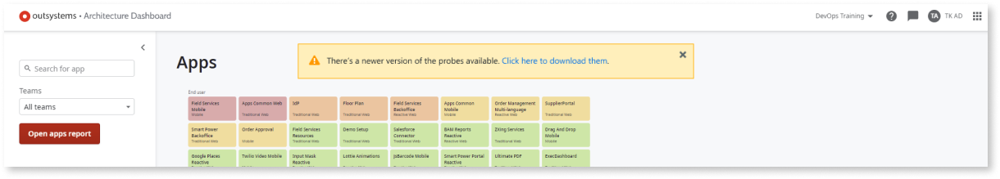
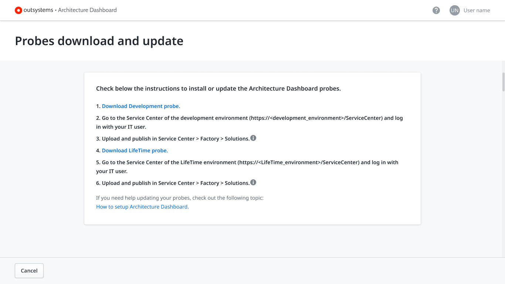

# How to update the Architecture Dashboard probes

If you have [**Full Control** permission assigned as default role](how-works.md#maint-op-permissions) for the code analysis environment, you see the following message when an updated versions of the probes is available:

After selecting **Click here to download them** (the probes) you go to the **Probes download and update** screen, where you can download the new probes.

## Prerequisites

Before configuring the proxy in Architecture Dashboard, make sure you met the following requirement:

* You have [**Full Control** permission assigned as default role](how-works.md#maint-op-permissions) for the code analysis environment.

## Update probes

To update the Architecture Dashboard Probes, follow these steps:

1. In the **Probes download and update** screen, select **Download Development probe**.

1. In the Service Center console of the **Development environment** (`https://<development_environment>/ServiceCenter`), install the **Development Environment Probe** in your **Development environment** by following these steps:

    1. Go to **Factory**.
    1. Go to **Solutions**.
    1. Select **Upload & Publish a Solution**.
    1. Select **Choose File** and select the Probe file.
    1. Select **1-Click Publish**.
    1. Validate if the Solution is successfully published by checking for a `Done: The solution was successfully published message`.

    

1. In the **Probes download and update** screen, select **Download LifeTime probe**.

1. In the Service Center console of the **LifeTime environment** (`https://<LifeTime_environment>/ServiceCenter`), install the **LifeTime Environment Probe** in your **LifeTime environment** by following these steps:

    1. Go to **Factory**.
    1. Go to **Solutions**.
    1. Select **Upload & Publish a Solution**.
    1. Select **Choose File** and select the Probe file.
    1. Select **1-Click Publish**.
    1. Validate if the Solution is successfully published by checking for a `Done: The solution was successfully published message`.
