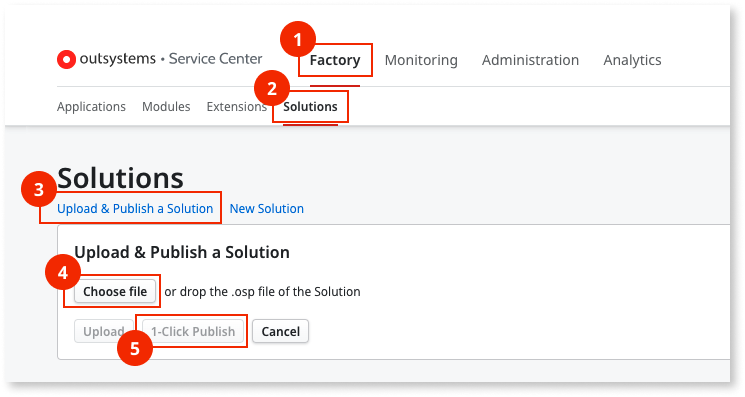

# How to update the AI Mentor Studio probes

If you have [**Full Control** permissions assigned as a default role](how-works.md#update-probes) for the code analysis environment, the following message is displayed when an updated version of the probes is available: 

After selecting **How to download and update probes**, you go to the **Probes download and update** screen, where you can download the new probes.

If you have a different permissions level, the following message is displayed when an updated version of the probes is available:

To install the new probes for AI Mentor Studio, contact your infrastructure administrator.

## Prerequisites

Before configuring the proxy in AI Mentor Studio, make sure you have [**Full Control** permissions assigned as a default role](how-works.md#update-probes) for the code analysis environment.

## Update probes

If you have a previous version of the probes installed there's no need to uninstall it prior to installing the new version of the probes.  
To update the AI Mentor Studio's probes, follow these steps:

1. In the **Probes download and update** screen, select **Download Development probe**.

1. In the Service Center console of the **Development environment** (`https://<development_environment>/ServiceCenter`), install the **Development Environment Probe** in your **Development environment** by following these steps:

    1. Go to **Factory**.
    1. Go to **Solutions**.
    1. Select **Upload & Publish a Solution**.
    1. Select **Choose File** and select the Probe file.
    1. Select **1-Click Publish**.
    1. Validate if the Solution is successfully published by checking for a `Done: The solution was successfully published message`.

    

1. In the **Probes download and update** screen, select **Download LifeTime probe**.

1. In the Service Center console of the **LifeTime environment** (`https://<LifeTime_environment>/ServiceCenter`), install the **LifeTime Environment Probe** in your **LifeTime environment** by following these steps:

    1. Go to **Factory**.
    1. Go to **Solutions**.
    1. Select **Upload & Publish a Solution**.
    1. Select **Choose File** and select the Probe file.
    1. Select **1-Click Publish**.
    1. Validate if the Solution is successfully published by checking for a `Done: The solution was successfully published message`.

