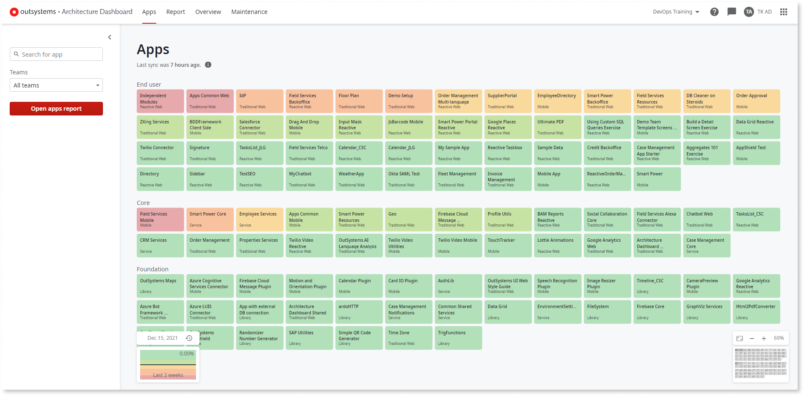
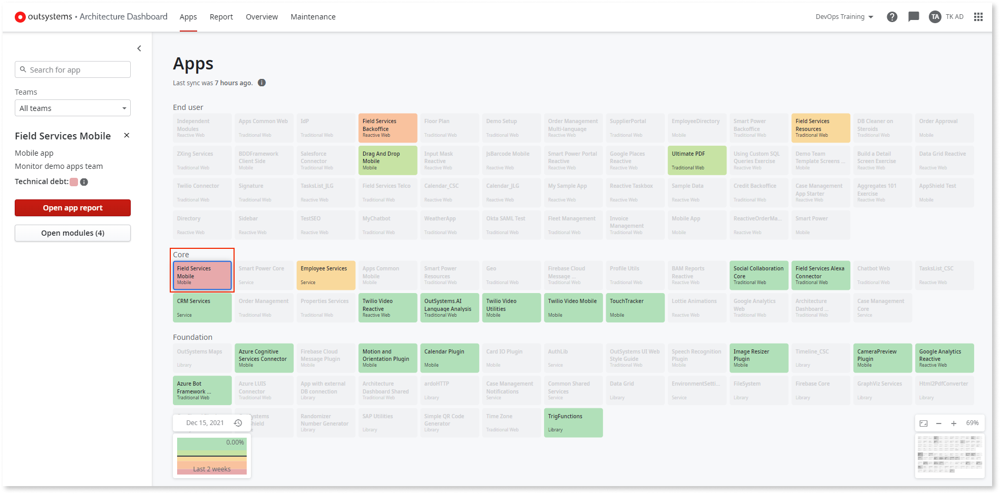
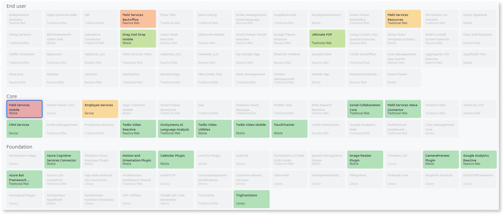
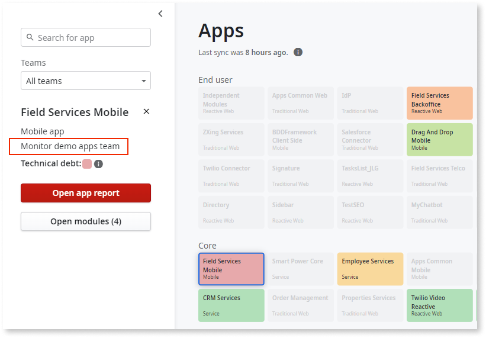
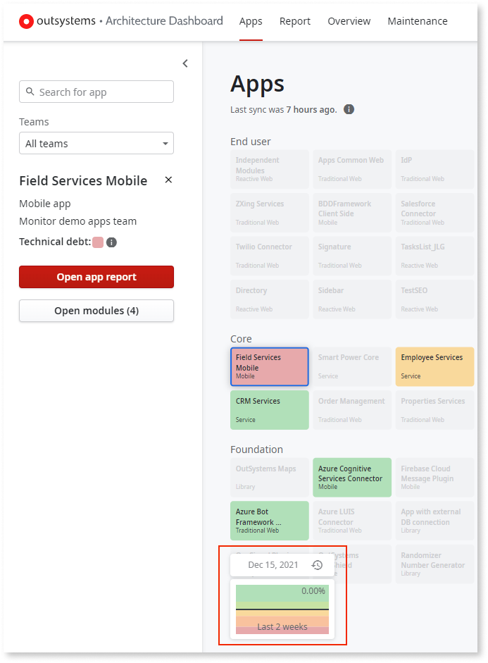
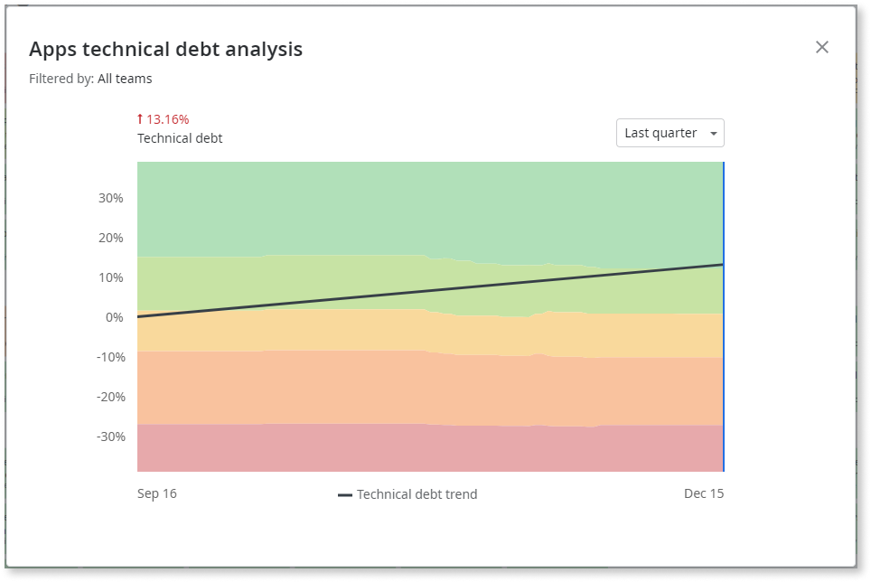
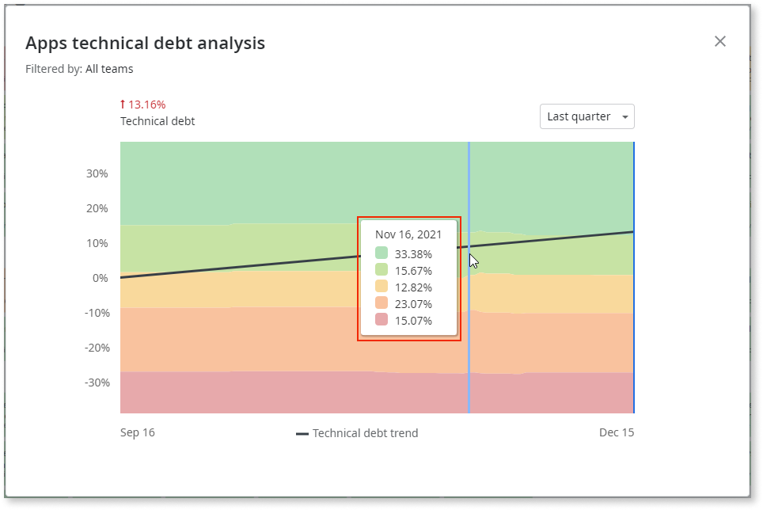
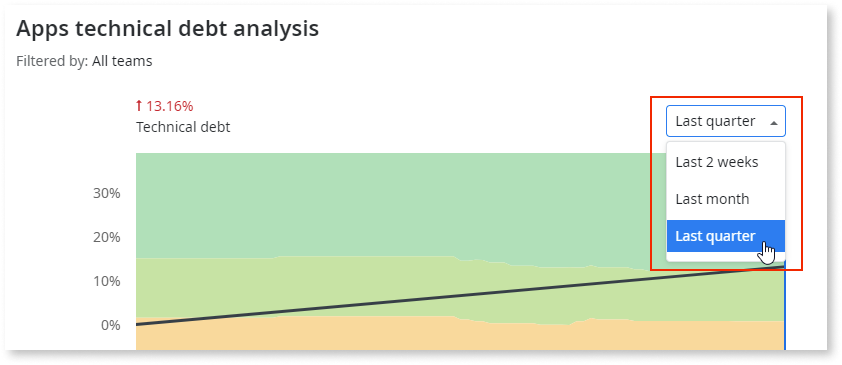
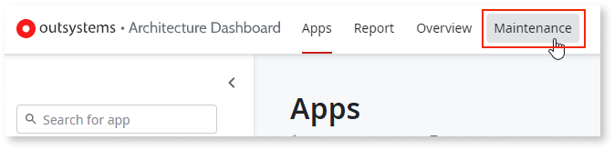

---
tags:
summary: Learn how to Check the technical debt of all the apps in your infrastructure.
locale: en-us
guid: 5771d1af-cf5a-4e5c-a4c7-79f03a5f99ef
app_type: traditional web apps, mobile apps, reactive web apps
---

# Getting started as an architect

As an architect, the Architecture Dashboard provides you with an overview of your organization’s technical debt.

From the Apps canvas, you can check the technical debt of all the apps in your infrastructure and take the necessary steps to reduce the technical debt score for problematic areas.

This guide assumes the following:

* Your infrastructure is already set up in Architecture Dashboard.

* Your IT user is already associated with Architecture Dashboard.

* You have the **Administrator** role in LifeTime.

After logging into [Architecture Dashboard](https://architecture.outsystems.com) with your OutSystems account, follow these steps:

## Check the technical debt of all your apps

The Apps canvas gives you an overview of all the apps on your infrastructure.

Each square is an app. It shows the app name and the app type.

The color of each app shows you how high the technical debt is in that app.
Technical debt tells you how difficult or easy it is to change and maintain an app or module.

## Find an app with high technical debt

Red means the app has high technical debt.

Select a red app. If there's no red app, select another app, preferably orange or yellow.

## Check the dependencies of the app

Selecting an app highlights the dependencies of that app. Use this information to help you decide which apps should be improved first.

## Find out which team owns the app

On the side panel, check the team that owns the app. You can use this information to ask for improvements to the app.

## Check how technical debt has changed with time

The mini chart shows how technical debt has changed over time.

To get more details, click the mini chart.

The technical debt chart includes a technical debt trendline and a trend value. This information tells you whether your technical debt is increasing or decreasing with time. 
To get information for a specific date, hover your mouse over the chart.

You can also select another date range.

## Get an overview of the technical debt across all factory

The **Infrastructure overview** dashboard gives you an understanding of the current status, distribution and evolution of the technical debt across all the apps in your factory.

To access the **Infrastructure overview** dashboard, click the **Overview** tab in the Architecture Dashboard.

Filter the analysis data by team, application, code pattern category, or date range, to get the data that you require to do the proper follow up. You can see, for example, which code patterns of a specific category contribute more to the technical debt of your factory.

[See here](overview-dashboard.md) more details about the Infrastructure overview dashboard.

## Remove modules from technical debt score

You can remove specific modules from the technical debt calculation for your infrastructure, by setting them as **Ignored Modules**.  
To set a module as ignored, follow these steps:

1. Click the **Maintenance** tab.

    

1. On the **Maintenance** screen, set the **Status** filter to **All**.

    

1. Find the module you want to remove from the technical debt calculation and switch the **Ignored** toggle on.

    

After completing these steps and after the next synchronization occurs, the findings associated with the ignored module are resolved and removed from the technical debt score.
