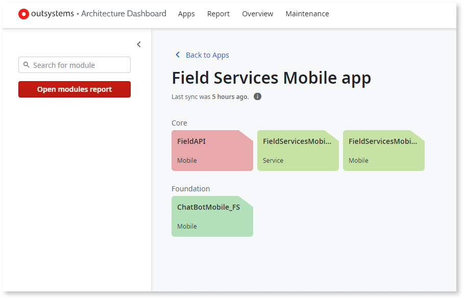
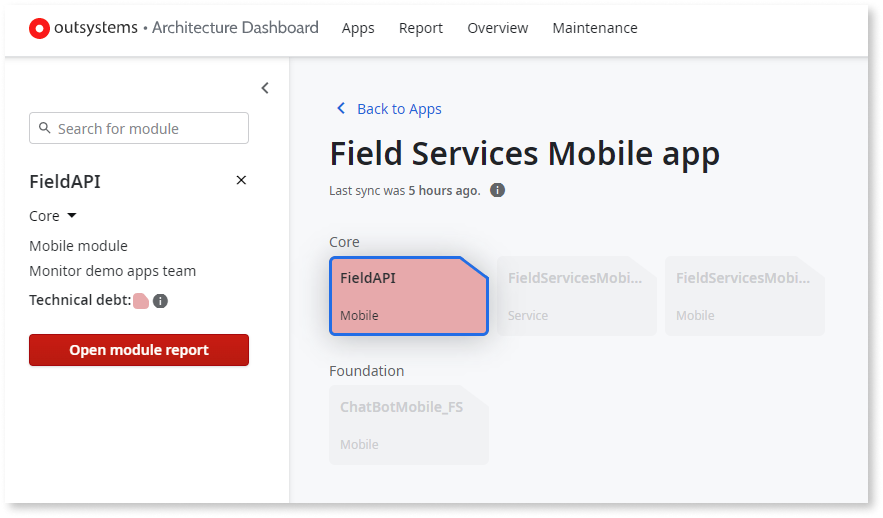
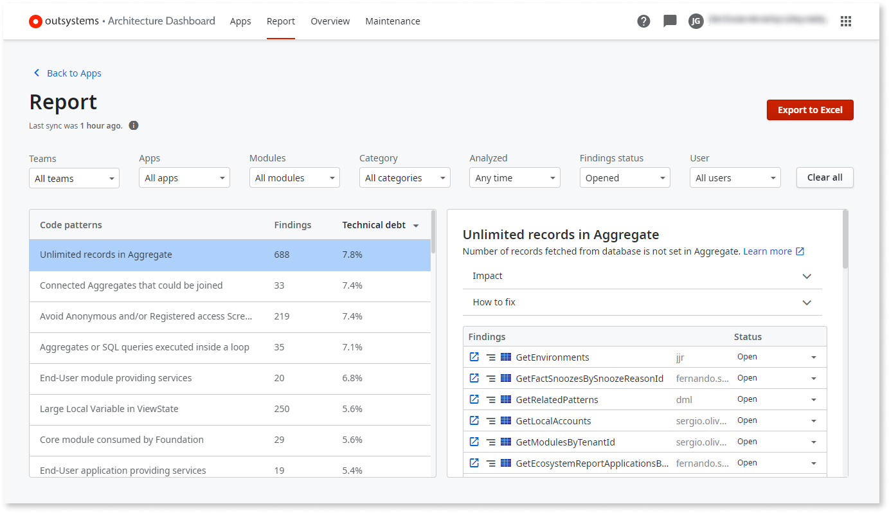
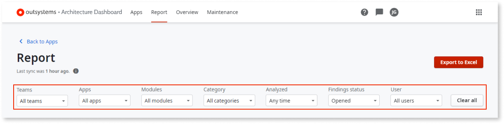
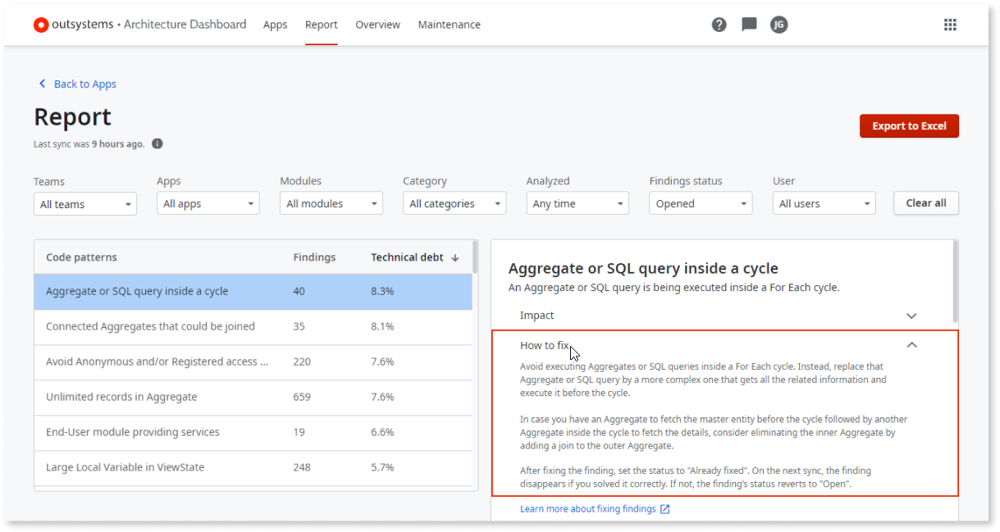
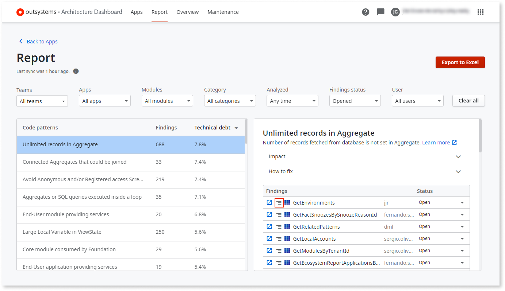
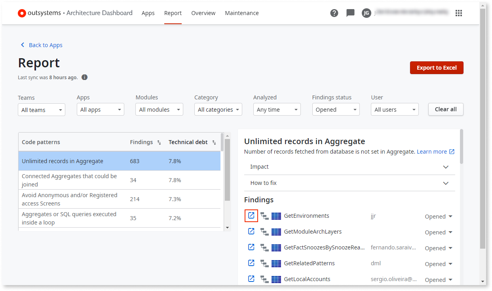

# Getting started as a developer

As a developer, **Architecture Dashboard** provides you with an overview of the organization's technical debt. It also provides you with a detailed overview of the technical debt of the apps in the infrastructure that need to be fixed so that the overall technical debt score is reduced. 

This guide assumes the following:

* Your infrastructure is already set up in **Architecture Dashboard**.

* Your IT user is already associated with **Architecture Dashboard**.

## Check the technical debt of the modules of an app

The apps page gives you an overview of the apps in the infrastructure that you have access to.

Each square is an app. It shows the app name and the app type.

The color of each app shows you how high or low the technical debt is in that app.

Technical debt tells you how difficult or easy it is to change and maintain an app or module.

Red means the app has high technical debt.

To get an overview of the modules of an app, double-click the app.  

Selecting a module gives you detailed information on the left panel, as well as access to the module report.

Click **Open Module report** in order to see the causes of technical debt in the module (seen in the next section).

## Find and understand the causes of technical debt in the module

After clicking **Open Module report** you can examine the causes of technical debt in the module.

You can filter the report based on your team(s), a specific app, module, category, when it was analyzed, the findings status, as well as specific users.

To see details about a code pattern that causes technical debt, click **Impact**. The **Impact** information details why a code pattern creates technical debt.

To check how to fix the code pattern, click **How to fix**. You can also use this information to understand the effort involved in fixing a code pattern.

## Fix and resolve technical debt findings

The **Findings** section displays all of the occurrences of the code pattern. To see in which module and element each finding occurs, click the path icon.

To open **Service Studio** and navigate to the element where a code patterns occurs, click the **Open in Service Studio** icon.

Your browser may ask you to confirm that you want to open **Service Studio**. In Chrome, confirm that you want to open **Service Studio** by clicking **Open Service Studio**.

After checking a specific finding, change the status of the finding depending on your action:

* If you fix the finding, set the status to **Already fixed**. This lets other developers in your team know it's fixed. After the next synchronization, if you have solved the finding correctly, it disappears. Otherwise, the finding reverts to **Open**.

* If you don't fix the finding because the finding is a false positive, set the status to **False positive**. After the next synchronization, the finding is not counted toward the total technical debt score.

* If you don't fix the finding, but the finding isn't a false positive, set the status to **Won't fix** and detail the reason for not fixing it. After the next synchronization, the finding is not counted toward the total technical debt score.

* To temporarily remove the finding from the total debt calculation, set the status to **Remind me later**. After the next synchronization, and during the next 30 days, the finding is not counted toward the total technical debt score.
