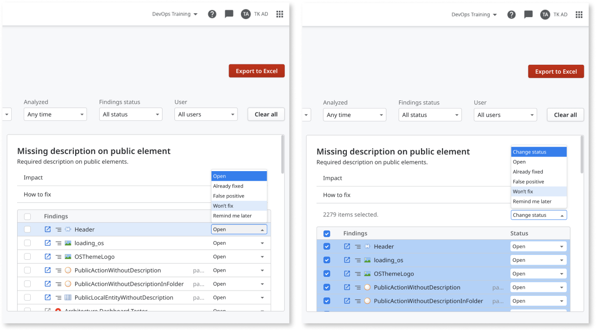

---
tags:
summary: Learn how to check the technical debt of your team's apps.
locale: en-us
guid: efc039d9-67e7-4824-a8fb-5e65418db58c
app_type: traditional web apps, mobile apps, reactive web apps
platform-version: o11
---

# Getting started as a team lead 

Architecture Dashboard is now AI Mentor Studio.

As a team lead, **AI Mentor Studio** provides you with an overview of the technical debt of organization's technical debt as well as detailed overview of the technical debt of your teams's apps.

From the Apps canvas, you can drill down into the team's problematic modules, and take the necessary steps to reduce the technical debt score for these areas. 

This guide assumes the following:

* Your infrastructure is already set up in AI Mentor Studio.

* Your IT user is already associated with AI Mentor Studio.

* You have the **Administrator** role in LifeTime.

After logging into [AI Mentor Studio](https://aimentorstudio.outsystems.com/), follow these steps:

## Check the technical debt of your team apps

The Apps page gives you an overview of all the apps on your infrastructure.

To only see apps from your team, select your team from the **Teams** dropdown.

Each square is an app. It shows the app name and the app type.

The color of each app shows you how high or low the technical debt is in that app.
Technical debt tells you how difficult or easy it is to change and maintain an app or module.

Red means the app has high technical debt.

## Check the technical debt of the modules of the app

To get an overview of all the modules of an app, double-click the app.  

Selecting a module gives you detailed information on the left panel, as well as access to the module report.

## Find and understand the causes of technical debt in an app

To go back and see all the apps of your team, click **Back to Apps**.

Select the app again. Make sure you don't double-click the app this time.

To see the causes of technical debt in the app, click the **Open app report** button in the side panel.

You can filter the report based on your team(s), a specific app, module, category, when it was analyzed, the findings status, as well as specific users.

To see the details about a code pattern that causes technical debt, click **Impact**. The **Impact** information details why a code pattern creates technical debt.

To check how to fix the code pattern, click **How to fix**. You can also use this information to understand the effort involved in fixing a code pattern.

The **Findings** section displays all the occurrences of the code pattern. To see in which module and element each finding occurs, click the path icon.

You can change the status of the findings individually or in bulk. 

 

After selecting one or multiple findings, you can change the status of the findings depending on your action:

* If you fix the finding, set the status to **Already fixed**. This lets other developers in your team know it's fixed. After the next synchronization, if you have solved the finding correctly, it disappears. Otherwise, the finding reverts to **Open**.

* If the finding is a false positive, set the status to **False positive**. After the next synchronization, the finding is not counted toward the total technical debt score.

* If the finding isn't a false positive, set the status to **Won't fix** and detail the reason for not fixing it. After the next synchronization, the finding is not counted toward the total technical debt score.

* To temporarily remove the finding from the total debt calculation, set the status to **Remind me later**. After the next synchronization, and during the next 30 days, the finding is not counted toward the total technical debt score.

## Get an overview of the technical debt of your team apps

The **Infrastructure overview** dashboard gives you an understanding of the current state, distribution, and evolution of the technical debt across all the apps of your team.

To access the **Infrastructure overview** dashboard, click the **Overview** tab in **AI Mentor Studio**.

Filter the analysis data by team, application, code pattern category, or date range, to get the data that you require to do the proper follow up. You can identify, for example, the apps and modules of your team that contribute more to your technical debt.

See this article, [Get an overview of the overall technical debt](overview-dashboard.md), for more details.
