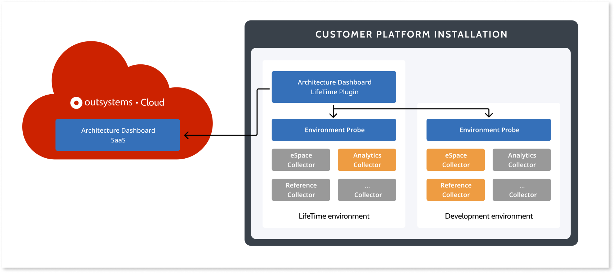

---
tags:
summary: Learn how Architecture Dashboard works and how your infrastructure communicates with the SaaS.
locale: en-us
guid: f6f9f871-5f0c-4991-a47e-91fa20033627
app_type: traditional web apps, mobile apps, reactive web apps
---

# How does Architecture Dashboard work

Architecture Dashboard includes the following pieces: 

Architecture Dashboard SaaS
:   A "Software as a Service" that processes and shows all data collected by the Architecture Dashboard LifeTime Plugin.

Architecture Dashboard LifeTime Plugin
:   A LifeTime plugin that's published in a platform installation (on-premises or cloud) with **environment probes** to collect data and communicate with the Architecture Dashboard SaaS.

## Communication

Communications between the Architecture Dashboard plugin and the Architecture Dashboard SaaS are always initiated by the plugin. This reduces connectivity requirements on your side since all that needs to be ensured is connectivity from the Plugin in the LifeTime environment to the Architecture Dashboard SaaS endpoint.

The plugin can use a forward proxy to connect to the Architecture Dashboard SaaS endpoint.

### Data collected in plugin and sent to SaaS

Architecture Dashboard collects the following data from your infrastructure:

* Platform metamodel data, including infrastructure activation code, environments information (name and Platform Server version), teams, list of apps and modules (including name and identifier), and platform configurations.

* Modules and dependency information for code analysis.

* Upon acceptance of the agreement, during Architecture Dashboard set up: users information (name, username, email address, user creation date, last login date) and LifeTime permissions.

* Optionally: Discovery snapshot data (architectural references, applications, and modules) for architecture analysis.

Data of each installation is kept in the OutSystems cloud and isolated from all other installations using the platform's multi-tenant mechanisms. This ensures data from one installation is not accessible by users of other installations.

### Data in transit

* The Plugin and SaaS share data in binary format through a well-known HTTPS endpoint.

* IP or DNS addresses aren't transmitted.

* No ports besides the defaults need to be open for the correct use of Architecture Dashboard Probes.

* No firewall issues should arise, although you need to be able to access the endpoint detailed in [How to set up Architecture Dashboard](how-setup.md).

### Data at rest in SaaS

* Data of each installation is kept isolated from all other installations using the platform's multi-tenant mechanisms. This ensures data from one installation isn't accessible by users of other installations.

### More information about security and compliance

Read more about security and compliance in the following FAQ sections:

* [Security, legal and compliance - registration in Architecture Dashboard](faq.md#data-faq)

* [Security, legal and compliance - personal information](faq.md#personal-data-faq)

## Permissions

The permissions that IT users have while using Architecture Dashboard with an infrastructure, depend on the [role and permissions set in LifeTime](../manage-it-teams/about-permission-levels.md#permissions) for the **code-analysis environment** of that infrastructure.

The set of permissions that an IT user has for the **code-analysis environment** is determined by the permissions of the assigned roles, and also by how the roles are assigned.

Roles and their permissions can be assigned as a default role, as a role for a team, or as role for an app.

The permissions of a role assigned for a team override the permissions for the team's apps assigned by the default role.

The permissions of a role assigned for an app override the permissions for the specific app assigned by the default role and of roles assigned for a team.

The following tables map the Architecture Dashboard permissions to the LifeTime permissions and to the way the roles are assigned to IT users.

### Main features permissions

#### View teams

<table>
  <thead>
  <tr>
   <th rowspan="2" >LifeTime permissions
   </th>
   <th colspan="3" >LifeTime role assignment
   </th>
  </tr>
  <tr>
   <th>Default role
   </th>
   <th>Assigned to a team
   </th>
   <th>Assigned to an app
   </th>
  </tr>
  </thead>
  <tbody>
  <tr>
   <td><b>No Access</b>
   </td>
   <td rowspan="2" colspan="3">No
   </td>
  </tr>
  <tr>
   <td><b>Access</b>
   </td>
  </tr>
  <tr>
   <td><b>List Application</b>
   </td>
   <td rowspan="3" >No
   </td>
   <td rowspan="3" >Assigned team
   </td>
   <td rowspan="3" >No
   </td>
  </tr>
  <tr>
   <td><b>Monitor and Add Dependencies</b>
   </td>
  </tr>
  <tr>
   <td><b>Open and Debug Applications </b>
   </td>
  </tr>
  <tr>
   <td><b>Change and Deploy Applications</b>
   </td>
   <td rowspan="2" >Team apps1
   </td>
   <td rowspan="2" >Assigned team
   </td>
   <td rowspan="2" >No
   </td>
  </tr>
  <tr>
   <td><b>Full Control</b>
   </td>
  </tr>
  </tbody>
</table>

**1Team apps**: Except in cases where the permission level of a specific app is set lower than that assigned to a team.

#### View apps and modules 

<table>
  <thead>
  <tr>
   <th rowspan="2" >LifeTime permissions
   </th>
   <th colspan="3" >LifeTime role assignment
   </th>
  </tr>
  <tr>
   <th>Default role
   </th>
   <th>Assigned to a team
   </th>
   <th>Assigned to an app
   </th>
  </tr>
  </thead>
  <tbody>
  <tr>
   <td><b>No Access</b>
   </td>
   <td rowspan="2" colspan="3" >No
   </td>
  </tr>
  <tr>
   <td><b>Access</b>
   </td>
  </tr>
  <tr>
   <td><b>List Application</b>
   </td>
   <td rowspan="5" >All apps1
   </td>
   <td rowspan="5" >Team apps2
   </td>
   <td rowspan="5" >Assigned apps
   </td>
  </tr>
  <tr>
   <td><b>Monitor and Add Dependencies</b>
   </td>
  </tr>
  <tr>
   <td><b>Open and Debug Applications </b>
   </td>
  </tr>
  <tr>
   <td><b>Change and Deploy Applications</b>
   </td>
  </tr>
  <tr>
   <td><b>Full Control</b>
   </td>
  </tr>
  
  </tbody>
</table>

1**All apps**: Except in cases where the permission level of a specific app (or teams assigned to that app) is set lower than that assigned to a role or team.

2**Team apps**: Except in cases where the permission level of a specific app is set lower than that assigned to a team.

#### Open findings report

<table>
  <thead>
  <tr>
   <th rowspan="2" >LifeTime permissions
   </th>
   <th colspan="3" >LifeTime role assignment
   </th>
  </tr>
  <tr>
   <th>Default role
   </th>
   <th>Assigned to a team
   </th>
   <th>Assigned to an app
   </th>
  </tr>
  </thead>
  <tbody>
  <tr>
   <td><b>No Access</b>
   </td>
   <td rowspan="4" colspan="3">No
   </td>
  </tr>
  <tr>
   <td><b>Access</b>
   </td>
  </tr>
  <tr>
   <td><b>List Application</b>
   </td>
  </tr>
  <tr>
   <td><b>Monitor and Add Dependencies</b>
   </td>
  </tr>
  <tr>
   <td><b>Open and Debug Applications </b>
   </td>
   <td rowspan="3">All apps1
   </td>
   <td rowspan="3">Team apps2
   </td>
   <td rowspan="3">Assigned apps
   </td>
  </tr>
  <tr>
   <td><b>Change and Deploy Applications</b>
   </td>
     </tr>
  <tr>
   <td><b>Full Control</b>
   </td>
  </tr>
  
  </tbody>
</table>

1**All apps**: Except in cases where the permission level of a specific app (or teams assigned to that app) is set lower than that assigned to a role or team.

2**Team apps**: Except in cases where the permission level of a specific app is set lower than that assigned to a team.

#### Export findings report

<table>
  <thead>
  <tr>
   <th rowspan="2" >LifeTime permissions
   </th>
   <th colspan="3" >LifeTime role assignment
   </th>
  </tr>
  <tr>
   <th>Default role
   </th>
   <th>Assigned to a team
   </th>
   <th>Assigned to an app
   </th>
  </tr>
  </thead>
  <tbody>
  <tr>
   <td><b>No Access</b>
   </td>
   <td rowspan="4" colspan="3">No
   </td>
  </tr>
  <tr>
   <td><b>Access</b>
   </td>
  </tr>
  <tr>
   <td><b>List Application</b>
   </td>
  
  </tr>
  <tr>
   <td><b>Monitor and Add Dependencies</b>
   </td>
  </tr>
  <tr>
   <td><b>Open and Debug Applications </b>
   </td>
   <td rowspan="3" >All apps1
   </td>
   <td rowspan="3" >Team apps2
   </td>
   <td rowspan="3" >Assigned apps
   </td>
  </tr>
  <tr>
   <td><b>Change and Deploy Applications</b>
   </td>
    </tr>
  <tr>
   <td><b>Full Control</b>
   </td>
  </tr>
  </tbody>
</table>

1**All apps**: Except in cases where the permission level of a specific app (or teams assigned to that app) is set lower than that assigned to a role or team.

2**Team apps**: Except in cases where the permission level of a specific app is set lower than that assigned to a team.

#### Resolve findings

<table>
  <thead>
  <tr>
   <th rowspan="2" >LifeTime permissions
   </th>
   <th colspan="3" >LifeTime role assignment
   </th>
  </tr>
  <tr>
   <th>Default role
   </th>
   <th>Assigned to a team
   </th>
   <th>Assigned to an app
   </th>
  </tr>
  </thead>
  <tbody>
  <tr>
   <td><b>No Access</b>
   </td>
   <td rowspan="5" colspan="3" >No
   </td>
   </tr>
  <tr>
   <td><b>Access</b>
   </td>
  </tr>
  <tr>
   <td><b>List Application</b>
   </td>   
  </tr>
  <tr>
   <td><b>Monitor and Add Dependencies</b>
   </td>
  </tr>
  <tr>
   <td><b>Open and Debug Applications </b>
   </td>   
  </tr>
  <tr>
   <td><b>Change and Deploy Applications</b>
   </td>
   <td rowspan="2" >All apps1
   </td>
   <td rowspan="2" >Team apps2
   </td>
   <td rowspan="2" >Assigned apps
   </td>
  </tr>
  <tr>
   <td><b>Full Control</b>
   </td>
  </tr>
  
  </tbody>
</table>

1**All apps**: Except in cases where the permission level of a specific app (or teams assigned to that app) is set lower than that assigned to a role or team.

2**Team apps**: Except in cases where the permission level of a specific app is set lower than that assigned to a team.

#### Overview dashboard

<table>
  <thead>
  <tr>
   <th rowspan="2" >LifeTime permissions
   </th>
   <th colspan="3" >LifeTime role assignment
   </th>
  </tr>
  <tr>
   <th>Default role
   </th>
   <th>Assigned to a team
   </th>
   <th>Assigned to an app
   </th>
  </tr>
  </thead>
  <tbody>
  <tr>
   <td><b>No Access</b>
   </td>
   <td rowspan="4" colspan="3">No
   </td>   
  </tr>
  <tr>
   <td><b>Access</b>
   </td>
  </tr>
  <tr>
   <td><b>List Application</b>
   </td>  
  </tr>
  <tr>
   <td><b>Monitor and Add Dependencies</b>
   </td>
  </tr>
  <tr>
   <td><b>Open and Debug Applications </b>
   </td>
   <td rowspan="3">All apps1
   </td>
   <td rowspan="3">Team apps2
   </td>
   <td rowspan="3">Assigned apps
   </td>
  </tr>
  <tr>
   <td><b>Change and Deploy Applications</b>
   </td>  
  </tr>
  <tr>
   <td><b>Full Control</b>
   </td>
  </tr>

  </tbody>
</table>

1**All apps**: Except in cases where the permission level of a specific app (or teams assigned to that app) is set lower than that assigned to a role or team.

2**Team apps**: Except in cases where the permission level of a specific app is set lower than that assigned to a team.

### Maintenance and operations permissions { #maint-op-permissions }

#### Ignore modules

<table>
  <thead>
  <tr>
   <th rowspan="2" >LifeTime permissions
   </th>
   <th colspan="3" >LifeTime role assignment
   </th>
  </tr>
  <tr>
   <th>Default role
   </th>
   <th>Assigned to a team
   </th>
   <th>Assigned to an app
   </th>
  </tr>
  </thead>
  <tbody>
  <tr>
   <td><b>Open and Debug Applications or lower</b>
   </td>
   <td colspan="3">No
   </td>   
  </tr>
  <tr>
   <td><b>Change and Deploy Applications</b>
   </td>
   <td rowspan="2">All modules1
   </td>
   <td rowspan="2">Team modules2
   </td>
   <td rowspan="2">Assigned app’s modules
   </td>
  </tr>

  </tbody>
</table>

1**All apps**: Except in cases where the permission level of a specific app (or teams assigned to that app) is set lower than that assigned to a role or team.

2**Team apps**: Except in cases where the permission level of a specific app is set lower than that assigned to a team.

#### Enable AI auto-classification

<table>
  <thead>
  <tr>
   <th rowspan="2" >LifeTime permissions
   </th>
   <th colspan="3" >LifeTime role assignment
   </th>
  </tr>
  <tr>
   <th>Default role
   </th>
   <th>Assigned to a team
   </th>
   <th>Assigned to an app
   </th>
  </tr>
  </thead>
  <tbody>
  <tr>
   <td><b>Open and Debug Applications or lower</b>
   </td>
   <td rowspan="2" colspan="3">No
   </td>   
  </tr>
  <tr>
   <td><b>Change and Deploy Applications</b>
   </td>   
  </tr>
  <tr>
   <td><b>Full Control</b>
   </td>
   <td>Yes
   </td>
   <td colspan="2">No
   </td>
  </tr>
    </tbody>
</table>

#### Override module AI auto-classification

<table>
  <thead>
  <tr>
   <th rowspan="2" >LifeTime permissions
   </th>
   <th colspan="3" >LifeTime role assignment
   </th>
  </tr>
  <tr>
   <th>Default role
   </th>
   <th>Assigned to a team
   </th>
   <th>Assigned to an app
   </th>
  </tr>
  </thead>
  <tbody>
  <tr>
   <td><b>Open and Debug Applications or lower</b>
   </td>
   <td rowspan="2" colspan="3">No
   </td>   
  </tr>
  <tr>
   <td><b>Change and Deploy Applications</b>
   </td>
   </tr>
  <tr>
   <td><b>Full Control</b>
   </td>
   <td>All modules1
   </td>
   <td colspan="2">No
   </td>
  </tr>

  </tbody>
</table>

1**All modules**: Except in cases where the permission level of a specific module (or teams assigned to that module) is set lower than that assigned to a role or team.

#### Update probes

<table>
  <thead>
  <tr>
   <th rowspan="2" >LifeTime permissions
   </th>
   <th colspan="3" >LifeTime role assignment
   </th>
  </tr>
  <tr>
   <th>Default role
   </th>
   <th>Assigned to a team
   </th>
   <th>Assigned to an app
   </th>
  </tr>
  </thead>
  <tbody>
  <tr>
   <td><b>Open and Debug Applications or lower</b>
   </td>
   <td rowspan="2" colspan="3">No
   </td>   
  </tr>
  <tr>
   <td><b>Change and Deploy Applications</b>
   </td>
  </tr>
  <tr>
   <td><b>Full Control</b>
   </td>
   <td>Yes
   </td>
   <td colspan="2">No
   </td>
  </tr>
  </tbody>
</table>

#### Manage Architecture Dashboard API

<table>
  <thead>
  <tr>
   <th rowspan="2" >LifeTime permissions
   </th>
   <th colspan="3" >LifeTime role assignment
   </th>
  </tr>
  <tr>
   <th>Default role
   </th>
   <th>Assigned to a team
   </th>
   <th>Assigned to an app
   </th>
  </tr>
  </thead>
  <tbody>
  <tr>
   <td><b>Open and Debug Applications or lower</b>
   </td>
   <td rowspan="2" colspan="3">No
   </td>   
  </tr>
  <tr>
   <td><b>Change and Deploy Applications</b>
   </td>
  </tr>
  <tr>
   <td><b>Full Control</b>
   </td>
   <td>Yes
   </td>
   <td colspan="2">No
   </td>
  </tr>
  </tbody>
</table>
