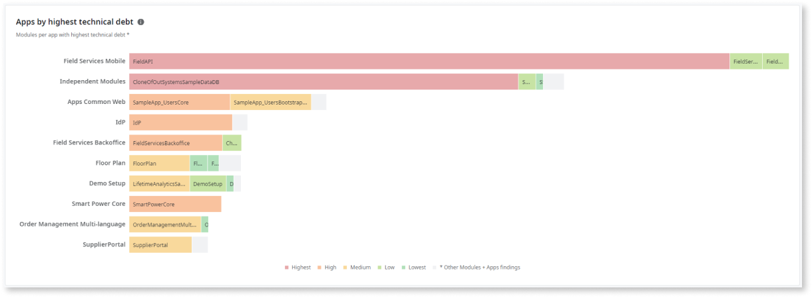

# Get an overview of the overall technical debt

Architecture Dashboard is now AI Mentor Studio.

The **Infrastructure overview** dashboard gives architects and development team leaders a better understanding of the technical debt across their factory: 

* What is the current status
* How is the technical debt distributed
* What has been the evolution

Using the Infrastructure overview dashboard, you can compare the different charts through a specific period of time. This enables you to check at the same time both **status** and **progress** within the several areas that contribute to your technical debt.

Architects and team leads can use the information obtained from this dashboard:

* To make informed decisions on which applications or teams require more investment to tackle the technical debt.

* As a tool to better communicate their technical debt strategies with the development teams.

To access the **Infrastructure overview** dashboard, click the **Overview** tab in the AI Mentor Studio.

## Get the most relevant data to define your strategy

As an architect or a team lead, you can apply several filters to get the most relevant data that you require to define the strategy to reduce your technical debt. You can filter by:

* A specific team
* One or more application
* One or more modules
* A specific code pattern category
* A specific analysis date range

For example, team leads can check for their own team impact, or analyze a specific application, while architects might want to validate the technical debt distribution by category across all applications.

The data displayed in the **Infrastructure overview** dashboard depends on the permissions of the IT user accessing the AI Mentor Studio. Each user sees the data corresponding to the applications and teams to which they have permissions. See the [main features permissions](how-works.md#Permissions) for further details.

You can set the analysis date range since the factory first started to use the AI Mentor Studio, until the last sync from the previous day. The data from the current day is collected during that day, and it will be available on the next day.

In the Infrastructure overview dashboard you can see the following information:

* The [overall evolution](#overall) of your technical debt
* The [technical debt distribution by code pattern category](#category)
* The [top code patterns with highest technical debt](#top-patterns)
* The [variation of the technical debt and corresponding findings](#variation)
* The [applications with the highest technical debt](#highest-apps)

### Check the overall evolution of your technical debt { #overall }

The **Technical debt** overall card gives you a first glimpse of how the technical debt is evolving in your applications through the main development slots (2 weeks, 1 month, and 3 months).

### Check the technical debt distribution by category { #category}

In the **Technical debt per category** list you can see the distribution (%) of each code pattern category and the total number of findings in your factory.

Here you can assess which are the categories contributing more to your technical debt, and correlate that percentage with the number (absolute values) of the findings in each category.

### Check the top code patterns with highest technical debt { #top-patterns }

The **Top code patterns with highest technical debt** graph shows an hierarchical view on the code patterns distribution:

* The biggest area represents the code pattern with highest technical debt.

* The smaller area represents the code pattern contributing less to the infrastructure technical debt.

Here you can quickly perceive which code patterns and categories are the largest contributors to your technical debt.

When you mouse hover a code pattern, you can see the corresponding number of findings.

### Check the variation of the technical debt and corresponding findings { #variation }

The **Technical debt variation vs. number of findings** chart shows a progress view of the variation of technical debt and the number of findings on a daily basis. The technical debt variation shows how much the technical debt has increased or decreased compared to the previous day. For each day, you can see the number of open, new, and solved findings.

This chart enables you to:

* Quickly identify the highest and lowest data points.

* Check, on a daily basis, for sudden increases in your technical debt and act upon it.

* Identify the number of Open findings per day, by category, and the changes in solved and new findings. This way you can easily identify what findings you added to your tech debt (New), or the findings you managed to solve (Solved), and correlate this with the technical debt variation.

You can enable or disable the Open, New, and Solved findings view individually. The Open findings view is disabled by default.

Note that if the number of new findings is greater than the number of solved findings, the tendency is to see the technical debt variation increasing. The weight of each finding contributes directly to the technical debt, meaning that patterns with less weight represent subtle spikes, while patterns with a lot of weight spike your technical debt.

For example, for a specific date:

* If the technical debt variation is much higher than the number of findings, it means that those findings have a big weight on the overall technical debt.

* If the number of findings is much higher than the technical debt for the same date, it means that those findings have a low weight on the overall technical debt.

* A technical debt variation with values around 0% doesn’t mean that you don’t have technical debt. It means that it didn’t vary from the previous day. 

### Check the applications with the highest technical debt { #highest-apps }

The **Apps by highest technical debt** chart shows a ranking of the applications that contribute more to your technical debt. On each application, you can identify the modules contributing to that technical debt.

