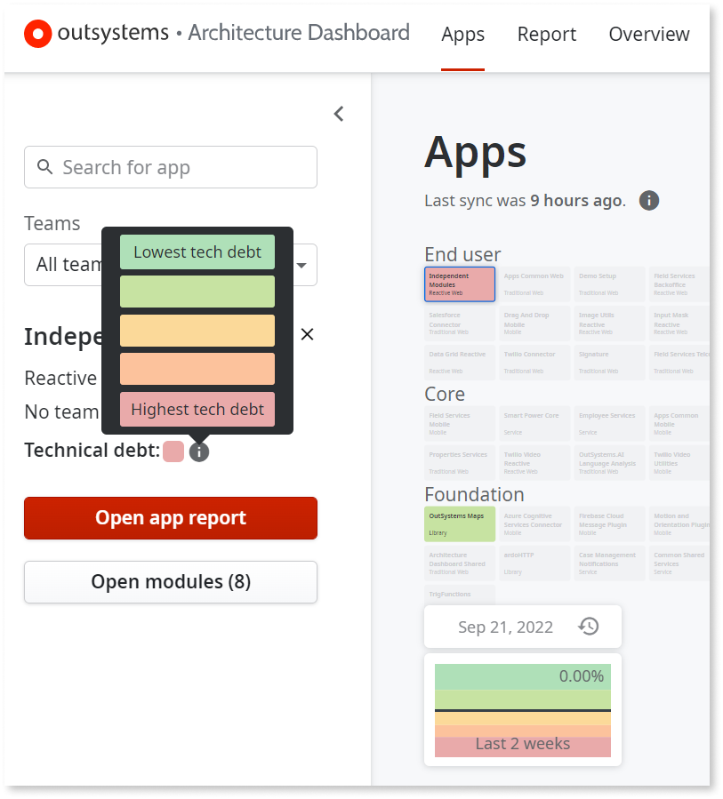
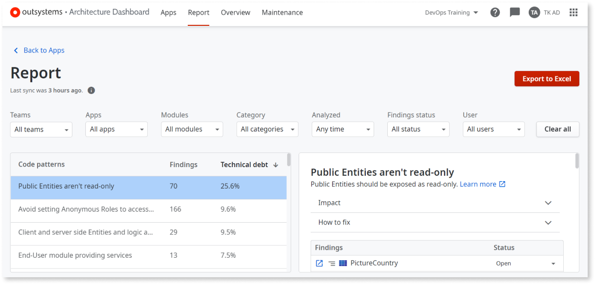
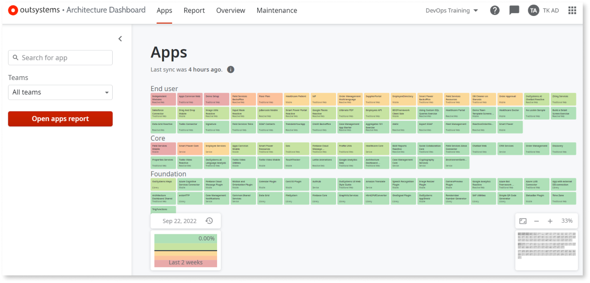
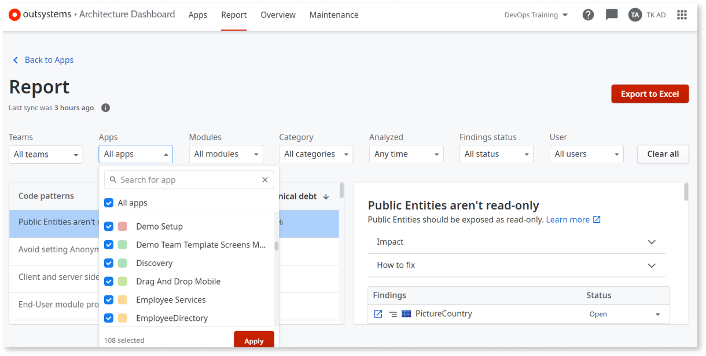

# How AI Mentor Studio calculates and shows technical debt

This article explains how AI Mentor Studio calculates and displays technical debt.  

Technical debt measures the cost of reworking a solution. Technical debt increases each time a developer bypasses code best practices. For example, creating a dependency between two apps adds complexity to future modifications.  

AI Mentor Studio uses a color code to help you visualize technical debt. Apps with the lowest technical debt display as pale green. Apps with the highest technical debt display as red.

## Technical debt formula

To translate the technical debt into the color code, the technical debt value must be calculated first. The technical debt value for each module, app, and the overall Factory Application Portfolio is calculated by summing up the number of findings per pattern, taking their predefined weight into account. AI Mentor Studio uses the following formula to calculate the technical debt value:

Technical debt = &#8721; (#Findings per pattern &#215; pattern weight)

The calculation results in an absolute value that is then compared with defined thresholds to provide the technical debt level represented in a color code and as a percentage.  

For instance, the **Public Entities aren’t read-only** pattern shows a technical debt of 25.6%. This value results from multiplying the 70 findings by the pattern weight itself, which is determined by an [internal process](#pattern-weight). The value is then turned into a percentage, meaning that the **Public Entities aren’t read-only** pattern represents 25.6% of the total technical debt.

### Pattern weight

The weight attributed to each code pattern is determined by an **Impact** variable, which describes the foreseen risk for the architecture, maintenance, performance, and security of the factory. The **Impact** is assessed based on a qualitative scale, ranging from low to high impact, which is then translated into an absolute weight used in the technical debt formula.

## How AI Mentor Studio shows technical debt

Not all code patterns have the same impact on technical debt. In addition to giving the technical debt in percentage, AI Mentor Studio uses the color code to help customers prioritize technical debt in a fast and visual way. The color code allows customers to understand which module or app has more urgency to be tackled.  

### Apps area

AI Mentor Studio’s Apps area has a birds-eye view of your factory that shows all the apps with the technical debt level attributed to it during the last analysis. This enables you to understand which app, at a higher level, should be your primary focus. For more information on how to interpret this data, check the articles under [Getting started with AI Mentor Studio](how-use.md).

### Report area

In the Report area, you see each app’s technical debt level when filtering by app. This helps you focus on the apps that have the highest technical debt. 

You can also sort the code patterns list by technical debt to keep the highest technical debt on the top of your list, or by findings number, if you wish to have a more quantitative approach. Always remember the technical debt formula. Having a high number of findings doesn’t mean that a specific pattern contributes more to your technical debt across the factory. The weight of the pattern also [plays a role](#technical-debt-formula).

### Overview area

The Infrastructure Overview dashboard provides a variety of graphics to help you understand your technical debt. For more information on how to interpret the data in the Overview area, go to [Get an overview of the overall technical debt](overview-dashboard.md).
