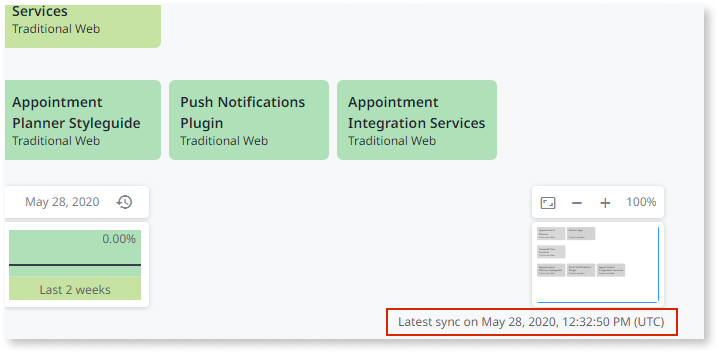

# Troubleshooting

## Apps aren't showing up in Architecture Dashboard

If Architecture Dashboard doesn't shown any apps, this can mean that there are synchronization issues between Architecture Dashboard and Discovery.

Ensure that you installed the latest Discovery version.

If you have the latest Discovery version and the apps still don’t show up, please contact the team via [Support Portal](https://www.outsystems.com/goto/submit-support-case).

## Synchronization issues

Synchronization (data sent from Architecture Dashboard Probe to SaaS) occurs every 12 hours.

In Architecture Dashboard, check the **Latest sync** date and time in the bottom right corner of the canvas.

If the last sync occured more than 24 hours ago, go to the **Monitoring** tab of the Service Center of the LifeTime environment (`https://<lifetime_environment>/ServiceCenter`), and check for errors in the Architecture Dashboard LifeTime Probe module named **ArPr_Communitcation**.

Note that the **LifeTime environment** must be able to connect to Architecture Dashboard Web Service available at:`https://architecture.outsystems.com/Broker_API/ArchitectureDashboard.asmx`.

If the issue persists, open a ticket in the [Support Portal](https://www.outsystems.com/goto/submit-support-case) with all the details that you have and steps followed to troubleshoot.
