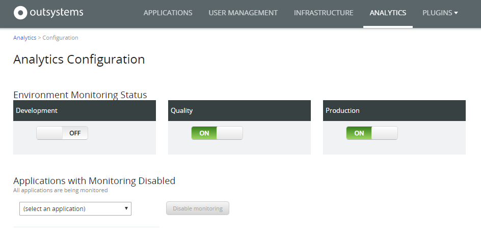

# Enable Analytics for an Environment

Applies only to Traditional Web Apps.

OutSystems collects analytics about the end-user experience of all applications running in the Production environment. However, you can turn on monitoring in other environments too. This article describes how.

LifeTime Analytics applies only to Traditional Web applications. For Mobile and Reactive apps, OutSystems enables you to integrate with industry-leading monitoring platforms. Check some of the components available in [OutSystems Forge](https://www.outsystems.com/forge/), such as [New Relic RUM](https://www.outsystems.com/forge/component-overview/6848/new-relic-rum) or [Elastic RUM](https://www.outsystems.com/forge/component-overview/7341/elastic-rum).

## Example

You want to detect performance issues of the FieldServices application before deploying it to Production. For this, you want the key users of the application to test it in the Quality Assurance environment. To monitor the end-user experience, you want to enable analytics in QA.

To do so, follow these steps:

1. In your LifeTime console (`https://<lifetime_env>/lifetime`), navigate to the **ANALYTICS** area.
1. Click the **Configuration** link below the name of the current environment.
1. On the **Analytics Configuration** page, use the toggle to enable analytics for the Quality Assurance environment.

After these steps, the platform starts collecting analytics about all applications in the Quality Assurance environment.

You can view the collected data in the **ANALYTICS** area.
