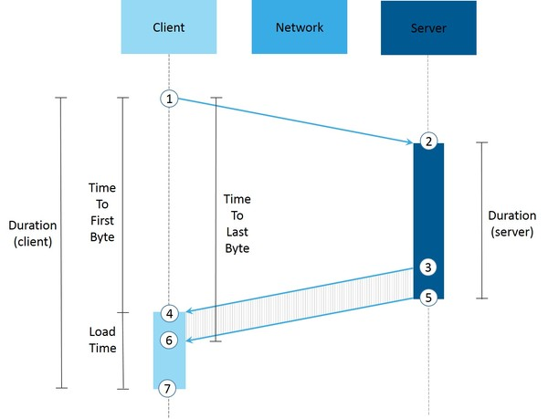

# How Application Performance Is Measured

Applies only to Traditional Web Apps.

OutSystems collects metrics of how applications are performing to allow you to monitor and troubleshoot runtime issues. The Outsystems Platform uses [LifeTime Analytics](troubleshoot-the-performance-of-an-application.md) to measure the end user experience based on industry-standard indicators and identify bottlenecks at different levels: client (eg. operating systems), network (eg. network types) and server (eg. business logic elements). This article describes what is collected and how.

## What Happens when Using an Application?

When end users are using an application, their actions send requests to a server. The server then processes the requests and sends back responses with the result. During this cycle, the Platform collects metrics to enable you to troubleshoot performance issues, for example.

The following picture shows the request-response cycle and the points where the Platform collects metrics.

1. The client sends a request to the server, a request triggered by an end user action in the application.
1. The request arrives to the server.
1. The server starts sending the response, after executing the logic to process the request.
1. The client starts receiving the response.
1. The server finishes sending the response.
1. The client receives the last byte of the response.
1. The client finishes the rendering of response to the end user.

## Client Metrics

The time spent on the client-side is measured by the Load Time (steps 4, 6, and 7), which contains the following:

* Receiving the response.
* Requesting static elements from the server: CSS, images, JavaScript scripts, etc.
* Rendering the screen.

This information is registered in the events called [WebScreenClientExecuted](<../../ref/apis/performancemonitoring-api.md#webscreenclientexecuted-details>).

To collect these metrics, OutSystems uses the [NavigationTiming API](<http://www.w3.org/TR/navigation-timing/>), if it's [possible](<http://caniuse.com/#feat=nav-timing>). Otherwise, it uses custom JavaScript code.

Besides metrics, the WebScreenClientExecuted event contains additional client details, like the user agent and the operating system. See all [the information collected on the client](<../../ref/apis/performancemonitoring-api.md#webscreenclientexecuted-details>).

## Network Metrics

The platform computes the network time based on metrics collected on client and server sides, namely: 

Network Duration = Client Duration – Client Load Time – Server Duration

When a web application runs in a browser, the WebScreenClientExecuted event captures further network-related details. Learn more about [the network-related details collected by the Platform](<../../ref/apis/performancemonitoring-api.md#webscreenclientexecuted-details>).

## Server Metrics

During server execution (steps 2, 3, and 5), the Platform collects metrics in a [WebScreenServerExecuted](<../../ref/apis/performancemonitoring-api.md#webscreenserverexecuted-details>) event for:

* All executed queries.
* All executed consumed integration methods: SOAP, REST or SAP.
* All executed extension actions.

The remaining server time is spent in acquiring the session, other application logic, and page rendering.

### About Slow Calls

Besides the metrics listed in this document, the platform also collects information about slow calls that were executed on the server.

A slow call occurs when the execution of a query exceeds a threshold (200ms by default).

If the same call is executed multiple times in an action, eg. happens inside a loop (For Each), the time considered is the sum of all executions. For example, if the 'GetOrdersForCustomer' query is executed ten times, each call taking 30 milliseconds, then the total time spent executing that query is 300ms.

When OutSystems detects a slow call, it registers it in a [QueryExecuted](<../../ref/apis/performancemonitoring-api.md#queryexecuted-details>), [ExtensionExecuted](<../../ref/apis/performancemonitoring-api.md#extensionexecuted-details>) or [ConsumedIntegrationExecuted](<../../ref/apis/performancemonitoring-api.md#consumedintegrationexecuted-details>) event, respectively.

## Read Metrics and Add Your Custom Metrics

OutSystems provides the PerformanceMonitoring API, that enables you to:

* Read metrics: fetch the metrics stored in the platform database and build your own dashboard, for example.
* Add your custom metrics: add your own metrics to applications.

Learn more about the [PerformanceMonitoring API](<../../ref/apis/performancemonitoring-api.md>).
