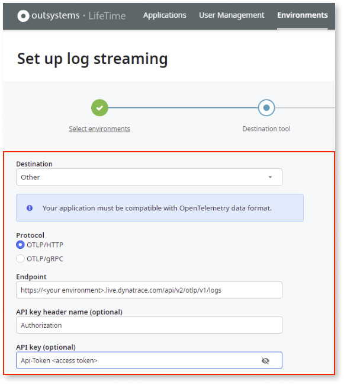

# Stream logs to Dynatrace

This article explains how you can set up log streaming from OutSystems applications to the **Dynatrace** APM tool.

## Prerequisites

* Enabled [Log separation](../../../setup-maintain/setup/logging-db/logs-separation-cloud/intro.md).

* Installed Platform Server version 11.23.1 or higher.

* Installed LifeTime version 11.19.0 or higher.

## Set up log streaming

To configure the OutSystems log streaming service, using **Dynatrace** as the destination tool, follow these steps:

1. Get the Dynatrace SaaS endpoint. 

1. Get the Dynatrace API token (must have the ingest logs permissions).

Once you've completed these steps, go to LifeTime and [configure the log streaming service](lifetime-streaming.md) and enter the following parameters:

* **Destination**: ``Other`` 
* **Protocol**: ``OTLP/HTTP`` (**Note**: gRPC is not supported)
* **Endpoint**: Dynatrace SaaS Endpoint  ``https://{your-environment-id}.live.dynatrace.com/api/v2/otlp/v1/logs``
* **API key header name**: ``Authorization``
* **API key**: ``Api-Token <access token>``

    

## Additional resources

[Export with OLTP.](https://www.dynatrace.com/support/help/extend-dynatrace/opentelemetry/getting-started/otlp-export)
