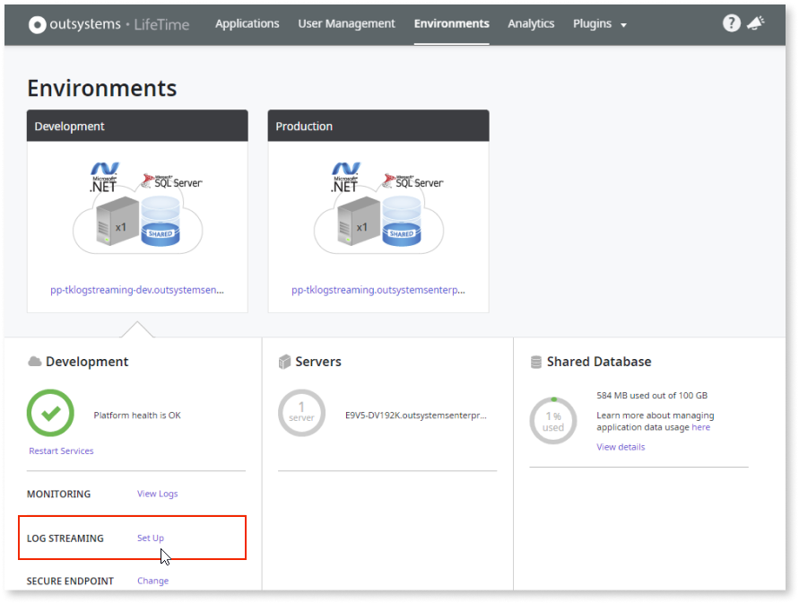
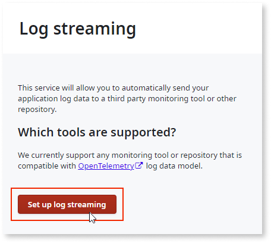
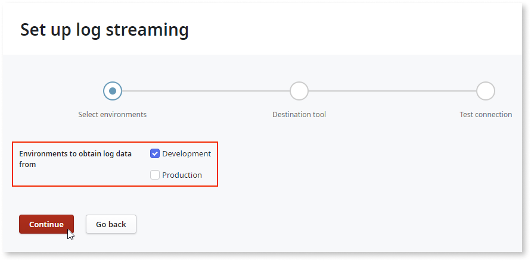
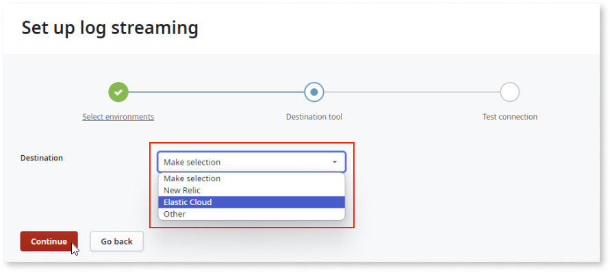
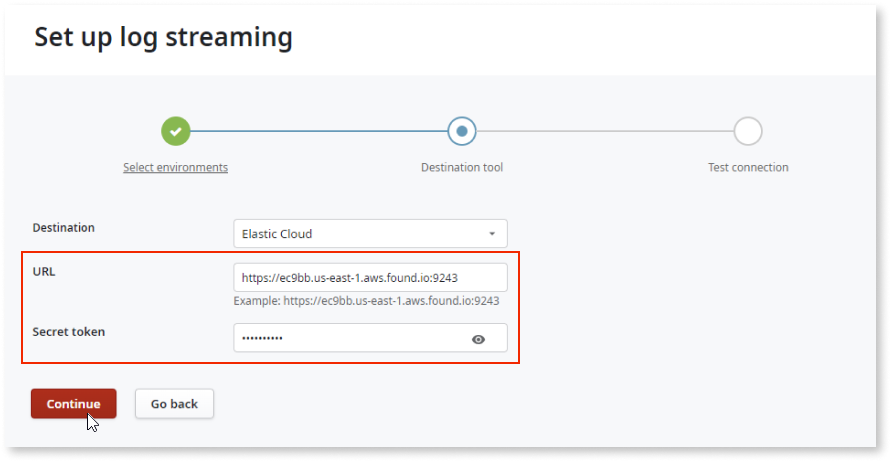
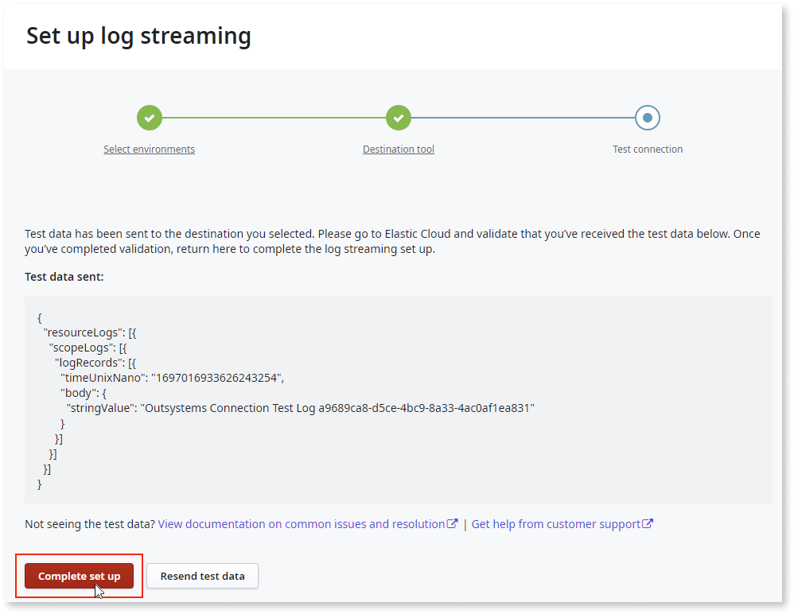
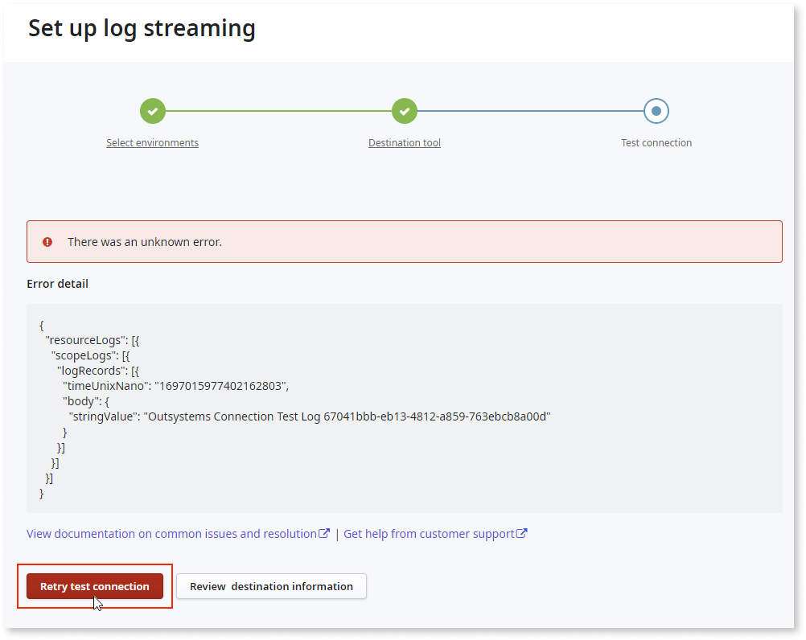

# Configuring the log streaming service in LifeTime 

This example uses **Elastic Cloud** as the destination tool.

1. Go to **LifeTime** > **Environments**.

1. Click **Log Streaming** - **Set up**.

    

1. Click **Set up log streaming**.

    

1. Select the environment and click **Continue**.

    

1. Select the destination tool and click **Continue**. 

    

1. Enter the URL and the secret token and click **Continue**.
    
    The connection is tested, and the test data is sent to the destination tool.
    
    

1. If the connection is successful, click **Complete set up**.

    **Note**: Before you complete the setup, validate that the test data has arrived at the destination tool.  For Elastic Cloud, see [View Logs](elastic.md#view-logs)

    
       
    If the connection is not successful, you can retry the test connection or review the destination information to ensure it’s correct.

    
