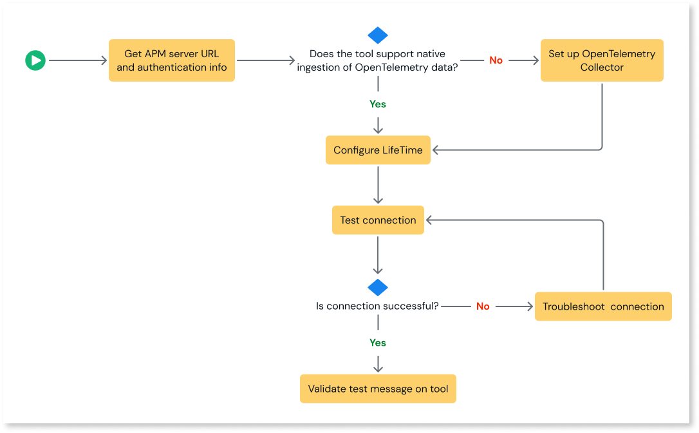

# Streaming log data

With log streaming, you can stream your application and platform logs in OpenTelemetry Protocol (OTLP) format to different [Application Performance Monitoring (APM) tools](intro.md#supported-application-performance-monitoring-tools) so that you can analyze, monitor, and proactively troubleshoot your system. You can easily integrate your application with any APM tool as most monitoring tools support data ingest in OpenTelemetry (OTel) format. For detailed information on log streaming, refer to [Introduction to log streaming](intro.md).

## Set up log streaming

Following is an overview of the process for streaming log data to different APM tools:

For detailed information on the prerequisites for log streaming, refer to the individual APM tool how-tos.

1. Retrieve the APM tool's server URL and the authentication credentials
To establish a secured connection between your app and the APM tool, you require the APM tool's server URL and the authentication credentials. The steps to retrieve the server URL and the authentication information vary for each tool. For detailed information, refer to the corresponding APM tool documentation.

2. (Optional) [Set up OpenTelemetry collector](configure-collector.md)
If your tool does not support native ingestion of OpenTelemetry data, then you must install and deploy OpenTelemetry collector.

3. [Configure LifeTime](lifetime-streaming.md)  
To enable log streaming from the OutSystems app to the corresponding APM tool, you must configure the APM server URL or OpenTelemetry collector URL and the authentication credentials.  

4. Test and validate the connection
In LifeTime, test if your app has established a connection with the APM tool and validate if the test data is sent to the destination tool.  If the connection fails, then refer to the [troubleshooting guide](https://success.outsystems.com/support/errors/log_streaming/) to understand why and how you can resolve the errors and retest the connection.

## What's next

For detailed information on streaming logs to different APM tools, refer to:

* [Stream log data to Elastic Cloud](elastic.md)

* [Stream log data to Splunk](splunk.md)

* [Stream log data to New Relic](new-relic.md)

* [Stream log data to Dynatrace](dynatrace.md)

* [Stream log data to Datadog](datadog.md)

For detailed information on handling troubleshooting and handling errors, refer to:
[Troubleshooting and handling errors](https://success.outsystems.com/support/errors/log_streaming/)
