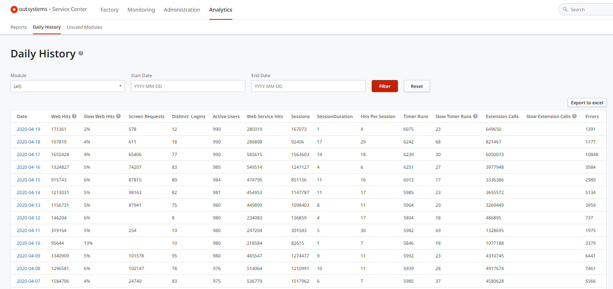
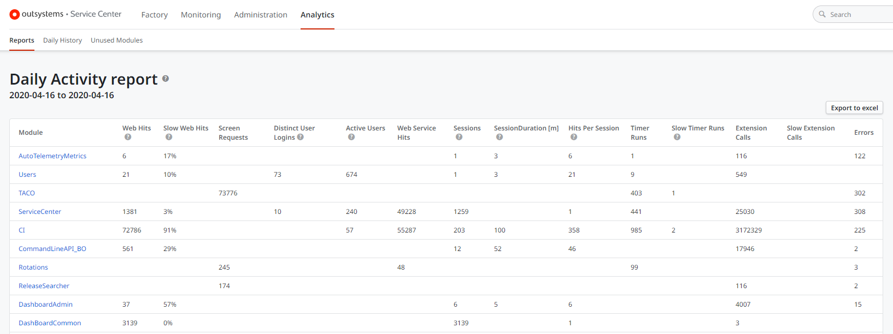

# Monitor the Environment Daily Activity

In OutSystems, you can monitor the daily activity of your environment in the Service Center console (`https://<environment>/ServiceCenter`).

In **Analytics > Daily History** area, you will find the daily reports containing the activity metrics for the applications in the environment.

Selecting the Daily Activity report for a specific date, you will see the daily metrics taken on that day for each application in the environment, such as the number of visitors, distinct users, sessions or errors.

The Daily Activity reports are generated only if the option **Enable Daily Activity Reports** is enabled in the [environment configuration](https://success.outsystems.com/Documentation/11/Setting_Up_OutSystems/Configure_your_OutSystems_environment). By default, OutSystems enables this option upon installation.
