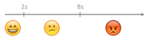

# The APDEX Performance Score

OutSystems uses the APDEX (Application Performance Index) metric, to measure the user satisfaction with the performance of your applications.

## How to Interpret an APDEX Score

Your applications are rated from 0% to 100%:

* 0%–70%:  the application provides a **poor** user experience for being slow
* 70%–85%: the application provides a **fair** user experience for being fairly slow
* 85%–100%: the application provides a **good** user experience, since it's fast

If there is no data about an application, OutSystems displays a hyphen (-).

## How an APDEX Score is Calculated

Each time the end user navigates to a page in your application, OutSystems checks how long the page took to load. If the page loads in:

* More than 8 seconds: it provides a poor user experience, because it's **slow**
* 2–8 seconds: it provides a fair user experience, because it's **fairly slow**
* Less than 2 seconds: it provides a good user experience, because it's **fast**

To calculate the APDEX score of an application, we use the following formula:

This scores an application with:

* 0% if all page loads were slow, i.e. took more than 8 seconds
* 50% if all page loads were fairly slow, i.e. took between 2 and 8 seconds
* 100% if all page loads were fast, i.e. took less than 2 seconds

You can learn more about this industry standard at [www.apdex.org](<http://www.apdex.org>).
