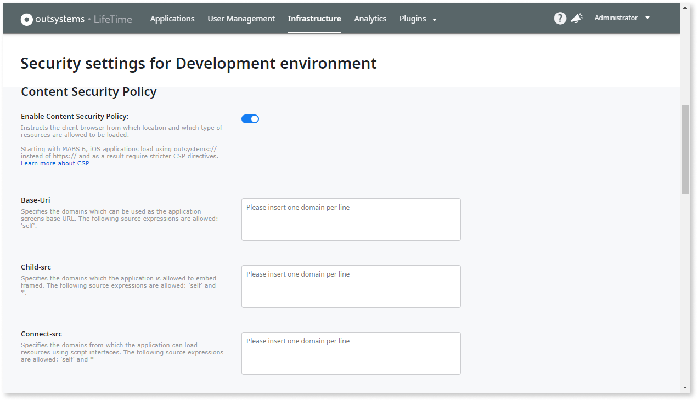
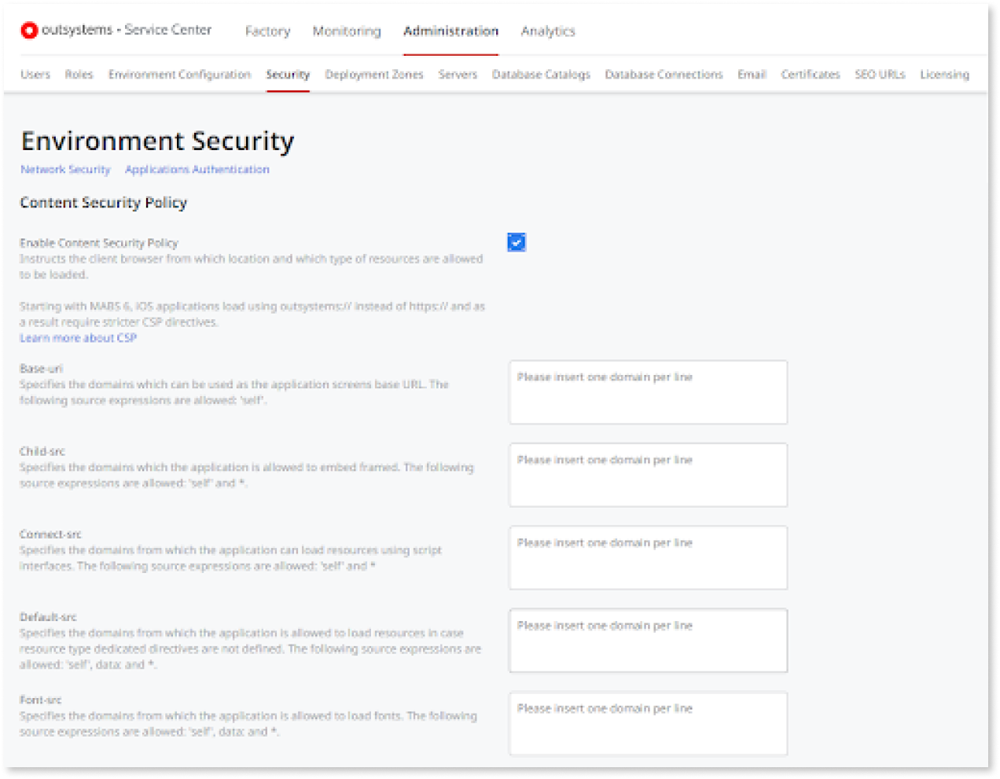

# Apply Content Security Policy


Content Security Policy (CSP) lets you define rules that help protect your users and apps from web attacks. CSP provides a standard way of declaring approved origins of content that browsers are allowed to load.

CSP is configured using directives that are sent to browsers in [specific HTTP headers](<https://en.wikipedia.org/wiki/Content_Security_Policy#Status>). This way, when browsers run pages of your applications, they know from which location and/or which type of resources to load.

It is advisable that you configure the CSP in every environment. Start with the allowed sources in an environment, for all its applications. Then, specify the sources per application, as needed, to override the general configuration.

The CSP configuration works for both web and mobile applications developed with OutSystems.


## Configure CSP in LifeTime

If you have **LifeTime** installed, set the **Content Security Policy** using this management console.



### For all environments

To configure the CSP in all environments in **LifeTime**:

1. Go to the **Infrastructure** section to see all environments.
1. In an environment, select the **Environment Security** option.
1. Enable CSP.
1. Configure directives, with one value per line.
1. Click **Save**.
1. Republish all applications using an ["All Components" solution](https://success.outsystems.com/Support/Enterprise_Customers/Maintenance_and_Operations/Creating_and_using_an_%22All_Components%22_solution).

### For an app

To configure CSP for an application in **LifeTime**:

1. Select the **Applications** section, and then the application.
1. Select the **Security Settings** option.
1. In the dropdown list, select the environment to which the settings will apply.
1. Enable CSP.
1. Configure directives, with one value per line.
1. Click **Save**.
1. Republish the application in Service Center.

<div class="info" markdown="1">

By design, the Content Security Policy on the app level overrides the same policy on the environment level. 

</div>

## Configure CSP in Service Center

If you don’t have **LifeTime** installed, configure CSP in each environment using the environment management console, **Service Center**.



### For an environment

To configure CSP for all apps in an environment in Service Center:

1. In the **Administration** section, select the **Security** option.
1. Enable CSP.
1. Configure directives, with one value per line.
1. Click **Save**.
1. Republish the application in Service Center.

### For an app

To configure CSP for an application in **Service Center**:

1. Select the **Factory** section and then the application.
1. Select the **Security** tab.
1. Enable CSP.
1. Configure directives, with one value per line.
1. Click **Save**.
1. Republish the application.

<div class="info" markdown="1">

By design, the Content Security Policy on the app level overrides the same policy on the environment level.

</div>

## Monitoring  { #monitoring }

Once you set CSP, monitor the blocked resources using the management console of the environment in **Service Center**:

1. Go to the **Monitoring** section and select the **Errors** option.
1. Set the eSpace filter to SecurityUtils to only see the resources blocked by CSP.

When configuring CSP take the following risks of misconfiguration into account:

* **Missing policies**: Make sure that you configure policies that allow all sources used in your applications. Otherwise, users may stumble upon things like videos that are not shown, or CSS that is not applied.

* **Too permissive policies**: Be especially cautious when allowing resources to be loaded from everywhere (by using `*` in the domain list). Hackers may take advantage of links, scripts, or other resources in your applications to redirect users to malicious pages.

* **Duplicated configuration**: On self-managed environments, set the CSP directives only in **LifeTime**. Don't set them directly in IIS, for example. It will cause unexpected results, by including the CSP directives twice.

## Directives reference

The table below describes the list of available directives to configure Content Security Policy in **OutSystems**. The **Required values** column indicates the values that **LifeTime** automatically applies to the directive for the applications to work correctly. Those values cannot be removed.

<div class="info" markdown="1">

When adding multiple domains, insert 1 domain per line without any separators after each line.

</div>

| Directive     | Reason        | Required values  |
| :------------ |:--------------|:----------------|
| Base-uri      |The domains which can be used as base URL for applications screens.<br/>The following source expressions are allowed: `self`.|`self`|
| Child-src     |The domains which applications are allowed to embed framed.<br/>The following source expressions are allowed: `self` and `*`.|`self`<br/>`gap:`|
| Connect-src   |The domains from which applications are allowed to load resources using script interfaces.<br/>The following source expressions are allowed: `self` and `*`.|`self`|
| Default-src   |The domains from which applications are allowed to load resources, by default.<br/>Any resource type dedicated directive (like object-src or img-src) that is not defined will inherit this configuration.<br/>The following source expressions are allowed: `self`, `data:` and `*`.|`self`<br/>`gap:`<br/><br/>Values added at runtime:<br/>`'unsafe-inline'`<br/>`'unsafe-eval'`|
| Font-src      |The domains from which applications are allowed to load fonts.<br/>The following source expressions are allowed: `self`, `data:` and `*`.|`self`<br/>`data:`|
| Img-src       |The domains from which applications are allowed to load images.<br/>The following source expressions are allowed: `self`, `data:` and `*`.|`self`<br/>`data:`<br/><br/>Values added at runtime:<br/>`blob:`|
| Media-src     |The domains from which applications are allowed to load media files.<br/>The following source expressions are allowed: `self`, `data:` and `*`.|-|
| Object-src    |The domains from which applications are allowed to load objects (for `<object>`, `<embed>` and `<applet>` elements).<br/>The following source expressions are allowed: `self` and `*`.|`-`|
| Plugin-types  |The valid plugins that the user browser may invoke|-|
| Script-src    |The domains from which applications are allowed to load scripts.<br/>The following source expressions are allowed: `self`, `data:` and `*`.|`self`<br/><br/>Values added at runtime:<br/>`'unsafe-inline'`<br/>`'unsafe-eval'`|
| Style-src     |The domains from which applications are allowed to load styles.<br/>The following source expressions are allowed: `self`, `data:` and `*`.|`self`<br/><br/>Values added at runtime:<br/>`'unsafe-eval'`|
| Frame-ancestors|The domains which are allowed to embed applications in a frame.<br/>The following source expressions are allowed: `self` and `*`.|`self`<br/>`gap:`|
| Frame-src | There's no dedicated field, but you can use the `Child-src` field to enter the values for the platform to generate the `Frame-src` directive. | `self` |
| Report-to     |URI where content security violations will be reported.|`<internal>`|
| Other directives|More directives to append to the Content Security Policy headers.|-|

## Content security policy and MABS { #mobile-apps }

<div class="info" markdown="1">

Applies to the iOS apps generated with MABS 6 and later.

</div>

The mobile apps generated with MABS 6 and higher require loading with `outsystems://` when running in iOS devices. Android apps still load content using `https://`. To ensure that images, fonts, videos, scripts, or stylesheet resources load properly in iOS apps, enter CSP configuration value so that the URL expressions are prefixed with `https://`.

Here are some examples:

| Before MABS 6           | After MABS 6                    |
| :---------------------- | :------------------------------ |
| `example.com`           | `https://example.com`           |
| `subdomain.example.com` | `https://subdomain.example.com` |
| `*.example.com`         | `https://*.example.com`         |
| `https://example.com`   | `https://example.com` (no change) |
| `http://example.com`    | `http://example.com` (no change)  |

**Applies to mobile apps only**. If you configure CSP on the environment level in LifeTime, change the schema to `outsystems://` in the mobile apps CSP configuration only. This prevents side effects for Traditional Web Apps or Progressive Web Apps (PWAs).

## Using iframes in iOS apps

If you want to use both CSP directives and iframes in your iOS apps, add the following to the **frame-ancestors** directive field:

```
outsystems://YOUR_APP_URL
https://YOUR_APP_URL
```

Failure to do so prevents content from rendering. You can identify the issue by searching for the **Interrupting main resource load due to CSP frame-ancestors or X-Frame-Options** error log.

See [Troubleshooting OutSystems apps on iOS devices](https://success.outsystems.com/Support/Enterprise_Customers/Troubleshooting/Troubleshooting_OutSystems_apps_on_iOS_devices) for additional information about using iframes on iOS devices.

